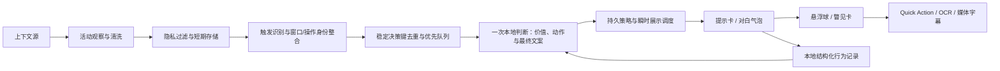

# 桌面情境助手实施方案（冻结稿）

最后更新：2026-07-30

状态：阶段 A、B、C 及 `D-73` 至 `D-84` 均已实现。当前源码使用 prompt `21`、fixture `10`；固定 `8s` 聚合和第二次评论模型调用已经移除，旧 prompt 资格缓存会按版本自动失效并重新检查。

产品需求来源：[桌面情境助手 PRD](floating-context-assistant-prd.md)

## 0. 文档职责

本文只维护“如何实现和如何验证”，包括代码职责、实施顺序、迁移步骤、测试与打包验收。

以下内容必须先回写 PRD，再由本文承接实现：

- 用户可见功能、交互和文案。
- 默认开关、权限、隐私和留存边界。
- V1 范围、后续范围和明确不做的内容。
- 任何新的 `D-xx` 产品决策。

以下内容只在本文维护：

- 类和模块职责。
- 源文件落点与迁移顺序。
- 开发阶段、依赖关系和完成状态。
- 单元、集成、窗口、packaged app 验证方案。
- 开发启动门槛与风险清单。

如两份文档冲突，以 PRD 的已确认产品决策为准。

## 1. 当前实现基线

当前悬浮组件的主要责任链：

- `Sources/LLMToolsApp/AppDelegate.swift` 中的旧窗口控制器创建标题为“悬浮组件”的普通窗口，并承担窗口层级、可见性和旧贴边逻辑。
- `Sources/LLMToolsApp/Views.swift` 中的 `FloatingWidgetView` 是完整文本任务表单，不是 `48pt` 悬浮球。
- 旧组件和 Quick Action 存在功能重叠；PRD `D-34` 已要求新助手彻底替换旧悬浮入口，文本工作台能力继续由 Quick Action 承担。
- 当前旧组件没有真实用户数据。新助手不读取、迁移或兼容任何旧窗口偏好；旧组件专属字段、UI 和分支在实现阶段直接清理。

实施前需要再次核对实际源码、用户未提交修改和 packaged app 运行状态，不能仅依赖本文快照。

## 2. 架构边界

新增独立组件：

- `AssistantContextCoordinator`：统一启动和停止上下文源，管理短期上下文。
- `UserActivityObserver`：产生清洗后的应用、剪贴板、选区和空闲事件。
- `ActivityPatternDetector`：使用确定性规则和专用能力识别模式。
- `AssistantValueJudgmentEngine`：使用较强本地模型复核候选提示的价值、证据和打断成本。
- `CompanionCommentEngine`：在判断结果锁定后复用可用本地模型或确定性模板生成评论，并校验其不能修改事实和动作集合。
- `AssistantInterruptionPolicy`：处理分数、冷却、安静时段和主动程度。
- `AssistantCardStore`：保存有界的当前会话提示卡和未读状态。
- `AssistantBehaviorStore`：使用版本化原子 JSON 持久化脱敏结构化行为、反馈和动作结果，并提供查询、裁剪、清理和删除。
- `FloatingAssistantWindowController`：管理悬浮球、悬停工具条、小型询问、瞥见卡和多屏位置。
- `AssistantPrivacyPolicy`：集中处理应用排除、敏感内容和 TTL 规则。
- `DesktopAssistantScreenCapture`：使用 ScreenCaptureKit 只截取当前前台窗口，缩放、哈希去重后产生内存 PNG。
- `AssistantSceneContract`：由本地通用 VLM 把截图收敛为严格 JSON 场景摘要；图片不进入事件存储或行为历史。

### 2.1 行为记录存储

复用现有 `HistoryStore` 和 `AppPaths` 的最小实现方式，不引入 SQLite、Core Data 或新依赖：

```text
~/Library/Application Support/llmTools/assistant-behavior.json

AssistantBehaviorSnapshot
- schemaVersion
- records[]
- aggregatePreferences
- updatedAt
```

- `AssistantBehaviorStore` 使用 actor 串行读写，启动时一次性加载快照到内存。
- 新增记录、反馈变化或清理后立即编码整个快照并原子替换文件。
- 保存前执行 `30days`、`5,000` 条和 `10MB` 三项裁剪，按时间删除最早记录。
- 目录权限使用 `0700`，文件权限使用 `0600`，复用 `AppPaths.preparePrivateFileStorage`。
- `ActivityEvent` 使用独立有界内存队列，最多 `60min`/`2,000` 条，不进入快照。
- 原始短期上下文最多 `10min`；暂停、隐私模式、停用和退出时清空内存队列及原始上下文。
- JSON 解码损坏时，将原文件原子移动为带时间戳的隔离文件，权限保持 `0600`，且只保留最近一份。
- `schemaVersion` 高于当前支持版本时保留原文件、不写入，关闭历史优化并暴露诊断状态。
- 单次保存失败保留内存快照并在下次变更重试；不得使助手崩溃或改用远程存储。
- “清除全部行为记录”删除主文件、隔离文件以及内存行为快照。

字段处理：

- 普通应用的 `appIdentity` 保存 Bundle ID，`appCategory` 使用确定性本地映射；显示名称不落盘。
- 完全排除应用在 `UserActivityObserver` 进入事件队列前丢弃，不生成抑制记录。
- 敏感内容记录仅包含抑制原因枚举和时间，不包含应用、摘要或指纹。
- `sanitizedEvidenceSummary` 最多 `240` 字符，按“来源清洗 -> 必要时本地概括 -> 再清洗 -> 限长”生成；禁止直接截取原文。
- 使用 CryptoKit `HMAC<SHA256>` 生成内容指纹，不新增依赖。
- 首次启用时创建独立随机指纹密钥文件，权限为 `0600`；不使用 Keychain。
- 只统一 Unicode、换行和首尾空白；终端或构建适配器可以先删除时间戳、临时路径等已知噪声，不全局小写。
- 指纹不进入模型输入、UI 或诊断导出。
- 清除全部记录和聚合偏好时删除并重新生成指纹密钥。

只有记录规模明显超过当前上限、出现复杂全文检索或多进程并发写入时，才重新评估数据库。

复用现有能力：

- `TaskEngine` 和既有任务模型路由。
- `SelectedTextService` 的安全选区与剪贴板保护能力。
- `LanguageDetectionService` 和 `FastTranslationService`。
- OCR 和媒体字幕工作台。
- Quick Action 作为深度工作台。
- 现有全局模型卸载策略。

禁止的实现方向：

- 继续把所有状态堆入单一 `AppState`。
- 在 SwiftUI View 中直接轮询剪贴板或运行模型。
- 继续扩展旧大窗口的宽度收起逻辑。
- 为每个模式建立互不兼容的窗口和历史存储。
- 让 LLM 直接接收原始事件流并自行决定执行动作。

总体数据流：



## 3. 开发评审顺序

评审按真实开发依赖推进。每阶段先确认产品细节并回写 PRD，再在本文冻结实现方案。

| 顺序 | 评审主题 | 当前状态 |
| --- | --- | --- |
| 1 | 旧组件迁移、启停生命周期、窗口层级、全屏行为 | 已完成，对应 `D-34` 至 `D-36` |
| 2 | 悬浮球、悬停工具条、小型询问、瞥见卡、拖入 | 已完成，对应 `D-37` 至 `D-42` |
| 3 | 首次引导、权限、上下文开关、偏好处理 | 已完成，对应 `D-43` 至 `D-48`；不做旧组件偏好迁移 |
| 4 | 活动事件、行为存储、隐私和持久化 | 已完成，对应 `D-49` 至 `D-54` |
| 5 | 模式检测、价值判断模型、资源调度和降级 | 已完成，对应 `D-55` 至 `D-60` |
| 6 | 评论、反馈和动作路由 | 已完成，对应 `D-61` 至 `D-66` |
| 7 | Settings、诊断状态、数据查看和清除 | 已完成，对应 `D-67` 至 `D-69` |
| 8 | 测试、旧实现清理、打包和最终验收 | 已完成，对应 `D-70` 至 `D-72` |

## 4. 实施阶段

### 阶段 A：悬浮球外壳

- 用新桌面情境助手替换旧悬浮组件入口和窗口，不保留并行旧入口。
- 删除 `FloatingWidgetView`、旧 pin state、窗口初始化、打开动作、贴边更新分支和旧本地化文案。
- 删除旧组件偏好及 CodingKeys；新增嵌套 `DesktopAssistantPreferences`，不读取或映射旧字段。
- 实现无标题 `48pt` 悬浮球，以及悬停工具条、小型询问、瞥见卡和暂停状态。
- 实现首次启用、启动恢复、隐藏、停用和全屏可见性生命周期。
- 使用始终置顶的非激活窗口层级，并移除悬浮球图钉。
- 实现自由拖动、多屏位置记忆和安全区域回退。
- 不实现贴边吸附、自动收起或收边动效。
- 实现当前会话最近提示、未读状态、前后浏览和清除。
- 暂不接入主动观察，先验证窗口是否适合长期常驻。

验收门槛：用户愿意让它长期留在桌面上，基础交互不抢焦点、不遮挡系统区域。

### 阶段 B：显式输入与剪贴板

- 三步首次引导，以及“仅手动使用”和取消回滚。
- 按来源保存授权选择，系统权限在真正启用对应来源时按需申请。
- 权限拒绝、撤销、重新授权和原始短期上下文清理。
- 隐藏、暂停、停用、重新启用和来源摘要确认的独立生命周期。
- 删除旧悬浮组件专属偏好、UI 和兼容分支，不实现迁移路径。
- 单项文本和文件拖入路由；投放态从 `48pt` 扩展到 `120pt`。
- 多项、文件夹和混合拖入整批拒绝，不实现或预留批量处理入口。
- 剪贴板外语检测。
- 选区接入。
- 规则模板评论。
- 权限、应用排除和短期上下文。
- 本地结构化行为记录、查看和清除入口。
- 独立 `assistant-behavior.json`、有界内存事件队列、原子保存、容量裁剪和损坏隔离。

验收门槛：翻译和文件投递比打开现有工作台更快，且不产生循环提醒。

### 阶段 C：行为模式与性格

- 重复失败只接入 llmTools 失败和显式错误文本；连续外语复制只使用已授权剪贴板。P-06 只合并授权剪贴板、显式选区和脱敏窗口标题，应用激活元数据仅用于排除、敏感过滤和归类，不能单独触发。
- 使用固定窗口、次数、证据和冷却常量生成候选，不实现 embedding 或通用操作理解框架。
- 主动程度、性格和反馈。
- 较强本地模型的高价值判断、保守降级和反例 fixture。
- 独立评论职责和结构化输出校验；优先复用已加载模型，`3s` 后使用确定性模板。
- 判断任务单并发、队列最多 `3`、总时限 `8s`/生成 `5s`，用户主动模型任务优先。
- 内置 `24` 个版本化资格 fixture；资格缓存绑定模型文件指纹、提示词版本和 fixture 版本。
- 当前会话累计明确负反馈 `2` 次或主动卡无交互超时 `3` 次时降一级，最低降到安静档。
- 资格 fixture 作为 Core 中的版本化 Swift 常量，由运行时检查和 `LLMToolsChecks` 共用。
- 普通首次启用默认适中，并在引导明确披露后自动启动可取消的 24 项本地检查；检查中、无模型或失败时实际保持安静。之后选择适中/活跃仍使用显式检查流程。

验收门槛：资格检查满足结构、准确率、硬反例和延迟门槛；提示有真实依据，打扰频率可接受，模板降级和会话内降档可用。

### 阶段 D：下一期增强

- 语音入口和手动 TTS。
- 应用专用适配器。
- 只有截图被证明无法支撑结构化网页操作时，才重新评估浏览器语义事件。

此阶段不属于首个 MVP 的前置条件。

## 5. 测试策略

沿用项目现有 `LLMToolsChecks`，不新增 XCTest target 或专用资格检查 executable。确定性假模型覆盖资格计分和状态机；真实模型只通过 packaged app 的资格检查流程验证，不在自动检查中下载或访问网络。

### 5.1 确定性测试

- 事件去重、来源标记、TTL 到期和内容销毁。
- `ActivityEvent` 不落盘，内存队列正确执行 `60min`/`2,000` 条双上限。
- 暂停、隐私模式、停用和退出清空内存事件及原始上下文。
- 行为快照原子保存，保存前执行 `30days`/`5,000` 条/`10MB` 三项裁剪。
- 损坏文件只保留一份 `0600` 隔离副本；清除全部时不遗留隔离文件。
- 更高 schema 版本不被旧 app 覆盖；单次写入失败不使助手崩溃。
- 普通应用身份、完全排除应用和敏感内容分别生成正确的持久化字段。
- 摘要经过双重清洗并限制 `240` 字符，不能由原文直接截断产生。
- 指纹使用本地 HMAC 密钥；不出现在模型输入、UI 或诊断导出。
- 清除全部数据后旧指纹不能与新事件继续关联。
- 完成引导前不启动观察器或创建行为记录文件；取消后完整回滚为停用。
- “仅手动使用”不启动任何后台来源，但询问和单项拖入可用。
- 剪贴板选择没有预选结果，必须记录用户的明确选择。
- 权限拒绝不循环请求；权限撤销停止来源并删除其未过期原始上下文。
- 重新授权后不补采权限中断期间的内容。
- 隐藏不停止观察，暂停可恢复原开关，停用后重启保持停用。
- 重新启用只在用户确认来源摘要后启动观察器。
- 新助手不读取任何旧悬浮组件偏好。
- 敏感文本过滤、应用排除和动作权限分级。
- 模式阈值、冷却、每小时上限和助手自身剪贴板防循环。
- P-01、P-03 的固定阈值边界和正反例，以及 P-06 的主动触发、支持证据、窗口版本、操作锚点、短防抖和跨应用剪贴板桥接边界；不存在 P-02 检测器、设置或历史迁移逻辑。
- 手动档不检测，安静档不调用价值模型，适中/活跃档仅对通过预筛选的候选调用。
- 判断单并发且队列不超过 `3`；过期、超时、资源冲突和用户主动任务优先时正确降级。
- 判断模型通过内置 `24` 个版本化 fixture 后才标记 qualified；模型文件、提示词或 fixture 变化后重新检查。
- 资格检查保持 `100%` JSON 有效，隐私、敏感和证据不足硬反例不允许主动误报；打字和全屏只进入展示调度，不作为模型价值硬否决；其余负例最多误报 `1` 个，正例至少通过 `9/12`。
- qualified 模型的动作只能来自候选提供的真实动作；暖机单次生成不超过 `5s`。
- 当前会话明确负反馈 `2` 次或主动卡无交互超时 `3` 次后只降一级；采纳动作、有用反馈或补充完整证据后清零。
- 徽标未查看不计入降档；“不好笑”只影响表达风格；降档不改写用户保存的主动程度。
- 同一判断输出同时锁定动作与最终文案；非法、敏感、含 URL/代码或超长文案均按模式保守降级。
- 反馈图标、原因菜单、明确关闭和模式关闭按各自语义更新同一条行为记录。
- 关闭整个模式需要确认并提供撤销；不实现按单条内容、应用或指纹屏蔽。
- 不建立内部临时待办存储、列表或入口；文本“提取待办”继续走现有任务和 Quick Action。
- P-01 解释动作只预填仍有效的原始错误，不自动运行；可恢复时返回原工作台，不实现自动重试或命令执行。
- P-03 使用单个可刷新到期时间的临时翻译会话，只处理未来同语言文本；本地能力不可用时单次报错并停止。
- Settings 顶层标签改为两个分别居中的固定 HStack，保持现有窗口宽度；第一排 `6` 个、第二排 `5` 个。
- Assistant 页面承载行为、上下文和隐私；判断模型及资格配置放入 Models > Model Settings，不再显示独立评论模型。
- 隐私守卫只瞬时读取前台 Bundle ID 做否决，不进入事件总线、记录、模型或诊断导出。
- 数据页只展示汇总；短期上下文、会话卡和行为记录分别清理，诊断 JSON 不包含正文和标识符。
- 卡片数量上限、过期、`9+` 徽标和成功展示后才标记已读。
- 单项拖入任务路由正确；多项、文件夹和混合拖入不部分接收。
- 清除当前会话提示不删除结构化行为记录。
- 小型询问不串联上一次问答，只携带显式选择的上下文。
- “深入处理”完整传递问题、回答和显式上下文。
- 行为记录不包含原始按键、鼠标轨迹和敏感正文。
- 行为记录到期清理、数量与空间上限和全部删除。
- 用户反馈只影响正确的同类判断。
- 判断模型不可用、超时、低置信或输出非法时不主动展开。
- 隐私和频率硬策略可以否决模型高价值结果。
- 普通首次启用默认适中，并在引导明确披露后自动运行本地资格检查；检查中、无模型、失败或取消时实际保持安静。之后手动选择适中/活跃时的开始、保持安静、进度、取消、让位、恢复、成功应用和失败回退状态正确。
- `LLMToolsChecks` 使用与运行时相同的 fixture 定义和确定性假输出，不依赖真实模型或网络。

### 5.2 窗口测试

- 主屏、外接屏、显示器断开、不同缩放、左右 Dock 和菜单栏安全区域。
- Space 切换、全屏默认隐藏、可选显示、全屏未读累计和退出全屏恢复。
- 点击、拖动、悬停工具条显示与收起，以及非激活状态不抢焦点。
- 悬浮球、悬停工具条和瞥见卡始终置顶且无图钉；Quick Action 层级不受影响。
- 首次未启用、启用后重启恢复、当前隐藏和完整停用。
- 长文本、长文件名和 `9+` 徽标不改变固定布局。
- 工具条在屏幕四边和四角正确选择方向，按钮命中区域不随动画漂移。
- `Enter`、`Shift+Enter`、`Esc` 和中文输入法组合态正确。
- 减少动态效果、VoiceOver 和键盘导航。
- 拖到屏幕边缘时保持完整形态并处于安全可见区域。

### 5.3 集成测试

- 剪贴板文本 -> 语言检测 -> 提示卡 -> 复制译文。
- 图片拖入 -> OCR 工作台；音视频拖入 -> 媒体字幕工作台。
- 纯文本/TXT/Markdown -> 选择任务 -> 直接运行。
- 独立 URL -> 仅复制或在浏览器打开，不抓取页面正文。
- 选区 -> 解释或翻译。
- 重复错误 fixture -> 单次提示和冷却。
- 高价值判断模型不可用 -> P-01/P-03 只显示徽标，P-06 保持静默，均不主动展开。
- 前台窗口截图 -> 哈希变化 -> 本地通用 VLM 严格场景摘要 -> P-06 判断；原图不落盘，动作可以为空。
- ScreenCaptureKit 权限缺失、排除应用、敏感摘要、非法 JSON、用户任务抢占或无通用 VLM -> 静默，不退回远程模型。
- 阅读、视频、正常切换等反例 -> 不产生高价值主动卡。
- 同类提示标为不相关 -> 后续本地判断降低主动性。
- 暂停或隐私模式 -> 所有观察器停止或按产品规则降级。

## 6. Packaged App 验收

最终实现以 `dist/llmTools.app` 为用户可见真相：

- `git diff --check` 通过。
- `swift build --product llmTools` 通过。
- `swift run LLMToolsChecks` 通过。
- `./scripts/package-app.sh` 成功，新增资源已包含且模型权重未误打包。
- `codesign --verify --deep --strict --verbose=2 dist/llmTools.app` 通过。
- 重启 packaged app 后位置、启停状态和设置符合 PRD。
- 使用与 V1 已启用来源相关的真实系统权限完成拒绝、撤销和重新授权验证。
- 使用本地 bridge 或诊断状态验证观察器已启动、已暂停和已释放。
- 确认真实运行进程来自 `dist/llmTools.app`，不是 SwiftPM debug 产物或旧安装包。
- 验证首次引导、仅手动、取消回滚、重启恢复、完整停用，以及旧入口和贴边设置消失。
- 验证 `48pt` 悬浮球、两排 Settings、悬停工具条、`120pt` 拖入态、非激活置顶、普通 Space 和全屏行为。
- 验证 P-01 预填/过期禁用，P-03 单条/30 分钟/防循环/本地能力缺失降级。
- 验证 VoiceOver、键盘导航、减少动态效果、长文本和中英文布局。
- 验证 Quick Action、OCR 和媒体工作台仍可打开，退出后无助手观察任务或专用模型进程残留。
- 有外接显示器时完成真实多屏、缩放和断开回退；不可用时运行窗口几何检查并在报告中明确标记真实多屏未执行。

本改动不触碰浏览器扩展，不运行浏览器 DOM 全量验收；实现和验收过程不下载模型，真实资格检查只使用用户已注册的本地模型。

## 7. 开发启动检查

开始实现时执行：

- PRD `D-01` 至 `D-83` 已确认；视觉上下文、无动作表达、实时诊断、徽标、工作动效、可调门槛和人在场启停只按 `D-74` 至 `D-83` 的本地、短期、单窗口、无正文边界实现。
- 行为记录粒度、期限、模型使用方式和高价值判断模型降级已经明确。
- 首个 MVP 包含高价值判断模型和独立评论逻辑；规则模板可以降级评论表达，但不能代替主动展开的价值判断。
- 剪贴板观察、窗口标题、后台远程 provider 和敏感内容边界明确。
- 悬浮球、悬停工具条、小型询问、瞥见卡和拖入交互全部确认。
- V1 行为模式和动作权限已确认。
- 尺寸、窗口、Space、全屏和已取消的贴边状态已经由 PRD 冻结；先完成阶段 A 外壳并截图检查，再接入观察器。
- fixture 类别、数量和通过门槛已经冻结；在接入真实判断模型前创建运行时和 `LLMToolsChecks` 共用的具体 fixture。
- 实现前重新读取相关源码和 dirty worktree，列出实际文件修改范围与回滚点。

实现不得扩展现有 `FloatingWidgetView`；第一阶段直接删除旧入口并建立新外壳，随后按阶段 B、C 顺序接入能力。

## 8. 实施与验收记录

### 8.1 当前实现状态

- 阶段 A 已完成：旧 `FloatingWidget` 产品入口和专属偏好已删除，由 `48pt` 非激活悬浮球、悬停工具条、小型询问、瞥见卡、会话提示和多显示器位置恢复替代；没有兼容层、图钉、贴边吸附或自动收起。
- 阶段 B 已完成：三步引导、仅手动模式、来源授权、`120pt` 单项投放态、文本/OCR/媒体/URL 路由、剪贴板与选区接入、隐私清洗、短期上下文和本地行为存储已经接入既有能力。
- 阶段 C 已完成：V1 包含 P-01、P-03 和 P-06；主动程度、反馈、一次判断成文、`24` 个共享资格 fixture、资格缓存和保守资源降级已经实现。fixture 保持总数 `24`，由 P-01/P-03/P-06 各 `4` 个正例和 `12` 个反例组成，P-06 另有 `3/4` 的最低门槛。
- `D-84` 情境整合已完成：证据携带真实发生时间、窗口 identity/revision、操作锚点和可信来源；显式选区、用户触发剪贴板和带明确 signal 的视觉摘要负责触发，窗口标题与中性截图只作支持。每个触发使用 `0.8s` 短防抖、最多 `2s`；同一 surface/revision/anchor 桶内由明确输入拥有动作，不同桶分别保留并依次判断，不再使用固定 `8s` 桶或全局单触发槽。
- 多触发处理已完成：同一操作只保留最新视觉帧；跨应用剪贴板在一次实际展示后消费；Quick Action 只接受主触发的冻结引文。慢截图不阻塞显式首轮，静默后可用同锚点新视觉补判，已展示后由稳定决策键阻止重复。判断队列和待展示队列各最多 `3` 条，P-01、P-03、显式 P-06、视觉 P-06 按优先级执行。打字、全屏、已有面板和拖动只延迟展示；窗口变更、来源撤销、过期或持久策略否决才丢弃。只有实际气泡或可见徽标提交冷却。
- 视觉陪伴恢复已完成：统一用户活动心跳让同一前台应用在长时间空闲后也能恢复；系统最后输入时间前进后 `3s` 防抖触发前台单窗口截图，最短间隔 `15s`，且只在实际主动程度为适中/活跃、判断模型合格和本地 VLM 可用时计划。视觉摘要与判断模型解耦，复用现有推荐策略自动选择快速通用本地 VLM；合格判断模型只负责价值判断与最终文案。用户模型抢占保留一个待恢复触发，档位或资格失效立即取消；只有成功视觉理解才记录内容哈希。超时钟脱离主线程，取消、真实超时和模型错误分别记录并按需重试；底层调用不响应取消时立即释放逻辑租约，并以超时调用 ID 等待完整用户模型任务结束后重试卸载恢复。连续空闲 `60s`、锁屏、会话失活或睡眠时暂停。
- 无动作 `contextualOpportunity` 复用既有非激活面板呈现 `280pt` 纯文字对白气泡；按悬浮球相对位置切换尾巴方向，点击仅收起，带动作提示继续使用完整瞥见卡。
- 只有未读且带动作入口的卡片计入徽标；截图、视觉理解、价值判断和显式快问真实运行时，悬浮球显示尊重“减少动态效果”的彩色工作环。
- 高级诊断展开时每秒刷新 schema `4` 状态；直接显示活动心跳、配置/实际主动程度和判断模型就绪状态，最新 `24` 条内存事件覆盖人在场、截图、视觉理解、情境整合、价值判断和展示，并显示默认或自定义置信度门槛。界面同时展示可读解释和原始机器码，区分短防抖、预留、已展示冷却、延迟展示和截图重试；收起即停止轮询，事件及 JSON 不含应用标识或观察正文。
- 后台助手模型调用具有硬性本地边界；显式带入既有工作台的内容若将使用远程 provider，会先执行一次性披露确认。桌面助手未接入浏览器扩展、语音/TTS、会议上下文或 P-04。

### 8.2 已取得的当前源码证据

以下结果按源码检查、真实本地模型和 packaged app 运行证据分开记录：

- `git diff --check`：通过。
- `swift build --product llmTools`：通过。
- `swift run LLMToolsChecks`：通过，输出 `LLMToolsChecks passed`；检查不下载模型、不访问远程模型。
- `D-84` 新增检查已通过：原始上下文引用在重复事件后保持稳定，迟到回调不覆盖新证据；标题不单独触发，中性截图不单独触发，明确视觉 signal 可产生无动作候选；窗口 revision/操作 anchor 隔离旧证据，同一操作只保留最新视觉状态；同桶明确触发优先、不同 surface 桶都被保留；`30s` 剪贴板允许一次跨应用衔接并在实际展示后消费；Quick Action 拒绝支持证据引文；多个相同决策合并为一个队列项；静默不消耗冷却，实际展示后才进入冷却；打字、全屏、代码和 URL 不再成为价值硬否决。
- `./scripts/package-app.sh` 已反复通过，输出 `Packaged /Users/po/Documents/llmTools/dist/llmTools.app`；`codesign --verify --deep --strict --verbose=2 dist/llmTools.app` 已通过，app、native host、Metal library 和 llama framework 均有效。最终交付序列在最后一次源码状态上重新执行，不复用旧绿色结果。
- 真实 packaged app 主进程来自 `/Users/po/Documents/llmTools/dist/llmTools.app/Contents/MacOS/llmTools`；本地 bridge 仅监听 `127.0.0.1`，状态文件权限为 `0600`，未授权请求返回 `401`。验证态诊断为来源观察器已启动、判断模型就绪且有 `1` 个 qualified 模型、配置与实际主动程度均为“适中”、资格 prompt/fixture 版本为 `16/8`，窗口尺寸为 `48 x 48`、显示器数量为 `2`。包内未发现 `.safetensors`、`.gguf`、`.onnx`、`.mlmodelc` 或模型权重文件。
- 历史真实本地 `Qwen3.5-9B-MLX-4bit` 证据来自 prompt `16`、fixture `8`；视觉陪伴初版 prompt `17` 的真实结果为 `JSON 24/24、positive 7/12、P06 0/4、false positive 0/12、hard 0、max 3990ms`，因此未取得资格。prompt `18` 隔离三种模式配方、固定上游事实并容忍无动作结果的已锚定冗余字段后，真实结果为 `JSON 24/24、positive 10/12、P06 4/4、false positive 0/12、hard 0、max 3284ms`，通过全部现有门槛。
- 真实 packaged 运行中，P-06 的无显式命令上下文产生 `contextualOpportunity` 瞥见卡；纯被动阅读被静默抑制；相同正负上下文在 `10` 分钟冷却内均未重复创建记录。卡片和本地行为文件只保留清洗后的类型、计数与冻结动作，原始上下文短语未写入 Application Support。
- 上一轮签名包使用可恢复 fixture 验证了观察器生命周期：仅手动模式下前台、剪贴板和权限观察器均未启动；授权前台/剪贴板/选区后，三个对应观察状态启动，AX 未授权时 `accessibilityAuthorized=false` 且不读取窗口标题。
- 最终签名包实际经历辅助功能未授权到用户重新授权，权限观察器无需重启即把 bridge 状态从 `accessibilityAuthorized=false` 更新为 `true`；前台、剪贴板、权限与选区来源继续按授权运行。
- 当前源码已加固所有会话卡 actor-hop 写回：进入隐私、撤销来源或清除提示后，迟到候选、快问、翻译、反馈、已读与维护快照不能恢复卡片或原文引用；现有 checks 增加按 ID 回滚 fixture，随后 `swift build --product llmTools` 与完整 `swift run LLMToolsChecks` 均通过。
- 生命周期 checks 已补充首次引导取消后保持禁用/隐藏/禁止观察，以及完成引导后重新启用不重复首次引导的直接断言；完整 `swift run LLMToolsChecks` 随后再次通过。
- 退出生命周期已在真实 packaged app 上反复验证：主进程退出后 bridge 状态文件删除，没有助手模型或 sidecar 子进程残留；Chrome 启动的独立 `LLMToolsNativeHost` 保留，不误判为助手泄漏。
- 用户原有 `model-registry.json`、`history.json` 和未跟踪 PRD/实施方案均保留；没有创建提交、Tag、推送或 PR。原文件已在验证结束后精确恢复为 `0600`，SHA-256 分别为 `74ef7741b6512d92556f44bd964cc76d8314aaa603fb41640170706e630941cb` 和 `4ab78a5c43e7b9cccad29185c15d5101200123a501f0c565ffd31159fcca26b7`；验证行为文件、指纹密钥和剪贴板内容也已从实际运行位置清理。

### 8.3 人工与自动验收矩阵

用户已在真实 packaged app 中完成主要交互验收；后续自动化又覆盖了 P-06、本地模型资格、隐私落盘、冷却、资源、键盘与退出生命周期：

- 已通过：完整圆形 `48pt` 悬浮球、悬停与点击工具条、“快问”改名和再次点击关闭、瞥见卡正文布局、未读徽标、两条最近提示与前后浏览、全部已读与清除提示、`120pt` 投放态、拖入后面板层级与按钮操作、两排居中 Settings、文本/OCR/媒体路由、30 分钟自动翻译。
- 已通过：P-01 第三次识别、12 秒收起、触发依据、解释错误只预填不自动运行及 30 分钟冷却；P-03 连续复制、未读提示及 30 分钟翻译；P-06 真实本地模型判断、被动阅读抑制、瞥见卡和 10 分钟冷却。
- 已通过：三步引导、默认来源、剪贴板无预选、取消后禁用且无悬浮球、完整启用、停用/重新启用不重复引导、来源摘要；“仅手动使用”跳到第三步、不要求剪贴板、四项后台来源关闭，同时保留“快问”和投放态。首次完整启用的默认主动程度现为“适中”，无 qualified 本地判断模型时仍保守保持安静。
- 已通过：普通 Space、全屏默认隐藏、退出全屏恢复、全屏可选显示、非激活置顶、不抢焦点、两台真实显示器拖动、四边四角安全区域、物理断开回退和重启位置恢复。两台屏幕缩放比相同，因此真实异缩放组合未执行，但确定性窗口几何 checks 已覆盖多屏安全区域和断开回退。
- 已通过自动验证：来源观察器仅按授权启动、仅手动模式不启动后台来源、AX 未授权时不读取窗口标题、撤销来源清除短期上下文且不能绕过冷却、退出清理和无助手专用残留进程。
- 已通过：独立 Quick Action 的 `Shift+Enter` 换行、`Enter` 执行、`Esc` 关闭和本地结果回显；真实回归发现共享多行输入会吞掉 `Tab/Shift+Tab`，已在 `CommandFriendlyTextView` 根因修复。最终签名包的快问焦点链可在关闭、输入与发送之间正反向遍历，不再插入制表符。
- 已通过：极端中英文长输入保持固定面板并可滚动，十条长回答可滚到结尾且底部操作区不重叠；用户用真实 Finder 拖入超长中英文 TXT 文件名，`120pt` 投放态与任务选择面板均稳定，名称单行省略且四个任务按钮可操作。原始长文件名未写入 Assistant 行为存储。
- 已通过：真实微信输入法把 `ni'hao` 保持为带标记组合态，第一次 `Esc` 只结束组合且保留窗口、第二次才关闭；重新组合后空格正确提交为“你好”。
- 已通过：系统 VoiceOver LaunchAgent 在最终签名包验收期间真实运行，`Control+Option+Right` 从输入区遍历到具名“发送”按钮；系统“减弱动态效果”开启后系统 API 与 packaged app bridge 均返回 `true`，悬浮球仍为 `48 x 48` 且面板布局稳定。两项系统偏好均在验证后恢复原状态。

V1 必需 GUI 项和最终交付验证均已完成：最后一次源码状态依次通过 `git diff --check`、`swift build --product llmTools`、`swift run LLMToolsChecks`、`./scripts/package-app.sh` 和严格 codesign 验证；最终 ad hoc 签名 CDHash 为 `60620c604321c870c54ef1e8b58b1ffafe08fb2b`。应用自己的“退出”命令已验证 bridge 文件删除且无助手专用残留进程，随后最终 packaged app 重新启动并保持运行，进程 PID 为 `53956`，实际路径为 `/Users/po/Documents/llmTools/dist/llmTools.app/Contents/MacOS/llmTools`。

### 8.4 `D-74` 至 `D-79` 此前增量验收

- 最终增量源码再次通过 `git diff --check`、`swift build --product llmTools` 和完整 `swift run LLMToolsChecks`，输出 `LLMToolsChecks passed`。
- `SWIFT_BUILD_JOBS=2 ./scripts/package-app.sh` 成功；严格 codesign 通过，最新 ad hoc CDHash 为 `26c1dc7e8acaa55ef0251273769334ec76bf25d5`，包内未发现 `.safetensors`、`.gguf`、`.onnx`、`.mlmodelc`、`.bin` 或 `.pt` 权重。
- 最新 packaged app 进程 PID `55262` 来自 `/Users/po/Documents/llmTools/dist/llmTools.app/Contents/MacOS/llmTools`。schema `2` bridge 返回 `visualCaptureObserverRunning=true`、`screenCaptureAuthorized=true`、`accessibilityAuthorized=true`，并给出最近尝试、成功和下次心跳时间；事件数量达到上限后稳定为 `24`，且不包含截图或摘要正文。
- 最终 packaged bridge 返回 configured/effective proactivity 均为 `active`、prompt/fixture 为 `18/8`、qualified 模型数为 `1`；本轮没有修改用户主动程度，也没有把命令行 smoke 结果写入 packaged UI 缓存。
- Stage A 真实窗口截图已验证无动作对白为 `280 x 68pt`：仅显示一句助手原话，尾巴指向悬浮球，没有标题、依据、导航、反馈、关闭或菜单；确定性 checks 同时覆盖带动作卡不进入该分支及四向屏幕安全布局。
- 真实调试进程已通过 schema `2` bridge 观察完整链路：`1600px` 前台窗口截图成功后进入本地 VLM，约 `10.9s` 生成可用情境，随后进入 `8s` 聚合与 `contextualOpportunity` 判断；此前诊断曾暴露视觉任务、重复聚合计划和判断候选可以交叠，现已按 `D-83` 收敛为单轮串行。真实设置页确认最近事件、时间、状态色和长原因码没有重叠或截断。
- 最终 packaged 设置页已实时显示 `capture succeeded -> vision succeeded -> context scheduled -> policy-veto=user-typing`，并在下一次心跳更新尝试/成功/下次时间；截图保存在 `dist/assistant-live-diagnostics.png`。已同时验证真实 VLM 场景 JSON、无动作对白气泡、三种性格文案及 `15s` 模型超时/抢占。

### 8.5 `D-80` 至 `D-83` 增量验收

- 最终源码依次通过 `git diff --check`、`swift build --product llmTools` 和完整 `swift run LLMToolsChecks`；新增检查覆盖无动作卡不计徽标、最新待处理卡只选择带动作卡、默认置信度门槛不变及自定义值限制在 `0.50...0.95`。
- `SWIFT_BUILD_JOBS=2 ./scripts/package-app.sh` 成功，严格 codesign 通过，最终 ad hoc CDHash 为 `68e709db143cf86a0b2a23deacf455189e9a1e19`；包内未发现 `.safetensors`、`.gguf`、`.onnx`、`.mlmodelc`、`.bin` 或 `.pt` 权重。
- 最终 packaged app 进程 PID `65643` 来自 `/Users/po/Documents/llmTools/dist/llmTools.app/Contents/MacOS/llmTools`，bridge 状态文件保持 `0600`。schema `3` 返回 configured/effective proactivity 均为 `active`、prompt/fixture 为 `18/8`、qualified 模型数为 `1`，当前自定义置信度门槛为 `0.95`；启动验收时截图、聚合和判断任务均为空闲。
- 本轮 packaged bridge 实测 `capture scheduled -> capture running/skipped -> context scheduled -> context succeeded(evidence-ready count=1) -> judgment queued/running -> model veto -> silent presentation`；价值判断和最终静默分别归属判断、展示阶段，不再显示成两条重复判断。`8s` 聚合期间没有第二条聚合计划，任务晚醒仍保留首条证据。连续操作期间 bridge 仅保留一条待处理截图，计划记录时间与 `nextVisualCaptureAt` 默认相差 `3s`；独立截图轮次仍保持至少 `15s` 间隔。
- 真实 Mac 锁屏状态下，schema `3` 持续返回 `userPresent=false`、`assistantWorking=false`、`visualCaptureTaskRunning=false`，截图 attempt/captured/next 均为 `null`；应用启动后没有初始截图，也不存在 `20s` 固定截图 Timer。锁屏画面证据保存在 `dist/assistant-presence-idle.png`。
- 工作圆环直接绑定截图、视觉理解、价值判断、性格表达和显式快问的真实运行状态，并在 SwiftUI 编译与“减少动态效果”分支中通过；由于最终验收时 Mac 已锁屏，未代替用户认证解锁，也未取得旋转瞬间截图。

### 8.6 `D-84` 情境整合与恢复验收

- 自动检查覆盖真实时间、稳定原文引用、迟到回调、窗口 revision、操作 anchor、同桶/跨桶多触发、最新视觉替换、标题/中性截图只作支持、明确视觉 signal 触发、一次性跨应用剪贴板桥接、主触发动作引文、稳定决策键去重、优先级替换和“静默不消耗冷却”。
- 判断契约当前为 prompt `26`、fixture `13`；正结果的 `comment` 是最终用户可见文案，否决时必须为空，并拒绝“用户正在”和内部价值评语。P-06 的代码或 URL 证据在送入判断前撤销 Quick Action，且动作引用只能来自主触发证据，仍允许安全无动作表达；主动陪伴 fixture 使用“俏皮少女”验证只陪伴、不分析技术细节的语气。
- 已判断结果在瞬时阻塞时进入最多 `3` 条的待展示队列；已有面板、打字、全屏或拖动结束后按优先级展示，窗口状态变化、权限撤销、暂停或过期时静默结算。
- 视觉链路恢复策略为成功后才保存哈希；模型错误进入退避并自动重试，资源竞态和过时 surface 保留触发快速重试。超时调用不退出时先释放逻辑租约，再保留超时 operation ID；完整用户模型任务结束后重试模型卸载，旧调用自行结束时自动撤销恢复任务。
