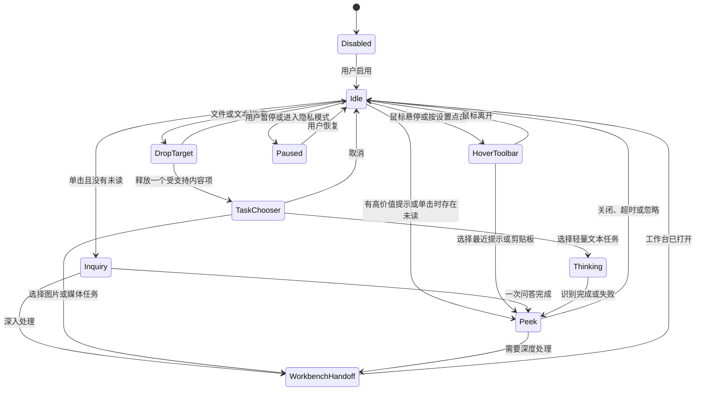

# 桌面情境助手 PRD（冻结稿）

最后更新：2026-07-31

状态：开发前设计评审已完成。`D-01` 至 `D-84` 已确认；`D-84` 是对实际使用中“上下文错配、多个触发互相覆盖、瞬时状态吞消息、截图失败后不恢复”的最终修订，并覆盖此前固定 `8s` 聚合和二次评论模型相关结论。

产品工作名：桌面情境助手

界面工作名：悬浮球

配套实施方案：[桌面情境助手实施方案](floating-context-assistant-implementation-plan.md)

## 0. 文档约定

本文使用两种范围状态：

- `已确认`：来自当前讨论，后续设计和实现应遵守。
- `下一期草案`：不属于 V1 实现承诺，未来立项时重新评审。

当前已确认的方向：

1. 现有“悬浮组件”没有实现真正的桌面悬浮球体验，需要重新设计，而不是只修改窗口样式。
2. 新悬浮球应能接收文件、剪贴板、选中文字及其他明确授权的上下文。
3. 新悬浮球应能观察用户操作中的语义模式，并给出意见、提醒、轻度吐槽或玩笑。
4. 助手需要长期在场但保持安静，不能因为追求主动性而频繁打断用户。
5. 用户希望先详细讨论需求，再开始实现。
6. 主动观察和后台评论优先使用本地能力，不以持续调用远程模型为前提。
7. 助手需要将经过清洗的行为记录保存在本地，后续可作为模型理解用户习惯和判断提示价值的依据。
8. 高价值消息不能只靠简单阈值判断；确定性规则先筛选候选，再由较强的本地判断模型评估是否值得主动打扰。
9. 悬浮球不提供贴边吸附、自动收起、缩放外滑或半隐藏状态，只保留自由拖动和位置记忆。
10. 新桌面情境助手彻底替换旧悬浮组件；首次由用户手动启用，启用后随 llmTools 启动自动恢复。
11. 悬浮球、悬停工具条和瞥见卡始终置顶且不提供图钉；完整工作台继续使用既有窗口层级。
12. 全屏 Space 默认隐藏悬浮球，只累计未读消息；用户可以在设置中选择在全屏应用上显示。
13. 悬停工具条只提供“最近提示”和“剪贴板”，小型询问由悬浮球单击进入。
14. 小型询问是一次问答，不保存多轮聊天会话；需要继续处理时携带上下文进入 Quick Action。
15. 当前会话最多保留 `20` 条最近提示；未读徽标最大显示 `9+`，提示卡与行为记录分别管理。

需求口径优先级：

1. 后续对本 PRD 中 `D-xx` 项作出的明确结论。
2. 本 PRD 的“已确认”内容。
3. 当前对话中已经明确的产品目标。
4. 既有 Phase 1 悬浮组件规格。
5. 当前 `FloatingWidgetView` 实现。

## 1. 背景与现状

### 1.1 原始设想

Phase 1 对悬浮组件的定义包含：

- 紧凑桌面组件。
- 可拖动。
- 可贴靠屏幕边缘。
- 贴边后自动收起。
- 鼠标悬停或点击后展开。
- 展开后支持文本输入、任务选择、执行、结果预览和复制。
- 支持拖入纯文本、TXT 和 Markdown 文件。

### 1.2 当前实现

当前实现是一个普通标题窗口：

- 初始尺寸约为 `360 x 520`。
- 主体长期显示任务、语言、模型、输入框、运行按钮和结果区。
- 贴边收起只将窗口宽度压缩到约 `42pt`，没有独立的圆形休眠界面。
- 收起后需要点击展开，没有真正的悬停快捷工具条或瞥见卡。
- 文件拖入直接进入既有文件加载逻辑，缺少文件类型识别后的任务建议。
- 没有剪贴板变化观察、用户活动模式识别、主动建议、评论或短期上下文。

因此，当前“悬浮组件”更接近独立版 Quick Action，不是桌面悬浮球，也不是情境助手。

上述贴边和自动收起只用于说明旧规格与当前实现，不再属于本 PRD 的目标范围；最终决策见 `D-03` 和 `D-32`。

### 1.3 本次重构机会

llmTools 已经具备可复用能力：

- Accessibility 选中文本读取和划词触发。
- 剪贴板快照、所有权保护和内容类型识别。
- 本地语言检测和 Fast MT。
- 本地或已配置文本模型的翻译、润色、总结、解释和待办提取。
- 图片 OCR、结构化提取和图像解释。
- 音视频文件转写和字幕导出。
- 本地 TTS。
- Chromium 扩展、Native Host 和本地桥接。
- 模型运行、取消和闲置卸载机制。

本需求的主要工作不是再增加一种模型，而是增加统一的上下文事件、模式判断、打扰策略和悬浮交互。

## 2. 产品定义

### 2.1 一句话定义

桌面情境助手是一个常驻 macOS 桌面、以悬浮球为入口的本地助手。它在用户明确授权的范围内感知剪贴板、选区、文件和应用切换，从中识别值得提醒的行为模式，并以一句简短评论和一到三个可执行动作提供帮助。

### 2.2 核心价值

1. 随时可达：无需先打开主窗口再描述上下文。
2. 理解当下：尽可能利用用户刚刚产生的真实上下文。
3. 适度主动：只在有明确价值时出现。
4. 给出下一步：评论必须尽可能连接到实际动作。
5. 本地可信：后台观察、短期上下文和评论默认留在本机。
6. 有性格但不冒犯：幽默服务于缓解重复劳动和提供帮助，不攻击用户。

### 2.3 产品边界

桌面情境助手不是：

- 全局键盘记录器。
- 持续录屏并逐帧分析的监控程序。
- 未经用户启动就持续监听麦克风的语音助手。
- 自动点击所有界面、自动执行命令的自治代理。
- 取代 Quick Action、OCR、媒体字幕和 TTS 工作台的新大窗口。
- 以随机段子代替真实帮助的娱乐挂件。
- 对用户情绪、身份、能力或健康状态作无依据推断的陪伴机器人。

## 3. 产品目标与成功标准

### 3.1 产品目标

- 将悬浮组件从大表单改造成真正的紧凑悬浮球。
- 支持休眠、悬停工具条、小型询问、瞥见卡、拖入和工作台跳转等清晰状态。
- 统一接入显式输入和授权上下文。
- 首个 MVP 识别重复失败和连续外语复制；长时间停滞模式放到下一期。
- 提供专业、温和、元气、冷静、俏皮少女、轻度吐槽六种可选择表达风格。
- 建立严格的打扰频率、敏感内容、权限和短期留存规则。
- 没有可用文本模型时仍能通过规则模板提供基本体验。

### 3.2 初步成功指标

以下指标用于产品验收和本地调试，不代表必须上传外部遥测：

- 悬浮球长期开启后，用户没有因为频繁弹出而关闭功能。
- 主动卡片的“有用”或动作点击比例高于直接忽略比例。
- 同类提示被选择“不要再提醒”的比例可控。
- 普通空闲状态不持续占用文本模型。
- 敏感应用和敏感文本没有进入持久化历史或诊断日志。
- 用户可以从任意提示看到“为什么出现”。
- 用户可以在两步以内暂停所有观察。
- 明确操作后，文件、剪贴板和选区都能跳转到正确的既有工作流。
- 本地行为记录可以解释、查看和清除，并能在不暴露原始按键、鼠标轨迹和敏感内容的前提下，为后续价值判断提供依据。
- 主动展开的提示必须通过高价值判断；模型不确定、模型不可用或证据不足时只能降级为徽标或静默处理。

`已确认 D-01`：需要将行为记录保存在本地，后续可以作为模型依据。记录对象是经过清洗的结构化行为、模式结果、提示、用户反馈和动作结果，不是原始键盘记录、鼠标轨迹或不受控的屏幕内容。具体记录粒度、保存期限和模型使用方式由 `D-29` 至 `D-31` 继续确认。

## 4. 产品原则

### 4.1 安静优先于聪明

无法确定是否有帮助时，默认只显示状态点或不显示，不主动展开评论。

### 4.2 语义事件优先于原始输入

观察“切换了应用”“复制了外语”“同一错误重复出现”，而不是保存每次鼠标坐标和每个键盘按键。

### 4.3 行动优先于段子

除纯状态提示外，每条主动评论应至少满足一个条件：

- 提供明确下一步。
- 允许立即执行一个低风险动作。
- 帮助用户整理、记下、理解或停止重复劳动。

### 4.4 证据优先于猜测

评论必须由明确事件或模式触发。用户应能展开查看触发原因，例如“过去 6 分钟检测到相同错误 3 次”。

### 4.5 明确授权优先于无感获取

需要 Accessibility、屏幕录制、麦克风、浏览器内容等权限时，应在首次使用对应功能时解释和申请，不在首次启动时一次性索要全部权限。

### 4.6 用户控制优先于自动执行

助手可以建议命令、替换文本、创建提醒或执行网页动作，但在产生外部副作用前必须获得用户确认。

### 4.7 失败必须诚实降级

无法获得上下文时说明缺少什么；模型不可用时使用规则模板或只给出动作，不能伪装成已经理解了当前内容。

## 5. 核心术语

| 术语 | 定义 |
| --- | --- |
| 悬浮球 | 可在桌面自由放置的紧凑入口，不等同于完整工作台 |
| 悬停工具条 | 鼠标悬停或按设置点击后，在悬浮球内侧显示的紧凑图标工具条 |
| 瞥见卡 | 锚定在悬浮球旁的小型非激活提示面板，只展示一条主要信息 |
| 工作台 | 现有 Quick Action、OCR、媒体字幕或 TTS 等完整界面 |
| 上下文源 | 剪贴板、选区、文件、当前应用、浏览器和屏幕等输入来源 |
| 活动事件 | 对用户操作进行清洗后的结构化语义事件 |
| 行为模式 | 在一个时间窗口内由多个活动事件组成的可解释模式 |
| 主动提示 | 未经用户当前点击“询问”而由高价值模式触发的提示 |
| 评论 | 助手对模式的简短自然语言表达，可为专业建议、提醒或玩笑 |
| 触发依据 | 用于解释提示为什么出现的事实摘要 |
| 短期上下文 | 仅用于当前判断、到期自动删除的内存数据 |

## 6. 范围

### 6.1 V1 范围

- 真正的圆形或紧凑悬浮球窗口。
- 完整替换旧悬浮组件入口，不并存两套组件。
- 首次显式启用、后续启动自动恢复，以及隐藏和停用两种不同生命周期。
- 始终置顶的非激活悬浮球、悬停工具条和瞥见卡；不显示图钉。
- 全屏 Space 默认隐藏、可配置显示；隐藏期间只累计消息。
- 自由拖动、位置记忆和跨桌面显示选项；不提供贴边吸附或自动收起。
- 休眠态、悬停工具条、小型询问、瞥见卡、拖入态、思考态和暂停态。
- 显式拖入文本、图片、音频、视频、TXT 和 Markdown。
- 剪贴板文本变化观察，支持外语检测和安静翻译提示。
- 选中文本事件接入。
- 当前前台应用元数据，不默认读取完整窗口内容，也不生成频繁切换模式。
- 两类行为模式：重复失败、连续外语复制。
- 专业、温和、元气、冷静、俏皮少女、轻度吐槽六种表达风格。
- 手动、安静、适中、活跃四档主动程度。
- 提示触发依据、反馈、忽略和同类屏蔽。
- 全局暂停、定时暂停、隐私模式和应用排除列表。
- 后台评论只使用本地模型或规则模板。
- 复杂任务跳转到既有工作台。
- 本地保存经过清洗的结构化行为记录，为反馈统计和后续模型判断提供依据。
- 使用确定性预筛选和较强本地模型复核的高价值判断链路；不确定时不得主动展开。
- 用户开启增强窗口上下文后，低频截取当前前台窗口并由本地通用 VLM 生成短期场景摘要。
- 不要求每次表达都映射功能；观察、鼓励、关心和轻度吐槽是第一类主动输出，工具入口仅在确实匹配时出现。

### 6.2 V1 后候选范围

以下仅是候选方向，不属于本次实施承诺：

- 浏览器页面语义事件和按站点授权；不作为桌面助手理解网页的前置依赖。
- 更稳定的 IDE、终端和构建结果适配器。
- 按住悬浮球说话和本地 TTS 回复。
- 本地日历、提醒事项和任务工具接入。
- 对历史提示进行搜索和会话整理。
- 用户可编辑的角色设定和语言风格模板。
- 基于明确反馈调整不同模式的提示权重。
- 长时间停滞模式 `P-04`。
- 手动朗读助手评论。

### 6.3 明确不在 V1

- 全局原始按键记录。
- 高频截图、全桌面录制或视频流视觉分析。
- 后台常开麦克风唤醒词。
- 自动运行 Shell 命令。
- 自动修改或删除本地文件。
- 自动发送消息或邮件。
- 无确认创建外部日历和提醒事项。
- 跨设备同步用户活动。
- 云端行为画像。
- 长期保存完整剪贴板、屏幕截图、字幕或窗口标题。

## 7. 总体交互模型

### 7.1 状态机



### 7.2 休眠态

`V1 已确认规则`：

- 直径 `48pt`。
- 无系统标题栏。
- 首次显示在主屏右侧中下区域，但不吸附到屏幕边缘。
- 用户可以自由拖动；靠近屏幕边缘时不吸附、不缩放、不外滑、不半隐藏。
- 正常状态只显示产品图标和细状态环。
- 不因状态文字、徽标或动画改变占位尺寸。
- 窗口不抢占当前应用键盘焦点。
- 悬浮球始终使用置顶非激活层级，不提供图钉或普通窗口层级切换。
- 位置按显示器分别记忆；显示器消失后回落到主屏可见区域。
- 默认加入所有普通 Spaces；进入全屏 Space 时隐藏，除非用户开启“在全屏应用上显示桌面助手”。

状态表达：

| 状态 | 视觉规则 |
| --- | --- |
| 空闲 | 中性灰或应用图标原色 |
| 可用上下文 | 蓝色细环或小圆点 |
| 正在处理 | 低幅度环形进度动画 |
| 有未读提示 | 右上角数字徽标，最大显示 `9+` |
| 已暂停 | 斜线或灰色暂停标识 |
| 隐私模式 | 明确锁形标识，不使用含糊颜色代替 |
| 错误 | 小型警示点，点击后解释，不持续闪烁 |

`已确认 D-02`：悬浮球默认直径采用 `48pt`。

`已确认 D-03`：取消贴边功能。悬浮球靠近屏幕边缘时不吸附、不自动收起，也不改变形态。用户可以把它自由放在安全可见区域，位置照常记忆。

`已确认 D-32`：取消贴边收边动效，不制作“缩小+外滑”“只外滑”或边缘把手原型，也不保留隐藏开关。

`已确认 D-04`：默认覆盖所有普通 Spaces；全屏 Space 的确定性行为由 `D-36` 约束，不再尝试猜测当前内容是否为视频或演示。

`已确认 D-34`：新桌面情境助手彻底替换旧悬浮组件。状态栏入口改为“启用/显示桌面情境助手”，不保留旧完整组件。升级后不突然弹出；用户首次手动启用并完成引导后，悬浮球在以后每次启动 llmTools 时自动恢复。隐藏只影响当前可见性，停用才停止观察并阻止下次自动显示。

`已确认 D-35`：悬浮球、悬停工具条和瞥见卡始终使用非激活置顶面板，不显示图钉，也不允许切换到普通窗口层级。只有用户点击小型询问输入时才取得键盘输入；Quick Action 等完整工作台继续使用各自既有层级和图钉策略。

`已确认 D-36`：普通 Space 中悬浮球始终显示；全屏 Space 默认隐藏。设置提供“在全屏应用上显示桌面助手”开关，默认关闭。全屏隐藏期间观察器按授权继续工作，但不主动弹卡，只累计未读消息；离开全屏后恢复悬浮球和徽标。

### 7.3 悬停工具条

鼠标停留 `350ms` 后显示，不立即展开内容卡。鼠标移出悬停工具条和悬浮球后延迟 `300ms` 收起，避免移动到按钮途中消失。

V1 只显示两个图标动作：

| 图标语义 | 动作 | 说明 |
| --- | --- | --- |
| 最近提示 | 打开当前会话提示列表 | 优先定位最新未读提示 |
| 剪贴板 | 查看最近剪贴板建议 | 不直接展示敏感全文 |

交互约束：

- 工具条始终出现在悬浮球朝向屏幕内部的一侧，并根据四周可用空间自动选择横向或纵向布局。
- 只显示图标，不常驻文字；图标使用系统 SF Symbols，并提供 Tooltip 和 VoiceOver 名称。
- “看当前窗口”和“语音”留到下一期，不在 V1 中显示空按钮或占位符。
- 文件拖入不占用工具条按钮；拖动内容接近悬浮球时自动进入拖入态。

`已确认 D-05，按 D-37 修订`：原“询问、剪贴板”方案改为“最近提示、剪贴板”。询问由悬浮球单击负责，避免两个入口做同一件事；屏幕和语音不显示占位。

`已确认 D-06`：默认悬停显示悬停工具条，设置中允许改为“点击后显示”。

`已确认 D-37`：V1 使用紧凑悬停工具条，不使用环绕式动作环。工具条按屏幕空间自适应出现在悬浮球内侧，`350ms` 后显示、移出后延迟 `300ms` 收起，只包含“最近提示”和“剪贴板”。

### 7.4 单击、双击和右键

`V1 已确认规则`：

- 单击：打开最近一条提示；没有提示时打开小型询问输入。
- 双击：不绑定隐藏功能，避免与单击冲突。
- 右键：打开系统菜单。
- 拖动：移动悬浮球，不触发单击。

右键菜单至少包括：

- 打开 Quick Action。
- 查看最近提示。
- 暂停 1 小时。
- 暂停到明天。
- 隐私模式。
- 设置。
- 隐藏悬浮球。
- 停用桌面情境助手。
- 退出 llmTools。

“隐藏”和“停用”必须明确区分：隐藏只让当前悬浮球不可见，观察器和下次启动自动显示设置不变；停用会停止所有助手观察器、隐藏悬浮球，并在下次启动时保持停用。

`已确认 D-07`：单击无未读提示时打开小型询问输入；最近提示由悬停工具条的独立入口访问。

生命周期与偏好规则：

- 隐藏悬浮球只影响界面可见性，观察器、来源选择和下次启动自动恢复不变。
- 暂停助手立即停止后台观察和主动提示，但保留来源开关；定时结束或手动恢复后按原选择重新启动。
- 停用助手停止所有观察器、隐藏悬浮球，并让下次启动保持停用；来源选择、性格、主动程度和已有行为记录继续保留。
- 已完成当前版本引导后重新启用，不重复三步引导；先显示将恢复的来源摘要，用户确认“启用”后才启动观察器。
- “仅手动使用”是所有后台来源关闭的预设，助手本身仍处于启用状态。
- 隐藏、暂停和停用均不自动删除行为记录；数据删除使用独立操作。

`已确认 D-46`：隐藏只隐藏界面；暂停临时停止观察；停用停止并保持停用但保留配置和数据；重新启用先确认将恢复的来源；仅手动使用作为零后台来源预设。

### 7.5 小型询问

小型询问用于快速处理一个问题，不承担多轮聊天和历史管理。

交互规则：

- 每次只接受一个问题并返回一条回答；回答完成后不出现连续对话输入框。
- 新问题始终创建新的独立问答，不自动拼接上一次问答。
- 默认不隐式带入无关内容；用户可以通过明确的上下文标签选择附带“当前剪贴板”或“当前提示”。
- 上下文标签必须显示来源，敏感或已过期内容不可附带。
- 回答显示为一张瞥见卡，并提供“深入处理”动作。
- “深入处理”把当前问题、回答和用户明确附带的上下文交给 Quick Action 的解释流程，不丢失内容。
- 输入框按 `Enter` 发送，`Shift+Enter` 换行，`Esc` 关闭；组合输入法正在组词时不得误发送或误关闭。
- 小型询问不建立聊天记录；提示卡只按当前会话最近提示规则保存。

`已确认 D-38`：V1 小型询问采用一次问答方案，不实现短会话或多轮聊天。需要延伸时携带本次问题、回答和显式上下文进入 Quick Action。

### 7.6 瞥见卡

瞥见卡只承载一条主要提示，不复制完整工作台。

`V1 已确认规则`：

- 宽度 `320pt`，高度按内容变化但不超过 `220pt`。
- 锚定在悬浮球内侧，避免越出当前屏幕。
- 默认不抢键盘焦点；只有用户点击输入区时才激活。
- 最多显示两行评论、一行依据摘要和三个动作。
- 超长正文只显示摘要，点击“查看内容”进入工作台。
- 主动出现后 `12s` 无交互自动收回为未读徽标。
- 用户正在拖动、全屏播放、演示或输入密码时不自动展开。

内容顺序：

1. 来源标签，例如“剪贴板”“Safari”“文件”。
2. 一句评论或建议。
3. 必要时显示一行触发依据。
4. 一到三个动作。
5. “有用”“不好笑/不相关”“忽略同类”反馈入口。

`已确认 D-08`：安静档只显示徽标，适中/活跃档才允许高价值提示主动展开。高价值不能只由简单规则或轻量评论模型决定：规则先进行低成本候选筛选，再由较强的本地判断模型对相关性、行动价值、紧迫性、证据充分度和打断成本进行结构化判断。模型不够可靠、不可用、输出不合法或置信不足时，只能降级为徽标或静默，不得主动展开。

`已确认 D-09`：主动瞥见卡显示 `12s`，无交互后收回为未读徽标。

### 7.7 拖入态

当系统拖拽内容进入悬浮球时：

- 初始命中区域就是可见的 `48pt` 悬浮球，不使用长期存在的透明扩大窗口。
- 内容进入后，悬浮球立即扩大为 `120pt` 的可见投放区域。
- 显示当前识别出的内容类型。
- 可处理时显示“松开选择任务”。
- 不支持时在松手前显示“不支持此类型”。
- 一次只接受一个内容项；多个文件、文件夹或文件与文本混合拖入时，显示“一次仅支持一个文件”，整批拒绝且不部分接收。
- 拖出扩展后的投放区域时恢复原位置和 `48pt` 尺寸。
- 不把批量文件处理列入当前 V1 或后续需求池；只有未来出现新的明确需求时才重新评审。

释放后的任务路由：

| 输入 | 任务选择 | 选择后的行为 |
| --- | --- | --- |
| 纯文本、TXT、Markdown | 翻译、总结、解释、提取待办 | 选择即确认，使用当前默认设置直接运行；失败或需要复杂设置时可进入 Quick Action |
| 图片 | OCR、结构化提取、翻译图片、解释图片 | 打开既有 OCR 工作台并预载图片，由工作台负责模型选择、执行和结果 |
| 音频、视频 | 转写、翻译字幕 | 打开对应媒体工作台并预载文件；用户检查语言、模型等设置后手动开始，不自动运行高资源任务 |
| 独立 URL | 复制链接、在浏览器打开 | V1 不抓取或分析页面正文；URL 作为普通文本的一部分时可随文本任务处理 |
| PDF、DOCX、文件夹和其他不支持类型 | 无 | 松手前明确显示不支持，不导入、不假装已解析 |
| 多个内容项 | 无 | 整批拒绝，不部分处理，不提供批量入口 |

`已确认 D-10，按 D-41 细化`：释放一个受支持内容项后先显示任务选择。选择轻量文本任务后可以立即运行；图片和媒体任务进入对应工作台，媒体高资源任务仍需用户手动开始。

`已确认 D-40`：V1 一次只处理一个拖入内容项。多个文件、文件夹或混合拖入整批拒绝，不部分接收；暂不考虑批量文件处理，也不为其预留产品入口。

`已确认 D-41`：文本任务在用户选择后直接运行；图片进入预载的 OCR 工作台；音视频进入预载的媒体工作台并由用户手动开始；独立 URL 只允许复制或在浏览器打开；不支持类型不导入。

`已确认 D-42`：拖入初始命中区域为真实 `48pt` 悬浮球，进入后扩展为 `120pt` 可见投放区域。V1 不使用可能拦截底层应用操作的大型透明感应窗口。

## 8. 上下文源与权限

### 8.1 上下文分级

| 上下文源 | 可以读取 | 明确不读取 | V1 默认 | 权限 |
| --- | --- | --- | --- | --- |
| 前台应用 | 应用名、Bundle ID、激活时间 | 应用内正文 | 开启 | 无额外系统权限 |
| 窗口元数据 | 清洗后的窗口标题、角色 | 密码字段、隐藏窗口全文 | 关闭 | Accessibility |
| 剪贴板 | 类型、变化时间；授权后读取文本 | 敏感类型全文、历史无限留存 | 首次引导必须明确选择 | 通常无额外系统权限 |
| 选中文字 | 用户触发或已启用划词时的文本 | 未选择的周边全文 | 仅接收用户主动触发的选区 | Accessibility/复制兜底 |
| 文件拖入 | 用户明确拖入的文件描述和内容 | 未拖入的目录扫描 | 开启 | 用户显式动作 |
| 浏览器 | 域名、页面标题；授权后读取当前页结构 | 其他标签页、无权限站点内容 | 关闭 | 扩展站点权限 |
| 当前窗口截图 | 用户触发的一次截图 | 持续录屏、其他窗口 | 关闭 | 屏幕录制 |
| 空闲时间 | 最近一次输入距今时间 | 原始按键和鼠标轨迹 | 开启 | 系统事件元数据 |

### 8.2 首次启用与授权流程

首次从状态栏或 Settings 启用桌面情境助手时，打开三步独立引导窗口：

1. 说明助手会读取什么、不会读取什么，以及后台不会自动调用远程模型。
2. 让用户选择允许的上下文源，剪贴板必须明确选择“允许观察”或“暂不允许”。
3. 说明本地行为记录、保留规则，并展示默认“安静 + 温和搭档”。

引导规则：

- 完成引导后才显示悬浮球并启动已授权观察器。
- 提供“仅手动使用”：启用悬浮球、小型询问和单项拖入，但关闭所有后台上下文观察。
- 关闭或取消引导时，助手保持停用，不启动观察器，也不创建行为记录文件。
- 首次引导不集中请求 Accessibility、屏幕录制或麦克风权限；只有用户真正开启依赖权限的来源时才解释并请求。
- 前台应用活动默认开启，只读取应用标识、类别和激活时间；引导中必须显示开关。
- 选中文字默认接入用户主动触发的既有划词或 Quick Action 选区，不新增被动扫描。
- 窗口标题默认关闭。
- 文件拖入和小型询问属于显式输入，助手启用后始终可用，不作为观察开关。
- 浏览器、当前窗口截图和语音入口在 V1 只显示“后续版本”说明，不显示可开启的假开关，也不申请相关权限。

`已确认 D-43`：采用上述三步独立引导。完成后才启用助手；可选择“仅手动使用”；取消时保持停用且不创建行为记录；系统权限延迟到真正使用对应来源时申请。

`已确认 D-44，按 D-58 修订`：前台应用元数据默认开启；剪贴板必须明确二选一；选区只接入主动触发事件；窗口标题默认关闭；显式拖入与询问始终可用；下一期能力不显示假开关。桌面助手不提供实时字幕或会议上下文开关。

### 8.3 系统权限状态

- 每项系统权限独立申请、独立降级，不能因为一项被拒绝而停用整个助手。
- 用户拒绝后，对应来源保持关闭，显示“未授权”和“打开系统设置”，不重复自动弹出系统权限框。
- 用户在系统设置撤销权限后，立即停止相关观察器，并删除该来源尚未过期的原始短期上下文。
- 撤销权限不自动删除已经生成的脱敏结构化行为记录；设置提供“同时清除该来源历史记录”的明确动作。
- 权限重新获得后只处理重新授权后的新事件，不补采中断期间的内容。
- 权限状态变化只更新状态徽标和 Settings，不生成主动评论、玩笑或系统通知。

`已确认 D-45`：系统权限按需申请；拒绝或撤销只关闭受影响来源。撤销时删除该来源未过期原始上下文，但保留已有脱敏行为记录直到用户明确清除；恢复后不补采历史事件。

### 8.4 原始键盘和鼠标边界

允许：

- 统计应用切换。
- 识别已有全局快捷键。
- 判断用户是否空闲。
- 在明确适配器中识别“重复执行”这类高层事件。
- 识别拖拽开始、进入和结束。

禁止：

- 记录原始按键序列。
- 保存鼠标移动轨迹。
- 将全局点击坐标交给 LLM 猜测用户意图。
- 在密码输入、认证器、银行等敏感场景采集内容。
- 使用输入事件重建用户聊天、密码或命令历史。

### 8.5 剪贴板规则

`V1 已确认规则`：

- 只在 `changeCount` 变化时处理一次。
- 先判断类型、长度、重复和敏感性，再决定是否读取或送入模型。
- 相同内容指纹在短期内只处理一次。
- 少于建议阈值的短文本不触发主动翻译，但手动查看仍可处理。
- 超长文本只生成本地指纹和截断摘要，深度处理交给工作台。
- 图片、文件和富文本默认只读取类型，除非用户主动打开或拖入。
- 疑似密码、Token、私钥、验证码时不生成玩笑，不进入模型，不持久化。
- 助手自己写入剪贴板的结果不能再次触发助手。

`已确认 D-11`：首次打开情境助手时单独说明剪贴板观察的范围、用途和留存规则，并让用户明确选择，不能静默开启。

`已确认 D-12`：剪贴板单条文本进入短期上下文的最大长度为 `12,000` 字符，超过后只保留指纹、类型和前后少量摘要。

### 8.6 当前应用和窗口

前台应用元数据只用于应用排除、敏感来源过滤和行为记录归类，不据此生成频繁切换提示。

`V1 已确认规则`：

- 默认只保存应用标识和激活时间。
- 窗口标题属于可选增强上下文。
- 标题进入事件前移除明显文件路径、查询参数、邮箱地址和长数字串。
- 每个应用可以单独设置“允许元数据”“允许标题”“完全排除”。
- 密码管理器、认证器和用户指定的敏感应用默认完全排除。

`已确认 D-13`：默认不读取窗口标题，只有用户开启“增强应用上下文”后才读取清洗后的标题。

### 8.7 浏览器上下文

浏览器扩展能提供比屏幕坐标更可靠的网页语义，但必须按站点授权。

`下一期草案`分层：

1. 基础：域名、页面标题、URL 去参数后的路径类型。
2. 增强：当前可见正文、选区、表单结构和可交互元素。
3. 操作：在用户确认后执行点击、填写、筛选、提取和导出。

`已确认 D-14`：浏览器上下文不进入首个 MVP，作为下一期需求；先让悬浮球、剪贴板和基础模式稳定。

### 8.8 屏幕内容

`D-74 覆盖 D-15`：用户开启“增强窗口上下文”后，助手可读取当前前台窗口截图作为主要语义来源：

- 不运行固定截图心跳；只在系统最后输入时间发生变化后防抖截取一次，并限制最短截图间隔。
- 连续空闲 `60s`、锁屏、会话失活、屏幕休眠或系统睡眠时立即取消待处理截图和主动判断；恢复后必须等到新的用户操作才继续。
- 只截取前台应用的单个可见窗口，不截全桌面、其他窗口或鼠标指针。
- 图片先缩放到最长边不超过 `1600px`，内容哈希未变化时不调用模型。
- 只调用本地、同时支持文本和图像的通用 VLM；专用 OCR 模型不承担场景理解，不使用 Apple Vision/VisionKit 做语义识别。
- PNG 只存在于当前内存任务；模型完成后立即释放。短期上下文仅保留受限结构化场景摘要，最长 `10min`，行为记录不保存图片或可逆正文。
- 排除应用、敏感文本、用户任务抢占、输入中、全屏、静默时段、主动频率和本地模型资格门继续生效。
- ScreenCaptureKit 只负责取图；浏览器插件不再是桌面助手获得网页状态的前置项目，既有网页翻译扩展保持独立。

### 8.9 与现有字幕和会议功能的边界

- 桌面情境助手不订阅实时字幕、系统音频、会议转写或会议纪要数据。
- 不提供会议行动项、决定、会中提醒或会议授权开关。
- 现有实时字幕、会议转写和会后纪要工作台保持独立，不因本 PRD 删除或改变。
- 用户显式拖入音频或视频时，仍可进入既有媒体字幕工作台完成转写或字幕翻译；这属于文件路由，不是会议观察。

`已确认 D-58，取消 D-47 和 P-05`：从桌面情境助手中移除全部会议和实时字幕上下文能力，不安排后续阶段。现有 llmTools 字幕、会议转写和纪要工作台不受影响。

## 9. 活动事件模型

### 9.1 事件字段

建议每个清洗后的活动事件至少包含：

```text
ActivityEvent
- id
- occurredAt
- type
- source
- appIdentity?
- contentType?
- sanitizedSummary?
- contentFingerprint?
- sensitivity
- confidence
- ephemeralContextReference?
- expiresAt
```

原则：事件本身尽量不携带完整内容；完整文本放入有 TTL 的临时上下文存储，通过引用访问。

### 9.2 V1 事件类型

- `applicationActivated`
- `windowContextChanged`
- `clipboardChanged`
- `selectionCaptured`
- `fileDropped`
- `foreignTextDetected`
- `taskStarted`
- `taskCompleted`
- `taskFailed`
- `repeatedContentObserved`
- `idleStateChanged`
- `assistantSuggestionActed`
- `assistantSuggestionDismissed`

### 9.3 去重和时间顺序

- 同一来源、同一内容指纹、同一应用的重复事件应合并计数。
- 助手自己触发的剪贴板、窗口或任务事件应带来源标记，避免循环触发。
- 异步模型结果按原始事件时间归属，不按完成时间伪装成刚发生。
- 上下文过期后，晚到的模型结果应丢弃或降级为不含原文的状态提示。
- 每个检测器只读取完成判断所需的最小事件集合。
- `ActivityEvent` 只保存在内存，不写入磁盘；最多保留 `60min` 且最多 `2,000` 条。
- 普通原始文本仍受 `10min` TTL 约束；过期后只允许保留指纹、类别和结构化计数。
- 只有模式判断、提示决策、用户反馈和动作结果可以形成持久化 `BehaviorRecord`。
- 隐藏悬浮球不清空事件；暂停、隐私模式、停用和退出 app 清空所有内存事件与原始短期上下文。

`已确认 D-50`：活动事件采用有界内存队列，不持久化原始事件。内存最多 `60min`/`2,000` 条，原始文本最多 `10min`；暂停、隐私模式、停用和退出时清空，持久化脱敏行为记录不受影响。

### 9.4 本地行为记录

`D-01` 已确认需要持久化行为记录，并在后续作为模型判断和个性化依据。这里的“行为记录”是清洗后的语义记录，不是对用户输入过程的完整复刻。

建议记录结构：

```text
BehaviorRecord
- id
- occurredAt
- patternType
- sourceTypes[]
- appIdentity?
- appCategory?
- evidenceFeatures
- sanitizedEvidenceSummary?
- contentFingerprint?
- assistantDecision
- judgmentModelID?
- judgmentConfidence?
- presentationResult
- userFeedback?
- selectedActionID?
- actionSucceeded?
- expiresAt?
```

建议必须记录：

- 识别到的模式类型。
- 触发所用来源类别。
- 次数、持续时间、相似度等结构化证据特征。
- 助手最终选择静默、徽标还是主动展开。
- 使用的判断模型和置信度。
- 用户是否查看、采纳、忽略、认为不相关或认为不好笑。
- 用户选择了哪个动作，以及动作是否成功。

默认不得记录：

- 原始按键序列。
- 鼠标移动和点击坐标轨迹。
- 密码、验证码、Token、私钥等敏感正文。
- 完整截图和音频。
- 未经清洗的完整窗口标题。
- 为了“以后可能有用”而无限保存的剪贴板全文。

字段级隐私规则：

- 普通且未排除应用可以保存 Bundle ID 和粗粒度应用类别；不单独保存应用显示名称。
- 应用显示名称只在展示时根据当前 Bundle ID 动态解析，解析失败时显示应用类别。
- Bundle ID 只用于同应用反馈和个性化，不能单独成为主动提示依据。
- “完全排除”的应用不产生 `ActivityEvent` 或 `BehaviorRecord`，也不保存“出现过一次”的计数。
- 普通应用中识别到敏感内容时，只保存“已因敏感性抑制”的最小状态，不保存 Bundle ID、摘要或指纹。
- 文件路径、项目名、窗口标题和文档名不能进入 `appIdentity`。
- `sanitizedEvidenceSummary` 最多 `240` 字符；不能截取原文前缀冒充脱敏摘要。
- 摘要依次经过来源专用确定性清洗、必要时本地概括、再次确定性清洗和长度限制；任一步无法确认安全时不保存摘要。
- 摘要清除 Token、私钥、验证码、邮箱、完整 URL 查询参数、用户目录路径和明显个人标识。
- 内容指纹使用本地随机密钥的 `HMAC-SHA256`，不能使用可被短文本字典猜测的普通未加盐哈希。
- 指纹只用于去重、相似历史定位和计数，不展示给用户，也不发送给模型。
- 清除全部行为记录和聚合偏好时同时轮换指纹密钥，使清除前后记录不可继续关联。

`已确认 D-52`：普通应用保存 Bundle ID 与粗粒度类别，不持久化显示名称；完全排除应用不留任何事件或记录；敏感内容只留最小抑制状态且不带应用身份、摘要或指纹。

`已确认 D-53`：脱敏证据摘要最多 `240` 字符，只有确有解释价值时才生成，执行“确定性清洗 -> 必要时本地概括 -> 再清洗 -> 限长”；无法确认安全时保存 `nil`。

`已确认 D-54`：指纹使用原生 CryptoKit `HMAC-SHA256` 和本地随机私有密钥，不使用 Keychain。只规范换行、Unicode 和首尾空白；来源适配器可先去除时间戳、临时路径等噪声。指纹不展示、不送入模型，清除全部时轮换密钥。

行为记录的模型用途：

1. 统计某类提示对当前用户是否经常有用。
2. 降低被多次忽略或标记“不相关”的模式权重。
3. 调整用户对专业、温和和吐槽表达的偏好。
4. 为高价值判断模型检索少量相似历史结果，例如“同类提示过去 5 次有 4 次被忽略”。
5. 帮助用户回顾助手为什么越来越安静或更主动。

V1 模型使用规则：

- 先按模式、来源类型、应用类别和用户反馈做确定性过滤与权重计算。
- 聚合偏好只保存统计结果和偏好权重，例如某类提示的展示、采纳、不相关和不好笑次数。
- 每次判断最多检索 `3-5` 条与当前候选最相关的脱敏行为记录。
- 不把完整 `30days` 行为记录一次性交给模型。
- V1 不引入向量数据库；优先使用模式、应用类别、来源和反馈字段进行结构化检索。
- 设置中提供“使用行为记录优化助手”开关；关闭后，即使记录仍保留，也不能进入模型上下文或调整判断权重。
- 清除详细记录和聚合偏好后，后续判断立即恢复默认策略。
- V1 不自动使用行为记录进行微调、LoRA 或持续训练。
- 任何未来本地训练都需要独立需求、训练数据预览、显式启动、可取消和可删除训练产物。

存储要求：

- 存储目录仅当前用户可访问，目录权限目标为 `0700`，记录文件目标为 `0600`。
- 行为记录与 `Recent History`、其他工作台草稿和模型注册表分开。
- 行为记录使用独立版本化本地文件，不混入通用 `history.json`，也不引入远程存储。
- 详细行为记录保留 `30days`。
- 详细行为记录同时受最多 `5,000` 条和最多 `10MB` 的双上限约束，达到任一上限时按时间顺序删除最早记录。
- 聚合偏好不包含普通原文，可以持续保留到用户主动清除。
- 设置中可以查看记录类别、数量、日期范围和占用空间。
- 支持一键清除全部行为记录。
- 清除详细行为记录时必须询问是否一并清除派生的长期偏好摘要，不能静默替用户决定。
- 诊断导出默认只包含计数和状态，不包含行为摘要正文。
- 文件损坏时保留至多一份私有隔离副本并以空记录继续；清除全部行为记录必须同时删除隔离副本。
- 文件版本高于当前 app 支持范围时不得覆盖或降级，暂时停用历史优化并提示更新 app。
- 写入失败不能导致助手崩溃或切换到远程存储。

`已确认 D-29`：采用方案 B。行为记录保存结构化特征、助手判断、用户反馈和动作结果；只有在内容已脱敏且确实是判断依据时才保存必要短摘要，不保存普通原文。敏感内容连摘要也不保存，只记录“已因敏感性抑制处理”的最小状态。

`已确认 D-30`：采用平衡方案。详细行为记录保留 `30days`，最多 `5,000` 条且最多 `10MB`，达到任一上限时删除最早记录。聚合偏好持续保留到用户主动清除；清除详细记录时必须询问是否一并清除聚合偏好。

`已确认 D-31`：V1 使用“规则权重 + 少量相关历史检索”。先做结构化过滤和聚合偏好计算，每次最多向判断模型提供 `3-5` 条相关脱敏记录；不引入向量数据库，不读取无关历史，不做自动微调。用户可以关闭历史优化，清除记录和偏好后立即恢复默认策略。

`已确认 D-49`：行为记录使用独立的版本化原子 JSON 文件，沿用本地私有文件权限，不复用通用历史，也不为当前上限引入 SQLite、Core Data 或第三方数据库。

`已确认 D-51`：原子保存；损坏文件最多保留一份 `0600` 隔离副本并从空记录继续；清除全部时一并删除；遇到更高文件版本不得覆盖；写入失败只进入本地诊断和重试，不使助手崩溃。

## 10. 行为模式检测

### 10.1 处理顺序

```text
活动事件
  -> 敏感性过滤
  -> 去重与短期聚合
  -> 确定性规则检测
  -> 专用模型检测
  -> 必要时调用本地小模型
  -> 计算是否值得打扰
  -> 生成瞥见卡或未读徽标
```

V1 证据能力边界：

- P-01 只读取 llmTools 自身任务失败，以及用户主动复制或选中的错误文本；不监听 Terminal、Xcode、VS Code 或其他 IDE 输出。
- P-03 只读取用户已授权的当前剪贴板变化，不读取历史剪贴板。
- 每个候选必须携带 `evidenceCapability`；缺少模式所需证据时直接不生成候选，模型不能猜测补齐。
- P-04 继续留在下一期。

`已确认 D-55，按 D-58、D-66 修订`：V1 仅实现 P-01 和 P-03。没有错误正文或授权剪贴板时，相应检测器不生成候选；前台应用元数据不单独产生行为提示。

### 10.2 行为模式清单

#### P-01 重复失败

目标：发现用户正在重复面对相同错误，并提供比再次运行更有价值的下一步。

建议触发条件：

- `10min` 内出现同一错误签名至少 `3` 次。
- 错误来自用户明确提供的剪贴板、选区或 llmTools 自身任务。
- 只看到点击次数而看不到错误内容时，不得声称“同一错误重复”。
- 来源适配器先移除时间戳、临时路径和行号等已知噪声，再计算 HMAC 错误签名；V1 不引入 embedding 或向量相似度。

建议提示：

> 这条错误已经第三次出现了。要不要先停止重试，我帮你查一下根因？

动作路由：

- 主要动作“解释错误”打开现有 Quick Action，选择“解释”任务并预填仍在 `10min` TTL 内的原始错误文本，但不自动运行。
- llmTools 自身任务失败且原工作台会话仍可恢复时，第二个动作显示“返回原工作台”；否则不显示第二个动作。
- 原始错误过期后禁用“解释错误”，不能把脱敏摘要冒充完整错误传给工作台。
- V1 不提供自动重试、执行修复命令、结束进程或单独的“故障排查中心”。
- “不再提醒这类内容”使用统一反馈菜单，不占主要动作位置。

冷却：同一错误指纹 `30min` 内最多主动提示一次。

`已确认 D-64`：P-01 只复用现有 Quick Action 和可恢复的原工作台。解释动作只预填、不自动运行；原文过期后不可执行；不新增排查中心、自动重试或命令执行能力。

#### P-02 频繁应用切换（已取消）

V1 不实现该模式。只有应用激活元数据时无法知道用户正在核对什么，也没有可执行的整理动作；不为保留该模式新增专注计时器、窗口正文采集或任务整理器。前台应用元数据仍用于应用排除、敏感来源过滤和行为归类。

#### P-03 连续外语复制

目标：发现用户正在重复复制外语并降低手动翻译成本。

建议触发条件：

- `10min` 内至少 `3` 条不同剪贴板文本被检测为同一外语。
- 每条文本至少 `20` 个有效字符，语言置信度至少 `0.80`。
- 纯 URL、明显代码块和敏感文本不计入。
- 用户没有关闭剪贴板观察或该语言提醒。

建议提示：

> 看来你正在连续处理英文内容。要临时开启 30 分钟剪贴板翻译吗？

动作与临时翻译会话：

- 初始提示直接显示“开启 30 分钟”和“只翻译这条”；“翻译设置”和“以后不建议该语言”进入更多菜单。
- “开启 30 分钟”只处理此后复制的新文本，不回溯历史，只处理触发时识别出的同一种外语。
- URL、明显代码、敏感文本、低置信文本和少于 `20` 个有效字符的文本继续跳过。
- 优先使用现有本地 Fast MT；不可用时只允许使用可用的本地文本模型，后台绝不回退到远程 provider。
- 每次成功后显示 `12s` 结果卡。该会话由用户显式开启，不受主动程度、每小时主动卡上限或 `D-60` 会话降档影响。
- 全屏隐藏期间不主动展示，只保留最新一条未读翻译结果。
- 不自动覆盖剪贴板；用户点击“复制译文”后才写入，并标记助手写入以阻止观察循环。
- “详细翻译”进入 Quick Action；工作台若选择远程 provider，仍执行 `D-24` 的首次发送说明。
- Fast MT 和本地文本模型均不可用时，只显示一次失败卡并结束当前临时会话。
- 到期后静默结束；剩余时间只在来源状态面板显示。再次开启只刷新到期时间，不叠加观察会话。

冷却：同一语言 `60min` 内最多建议一次；选择“以后不建议”后保持关闭，直到用户从 Settings 重新开启。

`已确认 D-65`：P-03 临时翻译只处理启用后的同语言新文本，后台严格本地执行，成功结果可主动显示但不参与主动频控或降档；不自动覆盖剪贴板，能力不可用时单次报错并结束。

`已确认 D-56，按 D-66 修订`：P-01 使用 `10min`/`3` 次和 `30min` 冷却；P-03 使用 `10min`/`3` 条/至少 `20` 字符/置信度 `0.80`，排除 URL、代码和敏感文本并冷却 `60min`。阈值只产生候选，不直接允许主动展开。P-02 阈值全部取消。

`已确认 D-66`：从 V1 删除 P-02，不放入明确的下一期计划。只保留取消记录；未来拥有可靠任务语义时重新立项评审，不能恢复旧的纯切换次数规则。

#### P-04 长时间停滞

状态：下一期需求，首个 MVP 不实现。

目标：在用户长时间停留且存在重复上下文时提供帮助。

限制：仅凭“在同一个窗口停留 15 分钟”不能判断用户卡住。阅读、写作、看视频都可能长时间停留。

建议触发条件必须同时包含：

- 在同一任务上下文停留超过建议阈值。
- 存在重复失败、重复复制、反复切换回来或用户主动多次查看同一帮助内容等第二证据。
- 不在阅读、媒体播放、全屏或排除应用中。

建议提示：

> 这个问题已经占用了一些时间。需要我根据目前的内容换一种思路吗？

`已确认 D-16`：`P-04` 不进入首个 MVP，作为下一期需求。保留本节设计约束，避免以后仅凭停留时间草率判断用户“卡住”。

### 10.3 打扰评分

每个候选提示建议计算：

```text
价值分 = 相关性 + 置信度 + 可行动性 + 时效性
       - 敏感风险 - 打断成本 - 近期提示惩罚
```

建议行为：

| 分数区间 | 行为 |
| --- | --- |
| 低 | 静默丢弃 |
| 中 | 增加未读徽标，不主动展开 |
| 高 | 在“适中/活跃”档允许主动展开瞥见卡 |
| 敏感 | 不生成普通评论，必要时只显示隐私保护提示 |

具体数值应通过本地 fixture 和手动使用调整，不需要把所有内部阈值暴露为设置项。

### 10.4 高价值消息判断

`D-08` 已确认：高价值判断必须足够聪明，错误主动打扰的成本高于漏掉一条普通建议。系统不能把“达到次数阈值”等同于“值得弹出来”。

建议采用三层判断：

1. 确定性预筛选：检查来源权限、敏感性、去重、冷却、基础模式和是否存在可执行动作。
2. 较强本地模型复核：结合当前证据、用户最近反馈和打断成本，判断消息价值。
3. 硬策略裁决：隐私、安静时段、频率上限和当前交互状态可以否决主动展开；模型不能绕过这些规则。

判断模型输入至少包括：

- 候选模式和结构化证据。
- 内容的脱敏摘要，而不是完整事件流。
- 当前应用类别和用户是否正在输入、演示或全屏。
- 最近同类提示的查看、采纳、忽略和“不相关”结果。
- 当前主动程度和本小时已主动提示次数。
- 可提供的真实动作集合。

建议输出：

```json
{
  "isHighValue": true,
  "valueScore": 0.86,
  "confidence": 0.91,
  "reason": "相同错误在短时间内重复，且存在可执行的端口检查动作",
  "evidenceSufficient": true,
  "recommendedPresentation": "peek",
  "suggestedActionIDs": ["show_port_checklist"]
}
```

主动展开至少要求：

- `isHighValue` 为真。
- 证据充分。
- 置信度达到已验证阈值。
- 存在一个真实可用的下一步，或消息本身具有明确时效价值。
- 没有触发隐私、冷却、频率和当前交互否决条件。

降级规则：

- 判断模型未配置或不可用：普通候选只显示徽标。
- 模型超时、输出非法或理由与证据不符：只显示徽标或静默。
- 模型认为可能有用但证据不足：只显示徽标。
- 模型判断高价值但用户处于安静档：只显示徽标。
- 模型判断高价值且用户处于适中/活跃档：仍需通过硬策略后才主动展开。

评估时应把误主动展开作为主要负样本。fixture 除正例外，必须包含阅读长文、观看视频、正常应用切换、连续复制代码片段和敏感内容等容易误判的反例。

`已确认 D-33`：新增独立的“助手判断模型”逻辑。自动模式优先选择通过专用判断能力检查的较强本地模型，用户可以手动覆盖；没有合格模型时，普通候选只能显示徽标或静默处理，不能让未通过检查的轻量模型勉强决定是否主动打扰。

## 11. 主动程度与打扰策略

### 11.1 四档主动程度

| 档位 | 行为 | 建议上限 |
| --- | --- | --- |
| 手动 | 不主动检测或弹出，只处理点击、拖入和快捷键 | 无主动提示 |
| 安静 | 检测已授权上下文，只显示状态点或徽标 | 每小时最多 1 个新徽标组 |
| 适中 | 高价值模式可主动显示瞥见卡 | 每小时最多 2 次主动展开 |
| 活跃 | 更多经过高价值复核的模式可主动显示 | 每小时最多 4 次主动展开 |

无论选择哪一档：

- 敏感内容都不能用更高活跃度绕过隐私规则。
- 用户连续忽略提示时自动降低本会话主动程度。
- 用户正在输入、拖动、演示、全屏或处理系统权限弹窗时延后提示。
- 同一模式有独立冷却时间。
- 多条同时出现时合并为一个徽标，不能连续弹卡。

`已确认 D-17`：首次启用的默认主动程度为“安静”，完成引导后由用户主动选择“适中”或“活跃”。

本会话自动降级规则：

- 连续 `2` 张主动卡被明确关闭或标记“不相关”时，主动程度下降一级。
- 连续 `3` 张主动卡在 `12s` 内完全无交互时，主动程度下降一级。
- 仅按 `活跃 -> 适中 -> 安静` 降级，不自动进入手动档。
- 点击动作、标记“有用”或完整查看依据后，连续忽略计数清零。
- 徽标未被打开不计入忽略；“不好笑”只调整语气，不降低主动程度。
- 降级只影响当前 app 会话，不修改用户持久化设置；下次启动恢复保存值，历史“不相关”仍按 D-31 影响模式权重。
- 降级时不弹新提示，只在状态详情和 Settings 显示“本次会话已自动降低主动性”。

`已确认 D-60`：采用上述本会话自动降级规则；明确负反馈 `2` 次或完全无交互 `3` 次降一级，最低安静。有效交互重置计数，徽标忽略和“不好笑”不计，持久化主动程度不被静默修改。

模型调用与资源规则：

- 手动档不运行行为模式检测或价值判断模型。
- 安静档运行确定性检测但只生成徽标，默认不调用价值判断模型；用户打开后再按需生成解释。
- 适中和活跃档只有候选通过权限、隐私、证据、去重和冷却检查后，才允许预热并调用合格本地判断模型。
- 判断任务同时最多运行 `1` 个，等待队列最多 `3` 个；任务失败候选优先，过期候选直接丢弃。
- 用户主动 OCR、文本、ASR 或媒体任务占用本地模型资源时，后台判断不得抢占或并行加载第二个大模型；候选降级为徽标或等待。
- 等待期间原始上下文过期后，不再运行判断。
- 判断模型预热和单次生成各使用 `60s` 卡死保护；资格检查的单项热推理上限为 `10s`。超时、取消、内存不足、输出非法或进入暂停时降级为徽标。
- 当前已加载模型只有通过判断能力检查时才能复用；后台判断永久禁止远程 provider。
- 判断完成后沿用全局闲置卸载策略，不为助手永久常驻模型。

`已确认 D-57，按慢模型实测修订`：按主动程度决定是否调用价值模型；后台判断单并发、队列最多 `3`，预热和生成各保留 `60s` 卡死保护，资格检查单项热推理最多 `10s`，并永远让位于用户主动任务。资源冲突、过期和失败统一降级，不能调用远程 provider 或复用未合格模型。

### 11.2 安静时段

`V1 已确认规则`：

- 支持固定安静时段。
- 安静时段内只显示用户显式动作结果、任务失败和隐私警告。
- 不因为夜间工作自动说教。
- 深夜提醒属于可选关怀能力，默认关闭。

`已确认 D-18`：提供“深夜工作提醒”独立开关，默认关闭，不与吐槽模式绑定。

## 12. 性格、评论和玩笑

### 12.1 性格与频率分离

性格决定“怎么说”，主动程度决定“多久说一次”，两者不能合并为一个设置。

### 12.2 建议性格

| 性格 | 表达规则 | 示例 |
| --- | --- | --- |
| 专业管家 | 直接陈述事实、风险和建议 | “相同错误已出现 3 次，建议先检查端口占用。” |
| 温和搭档 | 先承认处境，再给帮助 | “这条错误又出现了。要不要换个思路一起查一下？” |
| 元气队友 | 明快、有好奇心，但不幼稚或喧闹 | “条件都到齐了，我们一条条拆开！” |
| 冷静搭档 | 克制、稳定，用短句指出重点 | “条件不少。先沿状态流排查。” |
| 俏皮少女 | 轻快、有少女感，忽略技术分析并专注陪伴 | “这段还挺会绕弯呀，别急，我陪你慢慢看。” |
| 轻度吐槽 | 对重复处境做一句友好评论，再给动作 | “这条错误已经第三次回来报到了。要不要先查根因？” |

`已确认 D-19`：默认性格为“温和搭档”。

### 12.3 评论生成契约

每条评论必须：

- 只基于提供的结构化事实。
- 中文建议控制在一到两句。
- 最多包含一个玩笑点。
- 不虚构用户目标、情绪或工作内容。
- 不用羞辱、指责或居高临下的表达。
- 能说明下一步时优先给出下一步。
- 对财务、医疗、隐私、数据丢失等敏感情境自动切换专业表达。
- 在没有模型时可以由确定性模板产生。

建议长度：中文 `12-36` 字，硬上限 `80` 字符；超过后应压缩或进入详细视图。

评论生成顺序：

1. 同一次价值判断锁定事实、展示级别、允许动作和最终一句用户可见文案，不再启动第二次模型调用。
2. 正结果的 `comment` 即最终文案，否决结果必须为空；文案必须直接对用户说话，并服从界面语言、性格、`80` 字符、敏感内容、URL 和代码校验。
3. P-01/P-03 在判断模型不可用时仍可用确定性模板降级为可操作徽标；P-06 没有合格判断时保持静默。
4. 专业、温和、元气、冷静、俏皮少女和轻度吐槽均保留确定性模板，但模板不能替代 P-06 的价值判断。

`已确认 D-84，覆盖 D-23/D-61`：价值判断和最终成文合为一次本地模型调用，避免二次调用的延迟、事实漂移和资源占用；设置页不再提供无效的独立评论模型入口。

### 12.4 允许和禁止的表达

允许：

- “这个错误又出现了。”
- “这段文字已经修改了几轮，需要我帮你收一个最终版吗？”
- “这个话题讨论了一段时间，目前还有两个分歧点。”
- “这份音频看起来需要一会儿，先转写还是翻译字幕？”

禁止：

- “你怎么又把它弄坏了。”
- “这么简单的问题你还没解决。”
- “用户正在查看技术文档，适合提供温和共鸣。”
- “当前内容适合提供确认。”
- 对年龄、外貌、收入、身份、能力和健康作评价。
- 对私密聊天、密码、验证码、密钥和财务内容开玩笑。
- 在数据丢失、严重故障或明显紧急情境中幸灾乐祸。
- 把“可能”识别出的行动项说成已经确认的事实。

### 12.5 用户反馈

每条非纯状态提示采用紧凑反馈交互：

- 卡片最多直接显示两个主要动作，其余动作进入“更多”菜单。
- 底部直接显示“有用”和“反馈”图标；“反馈”中提供“不相关”，只有评论包含玩笑表达时才提供“不好笑”。
- 右上角关闭表示明确关闭，计入 `D-60` 的本会话负反馈计数，但不永久关闭模式。
- “不要再提醒这类内容”和“暂停主动提示”放入“更多”菜单。
- “不要再提醒这类内容”关闭整个模式，执行前确认并提供短时撤销；V1 不建立按单条内容、应用或内容指纹屏蔽的复杂规则。
- “不相关”降低同类模式权重但不直接关闭模式；“不好笑”只调整语气。
- 同一张卡允许修改反馈；更新原行为记录，不追加互相冲突的反馈记录。

反馈只调整本地偏好和本会话权重，不默认用于云端训练。

`已确认 D-20`：“不好笑”和“不相关”分成两个反馈；前者调整语气，后者调整模式准确性和价值判断。

`已确认 D-62`：采用上述紧凑反馈布局和语义；明确关闭参与会话内降档，永久关闭模式需要确认和撤销入口，V1 不实现细粒度内容屏蔽规则。

## 13. 提示卡数据契约

建议的提示卡结构：

```text
AssistantCard
- id
- createdAt
- source
- patternType
- presentationType
- comment
- evidenceSummary
- evidenceReferences
- actions[]
- sensitivity
- confidence
- expiresAt
- state
- feedback?
```

卡片状态：

- `unread`
- `viewed`
- `acted`
- `dismissed`
- `suppressed`
- `expired`

展示类型：

- 建议。
- 提醒。
- 轻度吐槽。
- 隐私保护。
- 任务完成。
- 任务失败。
- 权限或能力缺失。

### 13.1 最近提示

V1 规则：

- 未读徽标按未读卡片数显示，超过 `9` 条时固定显示 `9+`。
- 悬浮球存在未读时，单击优先打开最新一条未读；没有未读时才打开小型询问。
- 提示卡成功展示后才从 `unread` 变为 `viewed`；仅生成但因全屏、拖动或其他策略未展示时仍保持未读。
- 瞥见卡提供稳定的上一条、下一条图标按钮；切换卡片不会改变窗口占位或悬浮球位置。
- 悬停工具条的“最近提示”打开当前会话列表，按时间倒序显示来源、短摘要、未读状态和时间。
- 当前 app 会话最多保留 `20` 张卡片，超过上限时优先清理最早且已读、未处理的卡片。
- 列表提供“全部标为已读”和“清除当前会话提示”；清除前不额外弹系统确认，但必须避免误触并立即更新徽标。
- 退出 app 后清除当前会话提示卡。
- 卡片引用的原始上下文按更短 TTL 删除；卡片只保留必要摘要。
- 清除提示卡只清除展示层数据，不清除 `AssistantBehaviorStore` 中已脱敏的结构化行为记录；清除行为记录必须使用独立入口。

`已确认 D-21`：V1 不支持固定提示跨重启保存，避免在行为记录和隐私模型尚未完成细化前形成第二套内容历史。

`已确认 D-39`：未读徽标最大显示 `9+`；单击优先打开最新未读，卡片成功展示后标为已读，并可用上一条/下一条浏览。当前会话最近提示最多 `20` 条，支持全部标为已读和清除提示；提示卡与结构化行为记录分别管理。

## 14. 动作与确认规则

### 14.1 动作分级

| 等级 | 示例 | 规则 |
| --- | --- | --- |
| 只读 | 查看原话、打开详细解释、预览文件 | 用户点击即可 |
| 本地可逆 | 复制译文、创建草稿 | 当前点击视为确认，并提供撤销或清除 |
| 修改来源 | 替换原文、修改文件、填写网页表单 | 必须二次确认或进入明确编辑界面 |
| 外部副作用 | 发送消息、提交表单、执行命令、创建日历事件 | 必须展示将执行的内容并再次确认 |
| 高风险/破坏性 | 删除文件、付款、发布、关闭重要进程 | V1 不允许自动执行 |

### 14.2 Shell 和开发操作

- 可以解释命令和展示建议命令。
- 可以提供“复制命令”。
- V1 不直接执行 Shell 命令。
- 后续若增加执行能力，必须显示工作目录、完整命令、影响范围和确认按钮。
- 助手不能仅凭鼠标点击或窗口标题推断命令执行成功。

### 14.3 动作失败

- 失败必须保留原提示和失败原因。
- 可以重试，但不能形成自动重试循环。
- 跳转到工作台后应携带输入、来源和建议任务。
- 任务取消后应回到可操作状态，不丢失用户显式输入。

`D-22 已被 D-63 修订`：V1 不创建 llmTools 内部临时待办，也不接入系统提醒事项。现有文本“提取待办”任务保持不变，结果仍可复制或进入 Quick Action。

## 15. 本地模型与能力路由

### 15.1 分层原则

| 层级 | 负责内容 | 是否需要通用 LLM |
| --- | --- | --- |
| 确定性规则 | 类型、长度、重复、时间、频率、敏感文本初筛 | 否 |
| 专用本地能力 | 语言检测、Fast MT、OCR、ASR | 否或专用模型 |
| 助手判断模型 | 对预筛选候选做高价值、证据和打断成本复核，并一次产出最终短文案 | 是，要求较强本地模型 |
| 质量文本模型 | 长文总结、复杂解释、多轮问答 | 是，按需 |
| TTS | 用户明确要求的语音回复 | 专用本地模型 |

### 15.2 判断与成文模型

`V1 已确认规则`：

- 判断模型一次返回价值、展示级别、动作和最终短文案，不设置第二个评论模型。
- 没有合格判断模型时，P-01/P-03 使用固定模板形成徽标，P-06 保持静默。
- 不因为悬浮球常驻而永久加载文本模型。
- 模式检测先完成，只有候选提示达到阈值时才加载或调用模型。
- 判断完成后沿用 app 全局模型闲置卸载策略。
- 长任务交给已有工作台默认模型，不由桌面助手判断调用代替。

助手判断模型选择顺序：

1. 用户手动指定的本地判断模型，但必须已启用、运行健康并通过判断能力检查。
2. 没有手动指定时，从通过判断能力检查的本地模型中自动选择质量最好的候选。
3. 没有合格候选时进入保守降级，不使用远程 provider，也不让未通过检查的轻量模型替代。

判断模型资格不能只根据参数规模或模型名称决定。专用能力检查至少覆盖：

- 重复错误正例。
- 连续外语复制正例。
- 正常长时间阅读反例。
- 正常 IDE、浏览器和终端切换反例。
- 连续外语复制的低打扰建议。
- 连续代码复制反例。
- 敏感内容和证据不足硬反例。
- 历史多次“不相关”反馈后的降权。
- 全屏、演示或输入状态下的延迟展示。

资格检查标准：

- 内置 `24` 个版本化 fixture：`12` 个主动提示正例和 `12` 个应降级或静默的反例。
- 使用与生产一致的 prompt、JSON schema、温度和输出限制。
- JSON 结构合法率必须为 `100%`。
- 隐私、敏感、全屏和证据不足硬反例不得判定为主动展示；其他反例最多允许 `1` 个误判。
- 正例至少正确识别 `9/12`，且建议动作必须来自输入提供的真实动作集合。
- 热模型单例生成必须在 `5s` 内完成，超时按失败处理。
- 结果按“模型文件指纹 + 判断 prompt 版本 + fixture 版本”缓存，三者不变时不在启动时重复测试。
- prompt 或 fixture 更新后，相关模型回到 `unchecked`。
- 自动选择先比较通过后的准确性，再以延迟和内存占用作为同分项；用户只能手动选择 `qualified` 模型。

`已确认 D-59`：判断模型使用上述 `24` 个版本化 fixture 和明确通过门槛；结果按模型/prompt/fixture 版本缓存，任一变化后重新检查。自动与手动主动判断都只能使用 `qualified` 模型。

资格状态：

- `qualified`：健康且通过专用判断检查，可以用于主动判断。
- `unchecked`：尚未检查，只能用于手动任务或评论，不能决定主动展开。
- `unqualified`：检查结果不满足高精确率要求，不能用于主动判断。
- `unavailable`：模型文件、运行时或健康状态不可用。

模型选择和设置要求：

- 默认设置为“助手判断模型：自动”。
- 自动模式显示当前实际选择的模型。
- 高级用户可以从合格本地模型中手动覆盖。
- 模型列表显示资格状态和最近检查时间。
- 提供“测试判断能力”入口。
- 没有合格模型时显示“主动提示已降级为徽标”。
- 轻量模型只有在通过同一能力检查后才能参与主动判断；否则只能用于评论改写等低风险职责。

资格检查触发与交互：

- 24 个 fixture 作为版本化 Swift 常量放在 Core 中，运行时资格检查与 `LLMToolsChecks` 使用同一份定义。
- 首次引导完成后默认安静，不立即加载模型或阻塞引导。
- 用户首次选择适中/活跃且没有 qualified 模型时，提供“开始检查”和“保持安静”，不能静默开跑。
- 检查显示 `0/24` 至 `24/24` 进度并允许取消；检查期间实际主动程度保持安静。
- 检查只运行一个模型并让位于用户主动任务；已完成 fixture 进度保留，资源空闲后继续。
- 通过后才应用用户刚选择的适中/活跃档；取消、失败或不合格时保持安静。
- 失败只显示正例、反例、结构和延迟汇总，不展示 fixture 完整输入。
- Models > Model Settings 可以手动重跑；缓存键变化后在下次需要适中/活跃时再次询问，不在启动时自动重跑。
- 固定模式模板和手动询问不受判断模型资格失败影响。

`已确认 D-71`：采用上述延迟、显式、可取消的资格检查流程。默认安静不阻塞首次启用；适中/活跃必须等待 qualified 结果，检查失败或取消时保持安静。

资源要求：

- 只有规则检测到高概率候选后才预热判断模型。
- 判断完成后沿用全局闲置卸载策略。
- 只有一条判断/成文调用，不存在双模型同时常驻。
- 加载失败、超时或资源不足时立即保守降级，不阻塞悬浮球交互。

`已确认 D-84`：模型仍只负责候选价值与受限表达，确定性来源、隐私、动作白名单、队列、频控和展示调度继续由代码负责。

### 15.3 后台本地边界

`V1 已确认规则`：

- 后台自动观察产生的上下文不得自动发往远程 provider。
- 用户点击“在工作台深入处理”后，若工作台选择的是远程模型，应在首次发生时明确提示上下文将发送到所选 provider。
- 屏幕内容默认只允许本地模型。
- 规则模板必须覆盖无本地模型场景。

`已确认 D-24`：永久禁止后台助手自动调用远程 provider；只有用户显式点击后的工作台任务可以按既有设置使用远程 provider，并遵守首次发送提示。

### 15.4 模型输入输出

判断模型接收结构化、最小化输入，并在同一输出中返回最终文案，例如：

```json
{
  "pattern": "repeated_failure",
  "count": 3,
  "durationSeconds": 240,
  "sanitizedSummary": "Address already in use: 8080",
  "personality": "gentle",
  "responseLanguage": "zh-Hans",
  "allowedActions": ["explain_error", "show_checklist"]
}
```

模型输出应是可校验结构：

```json
{
  "isHighValue": true,
  "recommendedPresentation": "peek",
  "reason": "这条错误已经第三次出现了。要不要先检查端口占用？",
  "suggestedActionIDs": ["show_checklist"]
}
```

软件必须验证：

- 输出字段完整。
- 正结果的 `reason` 长度和表达受限，并直接作为用户可见文案。
- 动作 ID 必须来自允许集合。
- 模型不能生成可直接执行的任意命令动作 ID。
- 文案不能引入输入中不存在的数字、应用、人员、情绪或屏幕外事实。
- 校验失败时回退到固定模板。

## 16. 隐私与安全

### 16.1 默认原则

- 主动助手上下文本地处理。
- 不建立全局原始操作日志。
- 允许建立本地结构化行为记录，但必须遵守第 9.4 节的内容最小化、可查看和可清除要求。
- 不保存原始按键和鼠标轨迹。
- 不默认保存完整剪贴板历史。
- 不默认保存截图。
- 不在诊断信息中写入原始上下文。
- 不因“本地模型”而省略权限和可见状态。
- 行为记录作为模型依据时，只能在本机检索，不得随普通远程工作台请求隐式发送。

### 16.2 敏感内容

敏感内容候选至少包括：

- 密码和验证码。
- API Key、Token、私钥和证书片段。
- 银行账号、支付和认证信息。
- 用户排除应用中的任何内容。
- 标记为私密的网页和窗口。

敏感内容行为：

- 不送入评论模型。
- 不生成吐槽。
- 不进入最近提示全文。
- 不进入诊断。
- 必要时只显示“检测到敏感内容，本次未处理”。

### 16.3 应用排除列表

每个应用支持：

- 完全排除。
- 只允许应用切换元数据。
- 允许窗口标题。
- 允许用户显式选区。

V1 默认排除类别：密码管理器、认证器、银行和用户手动添加的应用。系统无法可靠判断类别时，不应根据应用名称过度推断，应提供明确列表和用户控制。

### 16.4 短期上下文 TTL

`V1 已确认规则`：

- 普通文本上下文：`10min`。
- 行为计数和内容指纹：`60min`。
- 持久化结构化行为记录：使用 `D-30` 单独确认的保留周期，不包含普通原文。
- 截图：处理完成立即删除，最长不超过当前任务生命周期。
- 提示卡：当前 app 会话内最多 `20` 条。

`已确认 D-25`：普通原始文本短期上下文 TTL 为 `10min`。本地结构化行为记录使用独立保留策略，不能以“模型依据”为由长期保存普通原文。

### 16.5 为什么出现

每条主动提示必须能显示：

- 使用了哪些上下文源。
- 触发的模式。
- 时间范围和次数。
- 是否调用了本地模型。
- 原始内容是否仍在内存中。
- 如何关闭此类观察。

## 17. 设置设计

Settings 新增独立“情境助手”页面，不继续堆入 General。

顶层标签保持现有窗口宽度并改为两排静态居中布局：

- 第一排：General、Assistant、Shortcuts、Models、Text、Image。
- 第二排：Media、Meeting、Webpage、Prompts、About。
- 两排分别使用固定尺寸的水平布局并整体居中，不使用会让最后一排左对齐的自动网格，也不提供横向滚动。
- 原 General 中旧悬浮组件的设置全部删除；新助手使用独立偏好字段。

`已确认 D-67`：Settings 顶层标签使用两排居中布局并保持现有窗口宽度；新增独立 Assistant 标签。助手行为和隐私配置放在 Assistant，实际模型选择与资格测试放在 Models > Model Settings 的“桌面助手”分组。

### 17.1 基本设置

- 启用桌面情境助手。
- 在所有普通 Spaces 显示，默认开启；使用新助手独立偏好，不读取旧组件字段。
- 在全屏应用上显示桌面助手，默认关闭。
- 悬停显示悬停工具条；关闭时改为点击显示。
- 主动程度。
- 性格。
- 安静时段和深夜提醒。
- P-01 重复失败、P-03 连续外语复制模式开关。
- 恢复默认位置。
- 只读显示助手判断模型是否就绪及当前模型，并提供“打开模型设置”。

不提供独立的每小时上限输入框或 P-01/P-03 内部阈值编辑器；上限由主动程度决定。任务完成提示和语音播报不进入 V1，玩笑表达由性格设置统一控制。

模型设置放在 Models > Model Settings 的“桌面助手”分组：

- 判断模型自动/手动选择、实际选择结果、资格状态、最近检查时间和“测试判断能力”。

### 17.2 上下文源

- 使用前台应用作为助手上下文，默认开启。
- 增强窗口上下文。
- 剪贴板文本。
- 选中文字。
- 浏览器页面和手动当前窗口分析只显示“后续版本”说明，不提供开关。

每个上下文源应显示：状态、需要的权限、当前是否正在使用以及最近一次使用时间。

权限被拒绝时显示“未授权”和“打开系统设置”；权限撤销后不得继续显示为“正在使用”。

应用隐私保护与正式上下文分离：

- 只要后台来源启用，隐私守卫就可以瞬时读取当前前台应用的 Bundle ID，仅用于排除应用和敏感来源过滤。
- 隐私守卫不生成活动事件、不进入行为记录、不送入模型，也不保存应用切换历史。
- 关闭“使用前台应用作为助手上下文”后，不再生成应用激活事件，也不把普通应用身份写入 P-01/P-03 行为记录；剪贴板仍可在隐私守卫保护下独立运行。
- 完全排除应用中的事件在进入队列前丢弃，不保留应用身份、正文或内容指纹。
- 增强窗口上下文依赖正式前台应用上下文；父开关关闭时停止读取，但保留子开关偏好供以后恢复。
- Settings 显示“应用隐私保护：始终启用”和独立的前台应用上下文开关；最近使用时间精确到分钟，不显示应用名或标题。

`已确认 D-68`：采用上述双层设计。用户可以关闭正式前台应用上下文而不削弱剪贴板排除保护；隐私守卫只能做瞬时本地否决，不能成为隐藏的行为来源。

### 17.3 提示控制

- 安静时段。
- 深夜提醒。
- 模式级开关：重复失败、连续外语复制。

普通用户不应被迫配置内部阈值；V1 不提供高级阈值设置页面。

### 17.4 隐私控制

- 当前正在观察的来源。
- 应用排除列表。
- 清除短期上下文。
- 清除最近提示。
- 查看行为记录保留期限、总数、最早/最新日期、占用空间和分类计数。
- 控制行为记录是否用于助手价值判断和个性化。
- 进入隐私模式。
- 查看本地权限状态。
- 查看最近提示为什么出现。

V1 不提供完整行为记录浏览器或单条删除：

- 最近一张提示的具体依据在卡片“为什么出现”中查看，Settings 不复制另一套详情历史。
- “清除短期上下文”立即清空内存事件和原始文本，不删除提示卡或行为记录。
- “清除当前会话提示”只清除展示卡，不删除行为记录。
- “清除行为记录”必须确认，并要求明确选择“仅删除详细记录”或“同时重置学习偏好”，不能预选答案。
- 完整清除同时删除隔离文件并轮换 HMAC 指纹密钥。

### 17.5 高级诊断

折叠区显示助手启停/暂停/隐私模式、各观察器状态和最后事件时间、内存队列数量、判断队列及让路状态、判断模型资格与检查版本、行为存储健康状态，以及当前临时翻译会话剩余时间。展开时每秒刷新，并额外显示截图计划/尝试/成功、视觉理解、情境整合、价值判断和最终展示的当前状态及最近有界事件。连续操作只刷新同一条待执行截图的真实起算时间；情境整合显示短防抖、证据就绪、去重和冷却结果；界面在原始机器码之外补充可读解释，并明确区分无触发证据、同决策预留、已展示冷却、策略静默和延迟展示。

提供“导出诊断 JSON”，但只包含计数、枚举状态、机器原因码、耗时、时间和版本。界面及导出均不得包含原始文本、脱敏摘要正文、应用 Bundle ID、内容指纹、截图、模型标识或完整模型 prompt。

`已确认 D-69`：V1 使用“汇总 + 单卡依据 + 脱敏诊断”，不建立行为记录浏览器。三类清理入口严格分离；行为记录清除要求用户明确选择是否重置学习偏好；诊断导出只包含无正文状态数据。

`已确认 D-26`：悬浮球旁不常驻显示“观察中”文字，通过状态环和可展开的来源面板表达当前观察状态。

## 18. 提示、通知与语音

### 18.1 展示优先级

1. 悬浮球状态变化。
2. 未读徽标。
3. 瞥见卡。
4. macOS 系统通知。
5. TTS 语音。

越靠后的方式打扰越强，默认使用越少。

### 18.2 系统通知

`V1 已确认规则`：桌面情境助手不发送 macOS 系统通知。V1 只使用悬浮球状态、未读徽标和瞥见卡；既有工作台自己的任务通知不属于本 PRD。

### 18.3 语音

`下一期草案`：可以复用本地 TTS 手动朗读评论，并评估按住悬浮球说话；屏幕共享和未知音频输出环境下不得自动朗读，隐私和严重错误提示不得使用玩笑语音。V1 不显示相关控件。

`已确认 D-27`：手动朗读助手评论不进入首个 MVP，作为下一期需求，可复用已有本地 TTS。

## 19. 窗口与可访问性要求

### 19.1 macOS 窗口行为

- 使用无标题、透明背景、非激活的面板形态承载悬浮球和瞥见卡。
- 悬浮球、悬停工具条和瞥见卡始终使用 `.floating` 层级，不显示图钉。
- 点击输入控件时允许成为键盘输入目标。
- 不默认抢占当前应用焦点。
- 处理多显示器、不同缩放比例、Dock 位置和菜单栏安全区域。
- 记忆每个显示器上的自由位置，不推导或保存停靠边状态。
- 显示器断开时确保悬浮球回到可见区域。
- Space 切换和全屏应用中行为一致且可配置。
- 全屏默认隐藏时只隐藏窗口，不停止已授权观察器；离开全屏后恢复未读徽标。
- 不实现边缘吸附、自动收起、外滑或大窗口缩宽。

### 19.2 拖动和误触

- 拖动阈值与点击阈值分离。
- 拖动结束后短时间内不触发单击。
- 悬停工具条的点击区域不能因为出现和收起动画移动。
- 悬浮球不能覆盖 Dock、菜单栏和系统关键控件。
- 拖动到屏幕边缘时只做安全区域限制，不产生吸附或形态变化。
- 支持恢复默认位置。

### 19.3 可访问性

- 所有图标有 VoiceOver 标签和帮助文本。
- 状态不只依赖颜色表达。
- 支持“减少动态效果”。
- 悬停工具条可以通过键盘导航。
- 文本支持系统字体缩放和高对比度。
- 提示卡内容不因长单词、文件名或模型名溢出。
- 关键操作不依赖双击、长按等隐藏手势。

### 19.4 旧悬浮组件迁移

- 状态栏“打开悬浮组件”替换为“启用桌面情境助手”或“显示桌面情境助手”，根据启用状态动态变化。
- 删除旧 `FloatingWidgetView` 产品入口，不保留两个悬浮功能供用户选择。
- 旧窗口里的文本任务继续由 Quick Action 承担，不迁入悬浮球。
- 当前旧悬浮组件没有真实用户数据，不迁移任何旧组件偏好或运行状态。
- 不读取或迁移旧窗口位置、是否显示、收起状态、图钉状态、`autoCollapseWidget` 或 `widgetVisibleOnAllSpaces`。
- 新助手按 PRD 已确认默认值开始，统一完成首次引导后才启用。
- 新助手使用独立偏好字段；实现时删除旧组件专属偏好、旧 UI 和兼容分支，不建立迁移版本标记。
- 旧悬浮组件没有独立业务历史需要迁移；通用 Recent History 保持原状。
- README、中英文文案、状态栏菜单和 Settings 必须同步移除旧悬浮组件与贴边设置。
- 删除旧 `floatingWidgetPinState`、窗口控制器初始化、`openFloatingWidget`、贴边更新分支和旧菜单动作。
- 从偏好模型中删除 `autoCollapseWidget`、`widgetVisibleOnAllSpaces` 及其 CodingKeys、编码和解码；旧 JSON 未识别字段自然忽略，不写迁移器。
- 新增嵌套 `DesktopAssistantPreferences` 保存已确认的持久偏好；字段缺失时默认停用且尚未完成引导。
- 事件队列、提示卡、资格检查进度和临时翻译会话属于运行态，不写入偏好，也不继续堆入单一 `AppState`。
- 复用通用 `WindowController`、`FloatingWindow` 和窗口位置计算，但不复用旧图钉、贴边和大任务表单。
- Core 负责事件、策略、行为存储和模型契约；App 负责 macOS 观察器、窗口和 SwiftUI；`AppDelegate` 只做创建、显示与生命周期转发。
- 不提供新旧双实现、兼容开关或隐藏 feature flag。

`已确认 D-48，修订 D-34 的实施边界`：不考虑旧悬浮组件偏好兼容或迁移。新助手使用全新默认值和首次引导；旧组件专属偏好及实现直接停止使用并在实现阶段清理。

`已确认 D-70`：按上述真实责任链直接删除旧组件并接入新助手。新助手使用嵌套独立偏好和现有通用窗口基础设施；运行态不塞入偏好或单一 `AppState`，不保留双实现。

## 20. 性能与资源目标

`V1 性能目标`：

- 没有模型运行时，活动观察不应持续产生明显 CPU 占用。
- 高频鼠标移动不进入语义事件总线。
- 应用元数据、剪贴板类型和拖入事件应在 `100ms` 级别更新悬浮状态。
- 确定性模式检测目标在 `200ms` 内完成。
- 本地判断与成文共享一次调用；达到总超时、输出非法或资源被用户任务抢占时立即走保守降级。
- 不为了等待主动提示而延迟用户明确发起的 OCR、媒体转写或文本任务。
- 判断模型沿用全局闲置卸载策略，不默认永久驻留。
- 事件聚合使用有界队列；超过容量时丢弃低价值旧事件，不能无限增长。
- app 退出、暂停助手或关闭对应来源时停止观察并释放相关资源。

`已确认 D-28，按 D-84 修订`：只有检测到高概率候选模式后才允许短时预热判断模型，不在 app 启动时加载。

## 21. 错误与降级

| 场景 | 降级行为 |
| --- | --- |
| Accessibility 未授权 | 保留应用切换和显式拖入；选区、增强窗口上下文显示授权入口 |
| 已授权权限后来被撤销 | 立即停止对应来源并删除其未过期原始上下文；不影响其他能力，不补采中断事件 |
| 屏幕录制未授权 | “看当前窗口”显示权限说明，不影响其他来源 |
| 浏览器扩展未连接 | 只显示基础本地能力，不声称已读取网页 |
| 剪贴板是敏感内容 | 不处理正文，只显示可选隐私提示 |
| 没有合格本地判断模型 | P-01/P-03 使用规则模板形成徽标；P-06 静默 |
| 判断模型超时或输出非法 | 按模式保守降级，不显示原始模型错误给普通用户 |
| 上下文已过期 | 丢弃晚到评论，或仅显示任务状态 |
| 行为记录文件损坏 | 隔离一份私有原文件，从空记录继续；Settings 显示状态，不主动弹评论 |
| 行为记录版本高于当前 app | 不覆盖文件，停用历史优化并提示更新 app |
| 行为记录写入失败 | 保留内存状态并在后续变更重试，不使助手退出 |
| 文件不支持 | 在拖入态提前提示，提供现有可用入口 |
| 提示过多 | 合并徽标并自动降低本会话活跃度 |
| 悬浮球位置不可见 | 回退到主屏右侧安全区域 |

## 22. 核心用户故事与验收

### 22.1 安静常驻

作为用户，我可以让悬浮球长期留在桌面上，而不被大窗口和频繁动画打扰。

验收：

- 默认是紧凑圆形或等价紧凑形态。
- 不显示系统标题栏和完整任务表单。
- 可自由拖动、记忆位置和恢复默认位置。
- 靠近屏幕边缘时不吸附、不收起、不改变形态。
- 不抢占其他应用焦点。
- 可以一键暂停、隐藏和恢复。
- 首次手动启用后，后续启动 llmTools 自动恢复悬浮球。
- 始终置顶但不显示图钉；打开输入前不抢键盘焦点。
- 全屏 Space 默认隐藏，离开全屏后恢复并显示期间累计的未读徽标。

### 22.2 悬停工具条与快速询问

作为用户，我把鼠标移动到悬浮球上后可以看到有限的快捷入口，单击悬浮球则能快速问一个问题。

验收：

- 悬停工具条在 `350ms` 后出现，移出后延迟 `300ms` 收起。
- 移向工具条按钮时不会提前消失。
- 工具条只显示“最近提示”和“剪贴板”，并根据屏幕空间选择位置和方向。
- 不直接展开大工作台。
- 每个动作有图标、VoiceOver 名称和帮助文本。
- 用户可以改为点击显示悬停工具条。
- 无未读时单击打开一次问答输入；有未读时单击先打开最新未读。
- 一次问答不形成多轮聊天；“深入处理”完整交接到 Quick Action。

### 22.3 剪贴板外语提示

作为用户，我复制外语后可以收到安静翻译提示，而不需要每次打开 Quick Action。

验收：

- 首次使用前明确说明剪贴板观察范围。
- 相同内容不重复触发。
- 助手自己复制的译文不形成循环。
- 安静档只显示徽标。
- 点击后可以查看译文、复制、详细翻译或忽略。
- 疑似敏感文本不进入翻译和评论模型。

### 22.4 文件拖入

作为用户，我可以把支持的文件拖到悬浮球上，并看到与文件类型匹配的任务。

验收：

- 拖近时悬浮球明显进入投放态。
- 内容进入 `48pt` 悬浮球后，投放态稳定扩展为 `120pt`。
- 松手前显示是否支持。
- 多个文件、文件夹和混合内容整批拒绝，不部分接收。
- 文本选择任务后直接运行；图片预载到 OCR 工作台；音视频预载到媒体工作台。
- 音视频等高资源处理必须在工作台中由用户手动开始。
- 独立 URL 不抓取正文，只能复制或在浏览器打开。
- 复杂结果进入既有工作台，输入不会丢失。

### 22.5 重复错误建议

作为用户，当同一错误重复出现时，可以得到基于事实的提醒和下一步。

验收：

- 至少有三次有内容证据的相同错误才触发。
- 提示显示次数和时间范围。
- 没有错误正文时不声称知道错误相同。
- 同一错误遵守冷却时间。
- 用户可以把仍有效的原始错误预填到 Quick Action；存在可恢复会话时可以返回原工作台，也可以关闭同类提示。

### 22.6 吐槽风格

作为用户，我可以选择轻度吐槽，但不会受到人身评价或高频打扰。

验收：

- 性格和主动程度分开设置。
- 每条最多一个玩笑点。
- 敏感场景自动使用专业表达。
- “不好笑”反馈只降低同类语气，不等同于模式不相关。
- 用户可以随时切换为专业或安静模式。

### 22.7 隐私解释

作为用户，我可以知道助手为什么出现，以及它读取了什么。

验收：

- 每条主动提示提供“为什么出现”。
- 显示上下文来源、模式、次数和时间范围。
- 显示是否调用本地模型。
- 可以从解释界面关闭对应来源或模式。
- 已过期原文不能通过解释界面恢复。

### 22.8 本地行为依据

作为用户，我允许助手在本地记录经过清洗的行为结果，让它以后更了解哪些提示对我有用。

验收：

- 行为记录包含模式、证据特征、助手判断、反馈和动作结果。
- 不包含原始按键、鼠标轨迹、敏感正文、截图和音频。
- 用户可以查看记录类别、数量、日期范围和空间占用。
- 用户可以清除记录，并明确处理派生偏好。
- 模型只检索当前判断所需的少量相关记录。
- 后台记录和检索不会隐式调用远程 provider。

### 22.9 高价值主动提示

作为用户，我只希望真正值得打断我的消息主动展开，普通候选应保持安静。

验收：

- 确定性规则只负责候选预筛选，不能单独把普通消息升级为主动瞥见卡。
- 较强本地判断模型返回结构化价值、置信度、理由和展示建议。
- 用户最近对同类提示的采纳或“不相关”反馈进入判断依据。
- 模型不可用、低置信、证据不足或输出非法时只能降级。
- 隐私、冷却、频率和当前交互状态可以否决模型结果。
- fixture 同时覆盖有价值正例和容易误判的反例。

### 22.10 首次启用和权限控制

作为用户，我可以在悬浮球开始观察之前理解并选择上下文来源，也可以只使用手动能力。

验收：

- 首次引导完整说明读取范围、本地记录和后台远程模型边界。
- 完成引导前不显示悬浮球、不启动观察器、不创建行为记录文件。
- 剪贴板没有预选答案，用户必须明确允许或暂不允许。
- “仅手动使用”只启用询问和单项拖入。
- 首次引导不集中弹出系统权限请求。
- 单项权限拒绝或撤销不影响其他能力，也不会被应用反复请求。
- 撤销权限后，对应来源的未过期原始上下文被删除，重新授权后不补采旧内容。

## 23. 产品决策记录

### 23.1 数据与指标

| 编号 | 问题 | 最终结论 | 状态 |
| --- | --- | --- | --- |
| D-01 | 是否保存行为记录 | 本地保存清洗后的结构化行为，后续作为模型依据 | 已确认 |

### 23.2 悬浮球外观与交互

| 编号 | 问题 | 最终结论 | 状态 |
| --- | --- | --- | --- |
| D-02 | 悬浮球直径 | `48pt` | 已确认 |
| D-03 | 是否提供贴边功能 | 不提供吸附、自动收起或形态变化 | 已确认 |
| D-04 | 是否默认显示在所有 Spaces | 开启，全屏场景降低存在感 | 已确认 |
| D-05 | V1 悬停动作 | 按 D-37 修订为“最近提示、剪贴板”；不显示屏幕、语音占位 | 已确认，已修订 |
| D-06 | 悬停工具条触发 | 默认悬停，可改为点击 | 已确认 |
| D-07 | 无未读提示时单击行为 | 打开小型询问输入 | 已确认 |
| D-08 | 是否允许高价值提示主动展开 | 安静档只显示徽标；适中/活跃档经 `D-33` 合格本地模型判断后允许 | 已确认 |
| D-09 | 主动瞥见卡停留时间 | `12s` 后收回为徽标 | 已确认 |
| D-10 | 文件释放后是否自动执行 | 先选择任务，不自动运行 | 已确认 |

### 23.3 上下文与权限

| 编号 | 问题 | 最终结论 | 状态 |
| --- | --- | --- | --- |
| D-11 | 剪贴板观察默认策略 | 首次单独说明并询问 | 已确认 |
| D-12 | 剪贴板文本最大短期长度 | `12,000` 字符 | 已确认 |
| D-13 | 是否默认读取清洗后窗口标题 | 关闭 | 已确认 |
| D-14 | 浏览器上下文是否进入首个 MVP | 不进入，放到下一期 | 已确认 |
| D-15 | 手动当前窗口分析是否进入 V1 | 不进入，放到下一期 | 已确认 |
| D-16 | 长时间停滞模式是否进入 V1 | 不进入，放到下一期 | 已确认 |

### 23.4 主动性与性格

| 编号 | 问题 | 最终结论 | 状态 |
| --- | --- | --- | --- |
| D-17 | 默认主动程度 | 安静 | 已确认 |
| D-18 | 是否提供深夜工作提醒 | 提供独立开关，默认关闭 | 已确认 |
| D-19 | 默认性格 | 温和搭档 | 已确认 |
| D-20 | “不好笑”和“不相关”是否分开 | 分开 | 已确认 |

### 23.5 历史与动作

| 编号 | 问题 | 最终结论 | 状态 |
| --- | --- | --- | --- |
| D-21 | V1 是否跨重启保存固定提示 | 暂不支持 | 已确认 |
| D-22 | V1 是否支持 llmTools 内部临时待办 | 已被 D-63 修订，V1 不建立内部待办系统 | 已修订 |

### 23.6 模型与隐私

| 编号 | 问题 | 最终结论 | 状态 |
| --- | --- | --- | --- |
| D-23 | 评论模型是否独立设置 | 使用独立职责和可覆盖设置，按 D-61 优先复用已加载模型 | 已确认，按 D-61 细化 |
| D-24 | 后台是否允许远程 provider | 永久禁止自动后台调用 | 已确认 |
| D-25 | 普通文本上下文 TTL | `10min` | 已确认 |
| D-26 | 是否常驻显示“观察中”文字 | 不常驻，使用状态环和来源面板 | 已确认 |
| D-27 | V1 是否提供手动朗读评论 | 不进入首个 MVP，放到下一期 | 已确认 |
| D-28 | 评论/判断模型是否短时预热 | 仅检测到高概率候选后预热 | 已确认 |

### 23.7 第一轮结论派生项

| 编号 | 问题 | 最终结论 | 状态 |
| --- | --- | --- | --- |
| D-29 | 本地行为记录保存到什么粒度 | 方案 B：结构化特征、判断、反馈、动作结果和必要脱敏短摘要；不保存普通原文 | 已确认 |
| D-30 | 本地行为记录保留多久 | 详细记录 `30days`，最多 `5,000` 条/`10MB`；聚合偏好保留到主动清除 | 已确认 |
| D-31 | 行为记录如何提供给模型 | 规则权重 + 最多 `3-5` 条相关脱敏记录检索；不使用向量数据库或自动微调 | 已确认 |
| D-32 | 贴边收边采用哪种动效 | 功能取消，不制作收边动效或边缘把手 | 已确认，已取消 |
| D-33 | 高价值判断模型如何选择 | 自动选择通过专用检查的较强本地模型，可覆盖；无合格模型时降级为徽标 | 已确认 |

### 23.8 开发评审阶段 1：入口与窗口生命周期

| 编号 | 问题 | 最终结论 | 状态 |
| --- | --- | --- | --- |
| D-34 | 旧悬浮组件如何迁移 | 新助手彻底替换旧入口；首次手动启用，后续启动自动恢复；隐藏与停用分离 | 已确认 |
| D-35 | 悬浮球是否始终置顶 | 悬浮球、悬停工具条、瞥见卡始终置顶且无图钉；工作台维持既有策略 | 已确认 |
| D-36 | 全屏 Space 如何显示 | 默认隐藏、可设置显示；隐藏期间继续观察但只累计未读消息 | 已确认 |

### 23.9 开发评审阶段 2：基础交互

| 编号 | 问题 | 最终结论 | 状态 |
| --- | --- | --- | --- |
| D-37 | 悬停快捷入口采用什么形态 | 使用自适应紧凑工具条；只显示最近提示和剪贴板；`350ms` 显示、`300ms` 延迟收起 | 已确认 |
| D-38 | 小型询问是否支持多轮 | 仅一次问答；深入处理时携带问题、回答和显式上下文进入 Quick Action | 已确认 |
| D-39 | 多条未读和最近提示如何管理 | 徽标最大 `9+`；先看最新未读，可前后浏览；会话内最多 `20` 条且与行为记录分开清除 | 已确认 |
| D-40 | 是否支持多个文件或批量任务 | 一次只接受一个内容项；多个或混合内容整批拒绝；暂不考虑批量文件功能 | 已确认 |
| D-41 | 不同拖入类型选择任务后如何执行 | 文本直接运行；图片和媒体预载到既有工作台；媒体手动开始；URL 不抓取正文 | 已确认 |
| D-42 | 拖入态扩展到多大 | 从真实 `48pt` 命中区域扩展到 `120pt`，不使用大型透明感应窗口 | 已确认 |

### 23.10 开发评审阶段 3：首次引导与权限

| 编号 | 问题 | 最终结论 | 状态 |
| --- | --- | --- | --- |
| D-43 | 首次启用采用什么引导 | 三步独立引导；完成后启用；支持仅手动使用；取消时保持停用；权限按需申请 | 已确认 |
| D-44 | 各上下文源首次默认状态 | 应用元数据开启；剪贴板明确选择；选区仅主动触发；窗口标题关闭 | 已确认，按 D-58 修订 |
| D-45 | 权限拒绝或撤销时如何处理 | 只停受影响来源；删除其短期原文、保留脱敏记录；不重复请求、不补采 | 已确认 |
| D-46 | 隐藏、暂停、停用和重启如何保持设置 | 分别控制界面、临时观察和全局启停；保留配置与数据；重启观察前显示来源摘要 | 已确认 |
| D-47 | 字幕与会议会话如何授权 | 已被 D-58 取消，桌面助手不接入字幕或会议上下文 | 已取消 |
| D-48 | 是否迁移旧悬浮组件偏好 | 不迁移、不兼容；新助手按全新默认值和首次引导开始，旧专属偏好直接清理 | 已确认，修订旧口径 |

### 23.11 开发评审阶段 4：事件与持久化

| 编号 | 问题 | 最终结论 | 状态 |
| --- | --- | --- | --- |
| D-49 | 行为记录采用什么存储格式 | 独立版本化原子 JSON，复用私有文件权限；当前规模不引入数据库 | 已确认 |
| D-50 | 哪些事件写入磁盘 | ActivityEvent 仅放有界内存；只持久化脱敏模式判断、反馈和动作结果 | 已确认 |
| D-51 | 损坏、版本不兼容和写入失败如何处理 | 单份私有隔离、空记录继续；不降级覆盖；失败进入本地诊断和重试 | 已确认 |
| D-52 | 是否持久化具体应用身份 | 普通应用保存 Bundle ID 和类别；完全排除应用不留记录；敏感记录不带应用身份 | 已确认 |
| D-53 | 脱敏短摘要保存到什么程度 | 最多 `240` 字符，双重确定性清洗；不能确认安全时不保存 | 已确认 |
| D-54 | 内容指纹如何生成和清除 | 本地随机密钥 HMAC-SHA256；不展示、不进模型；清除全部时轮换密钥 | 已确认 |

### 23.12 开发评审阶段 5：模式与价值判断

| 编号 | 问题 | 最终结论 | 状态 |
| --- | --- | --- | --- |
| D-55 | V1 各模式实际可读取什么 | 只使用明确现有来源；按 D-66 仅保留 P-01/P-03；缺证据不生成候选 | 已确认，按 D-66 修订 |
| D-56 | P-01、P-03 使用什么阈值 | 使用已确认保守固定阈值和独立冷却；P-02 阈值已取消 | 已确认，按 D-66 修订 |
| D-57 | 价值模型何时运行及如何处理资源冲突 | 手动不检测、安静不判断；适中/活跃按需判断；单并发并让位于用户任务 | 已确认 |
| D-58 | 桌面助手是否保留会议相关功能 | 不保留；删除 P-05、字幕/会议订阅和授权；现有独立工作台不受影响 | 已确认，取消 D-47/P-05 |
| D-59 | 判断模型如何取得 qualified 状态 | 通过 `24` 个版本化 fixture 和固定准确率、硬反例、结构与延迟门槛 | 已确认 |
| D-60 | 连续忽略后如何自动降级 | 明确负反馈 `2` 次或无交互 `3` 次降一级；仅当前会话，最低安静 | 已确认 |

### 23.13 开发评审阶段 6：评论、反馈与动作

| 编号 | 问题 | 最终结论 | 状态 |
| --- | --- | --- | --- |
| D-61 | 评论生成是否每次加载独立模型 | 不强制；优先复用已加载本地模型，评论独立校验，`3s` 后模板降级 | 已确认，细化 D-23 |
| D-62 | 提示卡反馈如何展示和生效 | 使用紧凑图标和菜单；关闭、不相关、不好笑及关闭模式分别处理 | 已确认 |
| D-63 | V1 是否保留内部临时待办 | 不保留；继续复用现有“提取待办”和 Quick Action，不新增任务系统 | 已确认，修订 D-22 |
| D-64 | P-01 的错误动作如何执行 | 只预填 Quick Action 或返回可恢复工作台；不自动运行、重试或执行命令 | 已确认 |
| D-65 | P-03 的 30 分钟翻译如何执行 | 只翻译启用后的同语言新文本，本地执行，不覆盖剪贴板，失败后结束 | 已确认 |
| D-66 | 是否保留 P-02 频繁切换 | 从 V1 删除，不进入明确下一期；前台应用元数据仅用于隐私和归类 | 已确认，修订 D-55/D-56 |

### 23.14 开发评审阶段 7：Settings、数据与诊断

| 编号 | 问题 | 最终结论 | 状态 |
| --- | --- | --- | --- |
| D-67 | Settings 如何组织助手配置 | 新增 Assistant 顶层标签；标签栏两排居中；模型配置归 Models 分组 | 已确认 |
| D-68 | 关闭应用上下文后如何保护剪贴板 | 独立瞬时隐私守卫继续排除应用，但不生成事件、记录或模型上下文 | 已确认 |
| D-69 | 行为数据和诊断展示到什么程度 | 只做汇总、单卡依据和脱敏诊断；清理分层，不做完整记录浏览器 | 已确认 |

### 23.15 开发评审阶段 8：清理、检查与验收

| 编号 | 问题 | 最终结论 | 状态 |
| --- | --- | --- | --- |
| D-70 | 旧实现如何删除、新助手如何接入 | 删除旧视图、窗口、偏好和文案；复用通用窗口；独立偏好与职责边界 | 已确认 |
| D-71 | 判断模型资格检查何时运行 | 默认安静不检查；选择适中/活跃时显式、可取消地检查，失败保持安静 | 已确认 |
| D-72 | 最终实现采用什么验收门槛 | 构建、LLMToolsChecks、打包、签名和 packaged app 人工矩阵全部通过 | 已确认 |

### 23.16 交付验收追加决策

| 编号 | 问题 | 最终结论 | 状态 |
| --- | --- | --- | --- |
| D-73 | 是否加入 P-06，以及首次启用默认使用什么主动程度 | 加入 P-06 情境机会；普通首次启用默认适中并在引导明确说明后自动运行 24 项本地资格检查，仅手动预设仍为手动。无合格模型、检查中、失败、超时、非法输出或证据不可核实时实际保持安静。P-06 的来源和资格边界继续有效；固定 `8s` 合并、冷却起算和独立评论模型由 `D-84` 替代。 | 已确认，按 D-84 修订 |
| D-74 | 截图是否成为桌面助手的主动上下文源 | 是。增强窗口上下文开启后捕获前台单窗口；按 D-83 修订为仅在用户操作后防抖触发，不再运行固定心跳。图片不落盘，仅本地通用 VLM 生成最长 `10min` 的场景摘要。该决策覆盖 D-15、D-44、D-73 中“仅标题/不进入 V1”的冲突部分。 | 已确认并实现，按 D-83 修订 |
| D-75 | 主动表达是否必须对应既有功能 | 否。观察、鼓励、关心、庆祝和轻度吐槽可以不带按钮；翻译、润色、总结、解释、提取待办只在真实匹配时作为可选入口。无动作表达仍需合格判断模型、可核证据、置信度、频率和隐私硬门。该决策覆盖 D-17、D-23、D-61、D-73 中强制动作/固定模板的冲突部分。 | 已确认并实现 |
| D-76 | 是否为桌面助手继续开发浏览器插件 | 不作为桌面助手依赖；前台截图覆盖跨应用可见状态，既有网页翻译扩展继续独立维护。以后只有在截图无法满足结构化网页操作时，才重新评估站点授权语义通道。 | 已确认 |
| D-77 | 视觉理解使用什么技术与隐私边界 | ScreenCaptureKit 只负责取图，语义识别只走本地通用 VLM；不用 Apple Vision/VisionKit 替代模型理解，不调用远程 provider，不持久化截图。模型非法 JSON、敏感摘要、无图像能力、资源冲突或权限失败时保持安静。 | 已确认并实现 |
| D-78 | 无动作陪伴表达采用什么呈现形式 | `contextualOpportunity` 且没有动作入口时使用指向悬浮球的临时对白气泡，只显示助手原话，不显示来源、依据、前后导航、关闭、反馈或更多菜单；点击整颗气泡只收起，不记为关闭或负反馈，并保留 `12s` 自动收起与“最近提示”回看。带动作的 P-06 及 P-01/P-03 继续使用完整瞥见卡。 | 已确认并实现 |
| D-79 | 如何实时调试助手是否截图、思考及为何没有展示 | “高级诊断”展开时每秒刷新现有诊断快照，显示截图调度与尝试、视觉理解、情境整合、价值判断和展示状态，并在内存保留最新 `24` 条阶段/状态/机器原因码；界面区分支持证据、主动触发、同决策预留、展示冷却、延迟展示、截图退避重试和策略静默。诊断 JSON 同时导出原始 `recentActivity` 和同一批事件的可读 `recentActivityDescriptions`。收起后停止轮询。事件和导出不得包含应用标识、截图、窗口标题、识别正文、内容指纹或模型标识。 | 已确认并实现，按 D-84 修订 |
| D-80 | 哪些提示计入悬浮球未读徽标 | 只有仍未读且带动作入口、需要用户处理的卡片计数并显示列表圆点；无动作陪伴表达仍保留在最近提示，但不形成数字徽标，也不在点击悬浮球时作为待办重新打开。 | 已确认并实现 |
| D-81 | 如何表示助手正在工作 | 截图、视觉理解、价值判断或显式快问真实运行时，`48pt` 悬浮球圆环显示彩色旋转并让图标轻微脉冲；排队、短防抖和等待合适展示时机不触发动效，系统“减少动态效果”开启时改为静态彩环。 | 已确认并实现，按 D-84 修订 |
| D-82 | 价值判断门槛是否允许用户调整 | 默认保持适中 `0.85`、活跃 `0.75` 的模型置信度门槛；Settings 可选开启 `0.50...0.95` 自定义覆盖。设置只改变合格模型输出的置信度验收，不绕过证据、隐私、人在场、全屏、安静时段、频控和历史否决，也不改变模型资格 fixture。 | 已确认并实现 |
| D-83 | 截图和主动助手何时因人在场状态启停 | 取消 `20s` 固定截图心跳。复用系统“距最后输入时间”元数据，只有时间戳前进才在 `3s` 防抖后安排截图，并保持 `15s` 最短截图间隔。连续空闲 `60s`、锁屏、会话失活或睡眠时取消当前及待处理轮次；不得读取或保存按键、坐标和鼠标轨迹。固定 `8s` 串行轮次由 `D-84` 的事件驱动整合与独立展示调度替代。 | 已确认并实现，按 D-84 修订 |
| D-84 | 当前操作、多个触发、价值判断和展示如何最终整合 | 每条证据携带真实发生时间、窗口 `surfaceID/revision`、操作锚点和来源可信度；选区、用户触发的剪贴板以及带明确 `signal` 的视觉摘要可主动触发，窗口标题和中性截图只作支持。触发后使用 `0.8s` 短防抖、最长 `2s`，同一窗口版本和操作锚点进入一个桶，明确输入优先成为动作所有者；不同窗口或不同锚点分别保留，不允许全局最后一条覆盖。每个桶按 `30s` 视觉新鲜度和至多一次 `30s` 跨应用剪贴板桥接选择最多 `5` 条证据；同一操作只保留最新视觉帧，已实际展示的显式证据随即消费。慢截图不阻塞显式输入的首轮判断：首轮静默时允许同锚点的新视觉补充再判断，首轮已展示时按决策锚点去重。候选按稳定决策键去重并按 P-01、P-03、显式 P-06、视觉 P-06 排序，队列满时只允许更高优先级替换。Quick Action 只能使用主触发的冻结选区或剪贴板引文，窗口标题和视觉摘要不得成为动作参数。合格判断模型一次完成价值判断、动作选择和最终气泡文案；代码或 URL 只撤销 P-06 动作，不否决安全的无动作表达。打字、全屏、助手面板和拖动属于展示阻塞，不属于价值否决；结果进入最多 `3` 条的待展示队列，恢复安静且窗口仍有效时依次出现。只有真正出现气泡或可见徽标才启动模式冷却，静默、失效和被抢占不消耗冷却。截图只在实际主动程度为适中/活跃、判断模型合格且本地视觉模型可用时计划；档位、资格、人在场或用户模型占用变化会取消或保留对应触发。模型失败 `30s` 后自动重试；超时且底层不响应取消时立即释放逻辑租约，并在完整用户模型任务结束后按超时调用身份重试卸载恢复。 | 已确认并实现；覆盖 D-23、D-73、D-79、D-81、D-82、D-83 的冲突部分 |

## 24. 讨论结论

`D-01` 至 `D-84` 已完成确认：

1. 本地行为记录的内容、期限和模型使用方式已经确定。
2. 高价值判断模型的选择、资格状态和保守降级已经确定。
3. 贴边功能及其收边动效已经取消，不进入原型或实现。
4. 旧悬浮组件迁移、首次启用、始终置顶和全屏生命周期已经确定。
5. 悬停工具条、一次问答小型询问和会话内未读提示管理已经确定。
6. 单项拖入边界、按类型任务路由和 `120pt` 投放态已经确定；批量文件暂不进入需求池。
7. 首次三步引导、各上下文源默认值和系统权限降级规则已经确定。
8. 启停状态持久化和“不迁移旧组件偏好”的实现边界已经确定；此前字幕/会议会话授权已取消。
9. 行为记录存储格式、内存事件边界和损坏降级策略已经确定。
10. 应用身份、`240` 字符脱敏摘要和带本地随机密钥的内容指纹规则已经确定。
11. V1 模式包含重复错误、连续外语复制，以及 `D-73` 追加的情境机会；频繁应用切换模式及其阈值已经取消。
12. 桌面助手会议能力已整体移除，判断模型资格门槛和会话内自动降级规则已经确定。
13. 评论生成与模板降级、紧凑反馈语义已经确定；内部临时待办从 V1 删除。
14. 重复错误和临时剪贴板翻译的动作路由已经确定，阶段 6 完成评审。
15. Settings 两排导航、应用隐私守卫、数据清理和诊断导出边界已经确定，阶段 7 完成评审。
16. 旧实现删除、资格检查触发和最终 packaged app 验收门槛已经确定，全部开发评审完成。
17. 用户追加批准 P-06 情境机会，并把普通首次启用的默认主动程度改为适中；具体覆盖关系和安全边界见 `D-73`。
18. 用户追加批准前台窗口视觉上下文和无动作陪伴型表达；浏览器插件不再是助手依赖，无动作表达使用指向悬浮球的纯文字对白气泡，具体边界见 `D-74` 至 `D-78`。
19. 用户追加批准高级诊断实时展示截图、视觉理解、情境聚合、价值判断、表达和展示的状态与无正文原因码，具体边界见 `D-79`。
20. 用户追加确认只有可操作卡片计入徽标、真实工作阶段驱动悬浮球动效、价值判断置信度可选覆盖，以及活动触发截图和离开暂停，具体边界见 `D-80` 至 `D-83`。
21. 用户最终确认事件驱动的窗口/操作身份整合、多个触发优先级与去重、一次判断直接成文、瞬时展示延迟、成功后冷却和截图失败恢复，具体边界见 `D-84`。

后续若变更已确认需求，应同时更新：

- 第 23 节状态和最终选择。
- 对应正文中的规则值。
- V1 范围。
- 相关用户故事和验收标准。
- 若决定推迟，明确移入哪个后续阶段。
