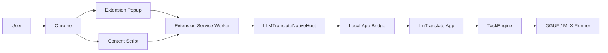

# Phase 2 PRD: Web Page Translation

Last updated: 2026-06-30

## 1. Objective

Phase 2 adds browser web-page translation to llmTranslate.

The user should be able to open an English webpage, trigger llmTranslate from the browser, and see the visible English text translated into Simplified Chinese directly inside the page. The page must remain usable, translation must be reversible, and page text must stay local by default.

This phase is not a separate chat product and not a cloud translation feature. It extends the existing local-model translation engine to browser pages.

## 2. Product Principles

- Local-first: webpage text is processed by the local llmTranslate app and local model runners by default.
- Reversible: every page translation must be restorable without reloading the page.
- Permissioned: browser extension installation, enablement, and site access must follow browser-controlled permission flows.
- Visible-first: translate what the user is reading first, then continue as more text becomes visible.
- Structure-preserving: translate text nodes without breaking links, buttons, tables, forms, layout, or page JavaScript.
- Low-friction setup: Settings should provide a guided installer and repair flow, but must not pretend browsers allow fully silent consumer extension installation.
- Observable: the app and extension should show current status, model used, progress, cancellation, and actionable errors.

## 3. Target User

Primary user:

- macOS user running llmTranslate locally.
- Has local Qwen models already configured from Phase 1.
- Frequently reads English documentation, articles, product pages, technical blogs, and dashboards.
- Wants page content translated in place instead of copying text into a separate app.

Primary jobs:

- Read English article/documentation in Chinese without losing page navigation.
- Translate a long page gradually while scrolling.
- Restore the original English text when translation quality or layout is not acceptable.
- Install or repair the browser extension from llmTranslate Settings with minimal manual work.

## 4. Platform Scope

### 4.1 Phase 2.0 MVP Browser

Build the first full MVP for Google Chrome on macOS.

Reasons:

- Chrome supports content scripts for DOM inspection and mutation.
- Chrome supports native messaging between extensions and native applications.
- Chrome is the best first target for a Manifest V3 extension and Playwright-based verification.

### 4.2 Phase 2.x Additional Browsers

After Chrome MVP is stable, add support in this order:

1. Microsoft Edge, because its native messaging model is close to Chrome.
2. Brave or Arc if user priority requires it and native messaging paths are verified.
3. Safari Web Extension, because it needs a Safari-specific containing-app/distribution path and user enablement in Safari Settings.
4. Firefox, because release/beta builds require signed add-ons and Firefox-specific manifest handling.

The Settings UI should be designed as multi-browser from the beginning, even if only Chrome is implemented in Phase 2.0.

## 5. Official Platform Constraints

These constraints are product requirements, not implementation preferences.

- Browser extensions run page-side code through content scripts. Chrome documents content scripts as code that can read and modify pages through the DOM and communicate with the extension.
- For current-tab translation, prefer temporary page access through `activeTab` plus programmatic script injection instead of blanket `<all_urls>` permission.
- Extension-to-native communication should use native messaging where possible. Chrome, Edge, and Firefox document native messaging as the browser-supported way for extensions to exchange messages with a native app.
- Native messaging manifests must be installed into browser-specific locations. On macOS, Chrome user-specific manifests live under `~/Library/Application Support/Google/Chrome/NativeMessagingHosts/`; Edge has its own `Microsoft Edge` path; Firefox uses Mozilla native manifest locations.
- Browser extension installation cannot be fully silent for normal consumer distribution. Chrome Web Store installation and permissions are browser-controlled; Safari extensions are installed/enabled through App Store/Safari settings flows; Firefox release/beta extensions must be signed.
- The app may automate local bridge assets, open the correct install/enable pages, verify connectivity, and provide exact repair steps. It must not bypass user consent or browser policy.

## 6. In Scope

### 6.1 Product

- Settings panel for browser integration.
- Guided Chrome extension installer/repair flow.
- Extension status detection and connection verification.
- One-click current-page translation from the browser extension.
- In-place English-to-Simplified-Chinese translation.
- Restore original page text.
- Cancel running translation.
- Visible-first translation and incremental scroll translation.
- Local translation cache for repeated text segments.
- Clear user-facing errors.
- Basic per-domain preference: enabled/disabled and ask-every-time.
- Local-only default privacy behavior.

### 6.2 Native App

- Browser integration state in preferences/registry.
- Native messaging host installer for Chrome MVP.
- Native messaging helper executable.
- Local app bridge from native helper to the running llmTranslate app.
- New webpage translation task path.
- Translation batching and cancellation support.
- Redacted diagnostics for setup and translation failures.

### 6.3 Browser Extension

- Manifest V3 Chrome extension.
- Background service worker.
- Popup UI with translate, cancel, restore, and status.
- Content script for DOM discovery, text-node mapping, replacement, mutation/scroll observation, and restore.
- Native messaging client.
- Session cache and per-page translation state.

## 7. Out of Scope

- Cloud translation APIs.
- OCR for images, videos, canvas, screenshots, or scanned PDFs.
- Translating browser internal pages such as `chrome://`, extension store pages, or browser settings pages.
- Translating user-entered form text.
- Rewriting page HTML structure.
- Persisting full page text to disk by default.
- Fully automatic translation of all websites without user opt-in.
- Silent extension installation that bypasses browser confirmation.
- Enterprise managed extension deployment.
- Mobile browser support.
- Cross-device sync.
- Full bilingual side-by-side mode.
- PDF viewer translation inside the browser.
- Multi-tab bulk translation.

## 8. Success Metrics

Phase 2 is successful when:

- Chrome extension can be installed or repaired through the Settings guided flow.
- Extension can verify native-app connectivity from the browser.
- English article/documentation pages translate visible content into readable Chinese in place.
- Restore returns translated text nodes to their original English text without reload.
- Cancel stops queued work within 1 second and prevents additional DOM replacement after cancellation.
- Links, buttons, tables, and ordinary navigation remain usable after translation.
- Page content is not written to persistent history unless explicitly enabled.
- Repeated text segments on the same page are not sent to the model repeatedly.

## 9. User Stories

### 9.1 Browser Setup

As a user, I can open llmTranslate Settings and see which supported browsers are installed and whether webpage translation is ready for each browser.

Acceptance:

- Chrome row appears when `/Applications/Google Chrome.app` exists.
- Row status is one of: `notInstalled`, `extensionMissing`, `extensionInstalledDisabled`, `permissionMissing`, `nativeHostMissing`, `appNotRunning`, `pairingRequired`, `ready`, `failed`.
- A primary action changes with status: `Install`, `Enable`, `Repair`, `Pair`, `Test`, or `Open Browser`.
- Failure text says exactly which action is needed next.

### 9.2 Guided Extension Installation

As a user, I can click one button in Settings to install or repair browser translation for Chrome.

Acceptance:

- The app installs or repairs the native messaging host manifest.
- The app opens the Chrome Web Store listing when a production extension ID is configured.
- In development builds, the app opens `chrome://extensions` and shows load-unpacked instructions.
- The user still confirms extension installation/enablement in Chrome.
- After confirmation, the app runs a ping from extension to native app and updates status to `ready`.

### 9.3 Translate Current Page

As a user, I can click the browser extension action and translate the current English page into Chinese.

Acceptance:

- Popup shows `Translate Page` when page is translatable and bridge is ready.
- Content script extracts visible English-dominant text nodes.
- Extension sends batches to llmTranslate through native messaging.
- Translated text replaces original text nodes in the page.
- Popup and in-page overlay show progress.
- Links and page controls remain clickable.

### 9.4 Restore Original

As a user, I can restore the original English page text.

Acceptance:

- `Restore Original` appears after at least one successful replacement.
- Restore uses in-memory original text mapping and does not require a page reload.
- Restore removes llmTranslate markers and stops incremental translation.

### 9.5 Cancel

As a user, I can cancel a long page translation.

Acceptance:

- Cancel is available while discovery, batching, translation, or DOM application is active.
- Extension sends cancellation to native app and clears queued batches.
- Already replaced nodes remain translated unless user presses restore.
- No new nodes are replaced after cancellation has been acknowledged.

### 9.6 Dynamic Scroll

As a user, when I scroll down a long page after translating, newly visible English paragraphs are translated automatically for the same page session.

Acceptance:

- Newly visible nodes are enqueued with debounce.
- Previously translated or skipped nodes are not reprocessed.
- Translation pauses when tab is hidden and resumes when visible.

## 10. UX Requirements

### 10.1 Native Settings Panel

Add a Settings section named `网页翻译`.

The section should contain:

- Master toggle: `启用网页翻译`.
- Browser integration table.
- One primary button per browser.
- `全部检测` action.
- `修复本地桥接` action when host manifest is missing or invalid.
- Privacy note: page text is processed locally and not stored by default.
- Advanced disclosure for development mode install steps.
- Last successful ping time and extension version.

Browser row fields:

- Browser name.
- Browser path.
- Extension status.
- Native host status.
- Pairing status.
- Last error.
- Primary action.

Primary actions:

- `安装扩展`: open browser install flow and install native host manifest.
- `启用扩展`: open browser extension settings.
- `修复`: rewrite native host manifest and retest.
- `配对`: start pairing challenge.
- `测试连接`: ping extension/native app.
- `打开当前浏览器`: launch browser.

### 10.2 Browser Extension Popup

Popup states:

- `Not ready`: native app missing, extension not paired, or no model configured.
- `Ready`: current tab can be translated.
- `Translating`: show progress, current batch, cancel.
- `Partially translated`: some nodes translated and some failed/skipped.
- `Translated`: restore and retranslate actions.
- `Unsupported page`: browser page cannot be scripted.

Popup controls:

- `翻译当前页`
- `取消`
- `恢复原文`
- `重新翻译`
- Domain toggle: `此网站自动翻译` off by default.
- Link/button to open llmTranslate Settings.

### 10.3 In-Page Overlay

Provide a small nonintrusive overlay during translation.

Requirements:

- Fixed position, bottom-right by default.
- Shows percent or translated/total segment count.
- Has cancel during active translation.
- Has restore after translation.
- Can be minimized.
- Must not cover selected text while user is editing.
- Must not inject global CSS that affects the host page.

## 11. Architecture

### 11.1 Component Diagram



### 11.2 Required Native Components

- `BrowserIntegrationService`: detects browsers, writes native host manifests, runs health checks, owns browser status.
- `BrowserIntegrationView`: Settings UI section.
- `WebPageTranslationService`: app-side queue, batching, cancellation, and bridge requests.
- `WebPageTranslationTypes`: shared request/response models.
- `LLMTranslateNativeHost`: executable target launched by the browser through native messaging.
- `LocalAppBridge`: local-only IPC between `LLMTranslateNativeHost` and the running app.

### 11.3 Required Extension Components

- `manifest.json`: MV3 manifest.
- `background.ts`: service worker, native messaging, tab job coordination.
- `popup.html` / `popup.ts`: user controls and status.
- `contentScript.ts`: content script entry.
- `domScanner.ts`: visible text-node discovery and skip rules.
- `domMutator.ts`: replacement, marker, restore.
- `language.ts`: English-dominant heuristics.
- `cache.ts`: session translation cache.
- `protocol.ts`: typed message contracts.

### 11.4 IPC Decision

Preferred MVP path:

1. Browser extension talks to `LLMTranslateNativeHost` through native messaging.
2. `LLMTranslateNativeHost` talks to the running app through a local-only app bridge.
3. The app bridge can be implemented as loopback HTTP on `127.0.0.1` with a random port and bearer token, or as Unix domain socket if implementation cost is acceptable.

Phase 2.0 recommendation:

- Use native messaging from extension to helper.
- Use loopback HTTP from helper to app for faster Swift implementation.
- Do not expose the loopback token to the extension or page.
- Bind only to `127.0.0.1`.
- Require a bearer token generated by the app and stored in a user-private file readable by the helper.
- Reject all direct browser/page requests to the app bridge unless they include the token.

Rationale:

- Native messaging is the browser-supported extension/native boundary.
- The helper avoids giving webpages direct access to app endpoints.
- The app can keep using existing `TaskEngine` and model runners.
- Loopback HTTP is simpler to debug than a custom binary IPC during MVP.

## 12. Browser Integration Installer

### 12.1 Browser Detection

Chrome MVP detection:

- Check `/Applications/Google Chrome.app`.
- Verify bundle id `com.google.Chrome` when possible.
- Determine if Chrome is running.
- Determine expected user native host manifest path:
  `~/Library/Application Support/Google/Chrome/NativeMessagingHosts/com.llmtranslate.native_host.json`

Future browser configs should be data-driven:

```json
{
  "id": "chrome",
  "name": "Google Chrome",
  "bundleID": "com.google.Chrome",
  "appPaths": ["/Applications/Google Chrome.app"],
  "nativeHostManifestPath": "~/Library/Application Support/Google/Chrome/NativeMessagingHosts/com.llmtranslate.native_host.json",
  "extensionInstallURL": "https://chromewebstore.google.com/detail/<extension-id>",
  "extensionSettingsURL": "chrome://extensions/?id=<extension-id>"
}
```

### 12.2 Native Host Manifest

Manifest name:

```text
com.llmtranslate.native_host
```

Chrome user-specific manifest path:

```text
~/Library/Application Support/Google/Chrome/NativeMessagingHosts/com.llmtranslate.native_host.json
```

Manifest shape:

```json
{
  "name": "com.llmtranslate.native_host",
  "description": "llmTranslate native messaging host",
  "path": "/absolute/path/to/LLMTranslateNativeHost",
  "type": "stdio",
  "allowed_origins": [
    "chrome-extension://<chrome-extension-id>/"
  ]
}
```

Rules:

- `path` must be absolute.
- `allowed_origins` must include only known production/dev extension IDs.
- File permissions should be user-readable and user-writable only where possible.
- Rewriting the manifest should be idempotent.
- Repair must validate that the executable exists and is runnable.

### 12.3 Install Flow

Production Chrome flow:

1. User clicks `安装扩展` in llmTranslate Settings.
2. App writes/repairs native host manifest.
3. App opens Chrome Web Store listing.
4. User clicks `Add to Chrome` and accepts permissions in Chrome.
5. Extension starts and sends `hello` through native messaging.
6. App verifies helper path, host manifest, extension ID, and pairing.
7. Settings row becomes `ready`.

Development Chrome flow:

1. User clicks `安装开发版扩展`.
2. App writes/repairs native host manifest with dev extension ID.
3. App opens `chrome://extensions`.
4. Settings shows exact local extension folder path.
5. User enables Developer Mode and loads unpacked extension.
6. Extension sends `hello`.
7. Settings row becomes `ready`.

Important:

- The app should automate everything outside Chrome's confirmation boundary.
- The app should not promise that Chrome will install or enable the extension without user confirmation.

### 12.4 Pairing Flow

Use pairing to make accidental extension/native connections visible.

Recommended MVP:

- Native app generates a short-lived pairing nonce when user clicks `配对`.
- Extension requests pairing through native messaging.
- App shows or validates the nonce.
- On success, app stores extension ID, browser ID, and pairing timestamp.

If using native messaging with strict `allowed_origins`, pairing can be lightweight. The main value is user visibility and repair diagnostics.

## 13. Extension Permissions

Chrome MVP manifest permissions:

```json
{
  "manifest_version": 3,
  "name": "llmTranslate",
  "permissions": [
    "activeTab",
    "scripting",
    "storage",
    "nativeMessaging"
  ],
  "host_permissions": [],
  "background": {
    "service_worker": "background.js"
  },
  "action": {
    "default_popup": "popup.html"
  }
}
```

Rules:

- Use `activeTab` for manual current-tab translation.
- Use `chrome.scripting.executeScript` to inject content script after user action.
- Do not request `<all_urls>` in the MVP.
- Request optional per-domain host permissions only when adding auto-translate for a domain.
- Do not use remote code.
- Keep extension storage minimal and avoid storing page text persistently.

## 14. DOM Translation Requirements

### 14.1 Text Discovery

Use `TreeWalker` to discover text nodes under `document.body`.

Include a text node only when:

- It has non-empty normalized text.
- It is inside a visible element.
- It is not in a skipped element.
- It is English-dominant.
- It has not already been processed in the current page session.

Skip elements:

- `script`
- `style`
- `noscript`
- `template`
- `svg`
- `canvas`
- `code`
- `pre`
- `kbd`
- `samp`
- `textarea`
- `input`
- `select`
- `option`
- editable elements
- elements with `aria-hidden="true"`
- elements hidden by CSS

Visibility checks:

- `display !== "none"`
- `visibility !== "hidden"`
- `opacity !== "0"`
- element has visible client rects
- text node is inside current or near-future viewport for visible-first mode

### 14.2 English-Dominant Heuristic

Translate only English-dominant text by default.

Suggested heuristic:

- Normalize whitespace.
- Skip if fewer than 3 Latin letters.
- Skip if text is mostly digits, punctuation, URL, email, hash, UUID, or code-like token.
- Translate if Latin letters are at least 60% of all letters.
- Skip if CJK characters are already at least 25% of all letters.
- Skip very short all-caps labels unless surrounded by sentence-like context.

This heuristic should live in the extension and be unit-tested with examples.

### 14.3 Segmentation

Segment at text-node level, but batch multiple segments per native request.

Segment fields:

- `segmentID`
- `nodeID`
- `frameID`
- `text`
- `tagName`
- `blockContext`
- `priority`
- `textHash`

Batch limits:

- Max 20 segments per batch.
- Max 2,000 source characters per batch for MVP.
- Max 200 batches queued per tab before requiring user confirmation.
- Retry individual segments when a batch response cannot be parsed safely.

Rationale:

- Small local models are more reliable with small batches.
- Native messaging message-size limits make smaller batches safer.
- Per-segment retry avoids losing a whole page because one model response is malformed.

### 14.4 Replacement

Replacement rules:

- Replace only `Text.nodeValue`.
- Do not assign `innerHTML`.
- Do not remove or recreate host elements.
- Add markers through WeakMap/session state first. Use DOM attributes only on host elements if needed for restore/debug.
- Preserve leading/trailing whitespace around the text node.
- If translated text is empty or identical after normalization, keep original.
- If applying translation throws because node detached, mark segment as `stale` and skip.

### 14.5 Restore

Restore rules:

- Store original `nodeValue` in memory before first replacement.
- Restore only nodes replaced by llmTranslate.
- If node no longer exists, ignore.
- If page has changed a translated node after replacement, do not overwrite by default. Mark as `changedAfterTranslation`.
- Clear observers, pending queue, and in-page overlay after restore.

### 14.6 Dynamic Content

Use:

- `IntersectionObserver` for visible/newly visible candidates.
- `MutationObserver` for DOM changes.
- Debounced queueing after scroll and mutations.

Rules:

- Initial pass translates visible viewport plus a small prefetch margin.
- Newly visible untranslated nodes are queued if page session is active.
- Do not retranslate nodes whose original text hash has already been translated.
- Use exponential backoff on pages that constantly mutate the same nodes.

## 15. Translation Behavior

### 15.1 Task Type

Add a webpage-specific task path.

Implementation options:

- Add `TaskKind.webPageTranslate`, or
- Keep `TaskKind.translate` and add `TranslationOrigin.webPage`.

Recommended:

- Add explicit webpage request/response types in `LLMTranslateCore`.
- Internally reuse prompt generation and runner execution.
- Keep webpage translation out of normal recent history unless user opts in.

### 15.2 Prompt

System prompt:

```text
You are a webpage translation engine. Translate English webpage text to Simplified Chinese.
Preserve meaning, numbers, names, URLs, product names, code-like tokens, and UI intent.
Return only valid JSON that follows the requested schema.
Do not explain.
```

Batch user prompt:

```text
Translate each item to Simplified Chinese.
Return a JSON array with objects in the same order:
[
  {"id":"...", "translation":"..."}
]

Rules:
- Preserve links, numbers, product names, keyboard shortcuts, and code-like tokens.
- For buttons and short UI labels, use concise Chinese.
- For paragraphs, use natural Chinese.
- Do not add commentary.

Items:
[
  {"id":"s1","text":"..."},
  {"id":"s2","text":"..."}
]
```

Fallback:

- If JSON parsing fails, retry the batch once with stricter prompt.
- If retry fails, translate segments individually with plain-text output.
- If individual translation fails, mark that segment failed and continue.

### 15.3 Model Routing

MVP:

- Use the existing default model from Phase 1.
- Allow user to choose a webpage translation model in advanced settings later.
- Show model name in extension status and app Settings.

Future:

- 0.8B for language detection and simple UI labels.
- 4B default for ordinary pages.
- 9B for long/technical pages or quality mode.

## 16. Protocol

### 16.1 Native Messaging Envelope

Every request:

```json
{
  "protocolVersion": 1,
  "requestID": "uuid",
  "type": "translateSegments",
  "browserID": "chrome",
  "extensionVersion": "0.1.0",
  "tabID": 123,
  "pageSessionID": "uuid",
  "sentAt": "2026-06-30T12:00:00Z",
  "payload": {}
}
```

Every response:

```json
{
  "protocolVersion": 1,
  "requestID": "uuid",
  "type": "translateSegments.result",
  "status": "ok",
  "payload": {},
  "error": null
}
```

### 16.2 Message Types

- `hello`: extension/native handshake.
- `getStatus`: app, model, bridge, and pairing status.
- `startPairing`: start pairing challenge.
- `confirmPairing`: complete pairing.
- `translateSegments`: translate a batch.
- `cancelJob`: cancel queued/running work for a page session.
- `openSettings`: ask native app to open Settings to browser integration section.
- `diagnostics`: redacted setup details for troubleshooting.

### 16.3 Translate Segments Request

```json
{
  "jobID": "uuid",
  "sourceLanguage": "en",
  "targetLanguage": "zh-Hans",
  "urlHash": "sha256-url",
  "title": "optional page title",
  "segments": [
    {
      "segmentID": "s1",
      "text": "The quick brown fox.",
      "tagName": "P",
      "blockContext": "article",
      "priority": 10,
      "textHash": "sha256-text"
    }
  ]
}
```

### 16.4 Translate Segments Response

```json
{
  "jobID": "uuid",
  "modelName": "Qwen 4B MLX 4bit",
  "translations": [
    {
      "segmentID": "s1",
      "translation": "敏捷的棕色狐狸。",
      "status": "translated"
    }
  ],
  "usage": {
    "sourceCharacters": 20,
    "targetCharacters": 9
  }
}
```

### 16.5 Error Codes

- `app_not_running`
- `native_host_missing`
- `native_host_invalid`
- `extension_not_paired`
- `extension_not_allowed`
- `model_not_configured`
- `model_not_ready`
- `model_load_failed`
- `translation_failed`
- `payload_too_large`
- `timeout`
- `cancelled`
- `permission_missing`
- `unsupported_page`
- `tab_changed`
- `page_session_expired`
- `rate_limited`
- `internal_error`

Every error must include:

- machine-readable code
- user-facing Chinese message
- repair action when available
- redacted diagnostic detail

## 17. State Machines

### 17.1 Browser Integration Status

```text
notInstalled
extensionMissing
extensionInstalledDisabled
permissionMissing
nativeHostMissing
nativeHostInvalid
appNotRunning
pairingRequired
ready
failed
```

### 17.2 Page Translation Status

```text
idle
unsupportedPage
discovering
waitingForModel
translating
applying
partiallyTranslated
translated
cancelling
cancelled
restoring
restored
failed
```

### 17.3 Segment Status

```text
pending
skipped
queued
translating
translated
applied
failed
stale
restored
changedAfterTranslation
```

## 18. Data Model

### 18.1 App Preferences Additions

Proposed additions to `AppPreferences` or a dedicated registry section:

```swift
public struct WebPageTranslationPreferences: Codable, Sendable, Hashable {
    public var enabled: Bool
    public var defaultTargetLanguage: String
    public var translateVisibleOnly: Bool
    public var autoTranslateDomains: [String]
    public var disabledDomains: [String]
    public var persistWebHistory: Bool
    public var maxSegmentsPerBatch: Int
    public var maxCharactersPerBatch: Int
}
```

Defaults:

- `enabled = true`
- `defaultTargetLanguage = "zh-Hans"`
- `translateVisibleOnly = true`
- `autoTranslateDomains = []`
- `disabledDomains = []`
- `persistWebHistory = false`
- `maxSegmentsPerBatch = 20`
- `maxCharactersPerBatch = 2000`

### 18.2 Browser Integration State

```swift
public struct BrowserIntegrationState: Codable, Sendable, Hashable, Identifiable {
    public var id: String
    public var name: String
    public var bundleID: String
    public var appPath: String?
    public var extensionID: String?
    public var extensionVersion: String?
    public var nativeHostManifestPath: String?
    public var status: BrowserIntegrationStatus
    public var pairedAt: Date?
    public var lastPingAt: Date?
    public var lastErrorCode: String?
    public var lastErrorMessage: String?
}
```

### 18.3 History Policy

Default:

- Do not save source text or translated webpage text to existing recent history.
- Do not persist full page content.
- Store only redacted diagnostics: timestamp, browser, domain hash, segment count, model, status, error code.

Optional future setting:

- User can opt into webpage translation history.
- If enabled, store title, URL, source preview, translation preview, and model.

## 19. Caching

### 19.1 Session Cache

Extension keeps an in-memory session cache:

```text
cacheKey = sha256(promptVersion + targetLanguage + normalizedSourceText)
```

Cache value:

- translated text
- model name
- timestamp

Rules:

- Use cache within the current page session.
- Do not persist page text to disk.
- Clear cache on restore, tab close, extension reload, or user clear.

### 19.2 App Cache

MVP:

- No persistent app-side webpage text cache.

Future:

- Optional encrypted local cache with explicit user setting.
- Cache key includes model ID and prompt version.

## 20. Performance Requirements

- First visible translation should start applying within 10 seconds on a normal article page after model is warm.
- Initial DOM scan should not block the page for more than 50 ms chunks.
- DOM application should run in chunks using `requestAnimationFrame` or micro-batched time slicing.
- Only one active translation batch per tab in MVP.
- App should serialize model generation globally unless the runner layer later supports safe parallelism.
- Extension should pause queueing when tab is hidden.
- Large pages should show confirmation when more than 200 batches are estimated.
- Batch timeout default: 90 seconds.
- Segment retry limit: 1 batch retry and 1 individual retry.

## 21. Privacy And Security Requirements

- Page text is local-only by default.
- Extension must not send page text to remote servers.
- Extension must not load remote scripts.
- Extension must use least-privilege permissions.
- Native host must accept messages only from configured extension IDs.
- App bridge must bind to `127.0.0.1` only if loopback HTTP is used.
- App bridge must require a random bearer token.
- Bridge token must be stored in a user-private app support file.
- Logs must redact segment text by default.
- Diagnostics can include text hashes, counts, timing, model name, browser, and error codes.
- User can clear browser integration pairing and caches from Settings.
- Random webpages must not be able to call the translation API directly.
- Cross-origin frames should be translated only when the extension has permission and content script access.

## 22. Unsupported And Edge Cases

The extension must detect or safely handle:

- `chrome://`, `edge://`, `about:`, extension store pages, and browser settings pages.
- Pages where content scripts cannot be injected.
- Pages with strict frames or inaccessible cross-origin iframes.
- Closed Shadow DOM.
- Canvas/image/video text.
- Browser PDF viewers.
- Pages that replace DOM nodes continuously.
- Virtualized lists that detach nodes while translating.
- Single-page apps that change route without full reload.
- Pages with mixed Chinese/English content.
- Code documentation pages where code blocks must be skipped.
- Forms, editors, and contenteditable areas.
- Sites that already run machine translation.
- Very long legal/license pages.
- Model unavailable, loading, or failed.
- App quits during translation.
- Browser restarts during pairing.

Expected behavior:

- Never corrupt page structure.
- Prefer skipping uncertain nodes over translating risky nodes.
- Show partial success when some segments fail.
- Restore should remain available after partial success.

## 23. Implementation Plan

### Milestone 0: PRD And Skeleton

- Add PRD.
- Add `browser-extension/chromium` folder.
- Add `LLMTranslateNativeHost` executable target.
- Add shared protocol models.
- Add browser integration status enums.

Exit criteria:

- Project builds with empty/native-host skeleton.
- Extension folder has a valid MVP manifest.

### Milestone 1: Native Messaging Ping

- Implement native messaging host stdio protocol.
- Install Chrome native host manifest from Settings.
- Extension sends `hello`.
- App/host returns app version, protocol version, and model status.

Exit criteria:

- Settings can show Chrome `ready` after ping.
- Failure modes show actionable messages.

### Milestone 2: DOM Discovery And Restore

- Implement content script injection.
- Implement visible text discovery.
- Implement English-dominant filter.
- Implement node mapping and original text storage.
- Implement dummy replacement with test translation.
- Implement restore.

Exit criteria:

- Local static test page can replace visible English text with marker text.
- Restore returns original content.
- Links/forms/code blocks remain untouched.

### Milestone 3: Real Translation Batch

- Connect extension batches to native host and app bridge.
- Add webpage translation service.
- Reuse model runner.
- Add JSON batch prompt and fallback.
- Apply real Chinese translations.

Exit criteria:

- Real English article page translates to Chinese with local model.
- Extension shows model name and progress.

### Milestone 4: Cancellation, Cache, And Dynamic Pages

- Add page session jobs.
- Add cancellation propagation.
- Add session cache.
- Add IntersectionObserver and MutationObserver.
- Add hidden-tab pause.

Exit criteria:

- Cancel stops queued work.
- Scrolling translates new visible content.
- Repeated text is not sent twice.

### Milestone 5: Settings Installer And Repair UX

- Add full browser integration panel.
- Add install/repair/test actions.
- Add dev install mode.
- Add pairing reset.
- Add clear cache/pairing actions.

Exit criteria:

- Fresh machine flow can be completed from Settings with clear manual browser confirmation steps.
- Broken native host manifest can be repaired.

### Milestone 6: Hardening And QA

- Add unit tests.
- Add Playwright E2E pages.
- Add privacy/log redaction checks.
- Add package script integration.
- Verify packaged `.app` and browser extension together.

Exit criteria:

- Definition of Done is satisfied.

## 24. Test Plan

### 24.1 Unit Tests

Native:

- browser detection config
- native host manifest generation
- manifest path expansion
- bridge token generation
- protocol request/response decoding
- error mapping
- webpage prompt fallback behavior

Extension:

- English-dominant heuristic
- skip element rules
- visible element detection
- segmentation limits
- cache key normalization
- restore behavior for detached/changed nodes
- protocol envelope validation

### 24.2 Integration Tests

- Native host starts and responds to `hello`.
- Native host rejects unknown extension origin.
- App bridge rejects missing/invalid token.
- App bridge returns `model_not_configured` when no model exists.
- Translation batch returns expected schema.
- Cancel request cancels queued batches.

### 24.3 Browser E2E Tests

Use Playwright with a dev-loaded Chromium extension.

Test pages:

- article page with headings, paragraphs, links
- documentation page with code/pre blocks
- product page with buttons and cards
- table-heavy page
- long page with 500+ segments
- SPA page with route change
- dynamic page appending content after scroll
- form page with inputs/contenteditable
- page with iframes

Assertions:

- visible English text becomes Chinese
- skipped elements remain unchanged
- links still navigate
- buttons still click
- restore returns original text
- cancel prevents further replacements
- no console errors from extension
- no remote network requests containing page text

### 24.4 Manual Acceptance Tests

Run against:

- English blog article.
- English technical documentation page.
- GitHub README page with code blocks.
- Product marketing page.
- Long news article.

Manual checks:

- Translation readability.
- Layout stability.
- Link/button usability.
- Restore correctness.
- Extension/app status clarity.
- App restart and browser restart recovery.

## 25. Definition Of Done

Phase 2.0 is done when:

- Chrome extension MVP is installable in development mode and has a defined production install path.
- Settings can install/repair native messaging assets and verify extension connectivity.
- Current-tab English-to-Chinese page translation works through the local app and local model.
- Visible-first translation, restore, cancel, dynamic-scroll translation, and session cache work.
- Browser and native app errors are actionable.
- No page text is persisted by default.
- Logs are redacted.
- Automated tests cover DOM skip rules, protocol, native host manifest generation, and core E2E flows.
- Packaged app verification uses `./scripts/package-app.sh`, launches `dist/llmTranslate.app`, and verifies the running app path before final acceptance.

## 26. Open Decisions

Resolve before implementation starts:

- Production extension distribution path: Chrome Web Store listed/unlisted, or development-only until later?
- Exact Chrome extension ID for production and development.
- App bridge IPC: loopback HTTP MVP or Unix domain socket MVP?
- Whether app sandboxing or App Store distribution is planned soon. This affects native host manifest installation.
- First additional browser after Chrome: Edge, Safari, Brave, Arc, or Firefox?

Recommended defaults:

- Chrome Web Store unlisted extension for production-like testing.
- Native messaging helper plus loopback HTTP bridge for MVP.
- Edge as second Chromium browser.
- Safari after Chrome/Edge behavior is stable.

## 27. Reference Links

- Chrome content scripts: https://developer.chrome.com/docs/extensions/develop/concepts/content-scripts
- Chrome activeTab permission: https://developer.chrome.com/docs/extensions/develop/concepts/activeTab
- Chrome scripting API: https://developer.chrome.com/docs/extensions/reference/api/scripting
- Chrome native messaging: https://developer.chrome.com/docs/extensions/develop/concepts/native-messaging
- Chrome alternative extension installation: https://developer.chrome.com/docs/extensions/how-to/distribute/install-extensions
- Chrome Web Store install user flow: https://support.google.com/chrome_webstore/answer/2664769
- Safari Web Extensions: https://developer.apple.com/documentation/safariservices/safari-web-extensions
- Safari extension enablement: https://support.apple.com/en-us/102343
- Safari extension preferences API: https://developer.apple.com/documentation/safariservices/sfsafariapplication/showpreferencesforextension%28withidentifier%3Acompletionhandler%3A%29
- Firefox native messaging: https://developer.mozilla.org/en-US/docs/Mozilla/Add-ons/WebExtensions/Native_messaging
- Firefox native manifests: https://developer.mozilla.org/en-US/docs/Mozilla/Add-ons/WebExtensions/Native_manifests
- Firefox signing and distribution: https://extensionworkshop.com/documentation/publish/signing-and-distribution-overview/
