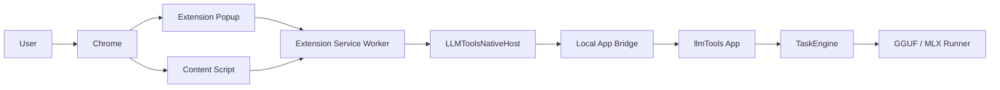

# Phase 2 PRD: Web Page Translation

Last updated: 2026-07-04

Status: active Phase 2 product and engineering plan, now in closure/acceptance planning. Phase 2.0 Chrome current-page translation, Phase 2.1 site rules, Phase 2.2 development-only Chrome distribution decision, Phase 2.4 current-page controls, Phase 2.5 complex-page baseline, and Phase 2.6 privacy/fixture baseline are implemented. Phase 2.3 Edge support is implemented at the app/config/manifest/test-runner level and still needs real Edge loading/native-messaging/translation acceptance when Edge is available. Chrome Web Store distribution, Safari/Firefox support, browser PDF translation, and image/OCR translation are deferred to later product decisions.

## 1. Objective

Phase 2 adds browser web-page translation to llmTools.

The user should be able to open an English webpage, trigger llmTools from the browser, and see the visible English text translated into Simplified Chinese directly inside the page. The page must remain usable, translation must be reversible, and page text must stay local by default.

This phase is not a separate chat product and not a cloud translation feature. It extends the existing local-model translation engine to browser pages.

## 1.1 Completed Phase 2.0 Baseline

Phase 2.0 established the Chrome current-page translation baseline:

- Chrome MV3 extension in `browser-extension/chromium`.
- Development extension ID: `jednddlgkkohaebgoejcidfppddjegij`.
- `LLMToolsNativeHost` Swift executable target for Chrome native messaging.
- `LocalAppBridgeServer` in the macOS app, bound to `127.0.0.1` and protected by an app-generated bearer token.
- Bridge state file at `~/Library/Application Support/llmTools/web-page-bridge.json`.
- `BrowserIntegrationService` for Chrome detection, native host manifest writing, extension folder discovery, and `chrome://extensions` launch.
- Settings section `网页翻译`, including Chrome bridge repair and manual unpacked-extension guidance.
- Shared webpage translation models in `WebPageTranslationTypes`.
- App-side webpage batch translation through `TaskEngine.translateWebPageSegments`.
- Browser popup controls for translate, restore, cancel, test, and cache clear.
- Content script support for visible text discovery, English-dominant filtering, skip rules, in-page overlay, pending indicators, restore, cancellation, mutation/scroll discovery, and dynamic segment enqueueing.
- Extension background support for batching, duplicate segment reuse, native messaging, context-menu toggle, translation state, and a `chrome.storage.local` translation cache.
- Focused checks through `swift run LLMToolsChecks` and `node scripts/check-browser-extension-dom.mjs`.

Do not treat these as remaining Phase 2 requirements unless a regression is found. They are the baseline that later Phase 2 work must preserve.

## 1.2 Phase 2 Scope Reset

The original remaining Phase 2 work was organized into these requirement groups:

1. Site rules and automatic translation controls.
2. Production Chrome distribution and repair UX.
3. Additional browser support.
4. Advanced reading and translation modes.
5. Complex webpage and embedded-content support.
6. Release-grade QA, observability, and privacy controls.

That list is no longer the active backlog. The current Phase 2 requirement state is:

- Closed for Phase 2: site/domain rules, auto-translate permission gating, page/site/all cache controls, development-only Chrome distribution decision, stable native-manifest diagnostics, reading modes, visible/full-page discovery controls, translation quality modes, pending translation style controls in the extension popup, current-page retranslate, per-domain reading/quality defaults, SPA route reset, virtualized rows, same-origin iframes, open shadow roots, table-heavy pages, unsupported embedded-content detection, redacted diagnostics, cache/history policy, and Phase 1 regression coverage.
- Still in Phase 2 closure: real Microsoft Edge acceptance, packaged-app Chrome/Edge release smoke, restart recovery smoke, and defect fixing found by those acceptance runs.
- Deferred to later release tracks: Chrome Web Store listed/unlisted production distribution and production extension ID, Brave/Arc/Safari/Firefox expansion, actual browser PDF viewer translation, image/canvas/OCR translation, form-writing assistance, multi-tab bulk translation, cross-device sync, and enterprise managed deployment.

The remaining work should not reopen the Phase 2.0 Chrome bridge architecture. Extend it only if a browser policy, security finding, or acceptance bug requires a change.

Current completed Phase 2 implementation:

- Implemented in Chrome development extension and macOS Settings: per-domain `ask`, `alwaysTranslate`, and `neverTranslate` state.
- Popup now shows the normalized current domain and lets the user change its rule.
- Domain rules persist in native llmTools preferences and are exposed through native messaging status; extension local storage remains a fallback when native is unavailable.
- `alwaysTranslate` runs translation automatically when a matching HTTP/HTTPS tab finishes loading.
- `neverTranslate` blocks automatic translation and context-menu translation for that domain.
- Popup-triggered translation remains an explicit manual override.
- Translation cache entries record the normalized domain, and popup cache controls can clear the current page, current site, or all webpage translation cache.
- The in-page overlay shows short-lived notices for site-rule saves, never-translate blocking, and cache clearing while keeping overlay text out of the page DOM.
- The Chrome manifest uses optional HTTP/HTTPS host permissions. Popup auto-translate enablement requests the current site's permission first, and background auto-translate is gated on that permission.
- Settings shows Chrome diagnostics for extension ID, extension version, Native Host path, native manifest path, and last local check. Native manifest validation detects stale host paths and wrong extension IDs.
- `node scripts/check-browser-extension-dom.mjs` covers domain rules, optional permission request/denial, auto-translate permission gating, cache scope, overlay notice behavior, the existing extension translation/cache/restore path, and a real-browser multi-page navigation smoke for article/docs fixtures.
- Phase 2.2 is explicitly development-only: Settings shows channel/version/manifest diagnostics, opens `chrome://extensions`, reveals the unpacked extension folder, repairs the development native messaging manifest only, and browser regression derives the development extension ID from `manifest.key` to prevent silent ID drift.
- Phase 2.3 has Microsoft Edge listed in Settings, independent Edge detection, independent Edge native messaging manifest repair, `edge://extensions` launch, and a reusable Edge-capable browser fixture runner.
- Phase 2.4 has popup-driven current-page reading modes, discovery scope, quality controls, and pending translation style controls: replacement, bilingual, original, visible-first/full-page discovery, natural, literal, technical terminology, Loading, flip-text, no pending style, current-page retranslate without page reload, and per-domain reading/quality defaults.
- Phase 2.5 has complex-page support for SPA route reset, stale page-session rejection, virtualized rows, same-origin iframes, open shadow roots, high-frequency mutations, table-heavy pages, protected/page-PDF unsupported states, and unsupported embedded-content partial reporting.
- Phase 2.6 has redacted popup diagnostics for webpage translation, explicit cache/history policy in Settings, default-off webpage Recent History, expanded browser E2E fixtures, least-privilege permission checks, non-translation native-message privacy assertions, content-script JS network privacy assertions, and Phase 1 native workflow regression checks.

## 2. Product Principles

- Local-first: webpage text is processed by the local llmTools app and local model runners by default.
- Reversible: every page translation must be restorable without reloading the page.
- Permissioned: browser extension installation, enablement, and site access must follow browser-controlled permission flows.
- Visible-first: translate what the user is reading first, then continue as more text becomes visible.
- Structure-preserving: translate text nodes without breaking links, buttons, tables, forms, layout, or page JavaScript.
- Low-friction setup: Settings should provide a guided installer and repair flow, but must not pretend browsers allow fully silent consumer extension installation.
- Observable: the app and extension should show current status, model used, progress, cancellation, and actionable errors.

## 3. Target User

Primary user:

- macOS user running llmTools locally.
- Has local Qwen models already configured from Phase 1.
- Frequently reads English documentation, articles, product pages, technical blogs, and dashboards.
- Wants page content translated in place instead of copying text into a separate app.

Primary jobs:

- Read English article/documentation in Chinese without losing page navigation.
- Translate a long page gradually while scrolling.
- Restore the original English text when translation quality or layout is not acceptable.
- Install or repair the browser extension from llmTools Settings with minimal manual work.

## 4. Platform Scope

### 4.1 Phase 2.0 MVP Browser

Build the first full MVP for Google Chrome on macOS.

Reasons:

- Chrome supports content scripts for DOM inspection and mutation.
- Chrome supports native messaging between extensions and native applications.
- Chrome is the best first target for a Manifest V3 extension and Playwright-based verification.

### 4.2 Phase 2.x Additional Browsers

After Chrome MVP is stable, add support in this order:

1. Microsoft Edge, because its native messaging model is close to Chrome.
2. Brave or Arc if user priority requires it and native messaging paths are verified.
3. Safari Web Extension, because it needs a Safari-specific containing-app/distribution path and user enablement in Safari Settings.
4. Firefox, because release/beta builds require signed add-ons and Firefox-specific manifest handling.

The Settings UI should be designed as multi-browser from the beginning, even if only Chrome is implemented in Phase 2.0.

## 5. Official Platform Constraints

These constraints are product requirements, not implementation preferences.

- Browser extensions run page-side code through content scripts. Chrome documents content scripts as code that can read and modify pages through the DOM and communicate with the extension.
- For current-tab translation, prefer temporary page access through `activeTab` plus programmatic script injection instead of blanket `<all_urls>` permission.
- Extension-to-native communication should use native messaging where possible. Chrome, Edge, and Firefox document native messaging as the browser-supported way for extensions to exchange messages with a native app.
- Native messaging manifests must be installed into browser-specific locations. On macOS, Chrome user-specific manifests live under `~/Library/Application Support/Google/Chrome/NativeMessagingHosts/`; Edge has its own `Microsoft Edge` path; Firefox uses Mozilla native manifest locations.
- Browser extension installation cannot be fully silent for normal consumer distribution. Chrome Web Store installation and permissions are browser-controlled; Safari extensions are installed/enabled through App Store/Safari settings flows; Firefox release/beta extensions must be signed.
- The app may automate local bridge assets, open the correct install/enable pages, verify connectivity, and provide exact repair steps. It must not bypass user consent or browser policy.

## 6. In Scope

### 6.1 Product

- Site/domain rules: always translate, never translate, ask every time, and clear site-specific state.
- Optional auto-translate on trusted domains, off by default.
- Development-only Chrome distribution decision, diagnostics, and repair UX for this phase.
- Microsoft Edge support after Chrome, with real Edge acceptance as the remaining Phase 2 browser task.
- Production Chrome extension distribution and update path only after a later release/distribution decision.
- Advanced reading and translation modes, including bilingual/original comparison, visible-first/full-page discovery scope, and natural/literal/technical quality modes.
- Complex-page handling for SPAs, virtualized lists, accessible frames, and table-heavy pages.
- Browser PDF viewer and image/OCR translation are deferred from Phase 2 closure unless a separate product decision reopens them.
- Release-grade privacy, cache, diagnostics, and browser E2E coverage.

### 6.2 Native App

- Store and expose site/domain translation preferences.
- Show production/development extension channel, extension version, browser version, last ping, and repair diagnostics.
- Support additional browser native messaging manifest paths.
- Provide explicit cache/history controls for webpage translation.
- Keep webpage diagnostics redacted by default.
- Preserve Phase 1 native workflows while webpage features expand.

### 6.3 Browser Extension

- Domain toggle and per-site status in popup and context menu.
- Optional auto-translate permission request for domains the user enables.
- Bilingual/original comparison UI without corrupting page layout.
- Retranslate current page with a different model or quality mode.
- Development extension identity, versioning, and production upgrade compatibility notes.
- Additional Chromium browser manifests and build/distribution variants.
- More robust SPA route, iframe, open shadow root, virtualized list, and PDF viewer handling.

## 7. Out of Scope

- Cloud translation APIs.
- Automatic cloud fallback.
- Translating browser internal pages such as `chrome://`, extension store pages, or browser settings pages.
- Translating user-entered form text.
- Rewriting page HTML structure.
- Persisting full page text to disk by default.
- Fully automatic translation of all websites without user opt-in.
- Silent extension installation that bypasses browser confirmation.
- Enterprise managed extension deployment.
- Mobile browser support.
- Cross-device sync.
- Multi-tab bulk translation.

## 8. Success Metrics

Phase 2 closure is successful when:

- Users can set per-site behavior: ask, always translate, never translate, clear cached translations, and disable auto-translate quickly.
- Chrome has an explicitly documented development-only distribution decision for this phase, with stable diagnostics and repair UX.
- Edge can use the same webpage translation feature with the same local app bridge behavior, or Edge is explicitly deferred because the release environment cannot run Edge acceptance.
- Settings can show clear status across supported browsers and repair the correct native messaging manifest for each one.
- Users can choose a readable bilingual/original comparison mode without breaking links, tables, forms, or page layout.
- Complex pages such as SPAs, table-heavy pages, documentation pages, and virtualized feeds have defined supported behavior and graceful fallback.
- Webpage cache/history behavior is explicit, user-controlled, and covered by privacy checks.
- Automated browser tests cover the supported browser/page matrix, and manual packaged-app smoke covers representative real pages before Phase 2 closes.

## 9. User Stories

### 9.1 Site Translation Rules

As a user, I can decide how llmTools behaves on the current website.

Acceptance:

- Popup shows the current domain and rule: `ask`, `alwaysTranslate`, or `neverTranslate`.
- The user can enable auto-translate for the current domain only after a clear browser permission prompt when extra host permission is required.
- `neverTranslate` prevents automatic translation and hides auto-translate prompts for the domain.
- Domain rules are visible and editable in Settings.
- Clearing a domain rule does not delete unrelated model or app settings.

### 9.2 Chrome Distribution Decision And Diagnostics

As a user, I can tell whether Chrome support is development-only or production, and I can repair the development bridge without mixing extension IDs.

Acceptance:

- Phase 2 explicitly documents that Chrome distribution remains development-only.
- If a Chrome Web Store path is chosen in a later release track, Settings opens the correct listing and writes a manifest with the production extension ID.
- Development and production extension IDs cannot be mixed silently.
- Settings shows extension version, native host path, manifest path, and last successful connection time.
- Repair tells the user exactly whether the failure is extension missing, wrong extension ID, native host missing, app not running, or permission missing.

### 9.3 Additional Browser Support

As a user, I can use webpage translation from another supported browser after Chrome.

Acceptance:

- Edge is the first additional browser target.
- Settings detects Edge and writes/repairs the correct Edge native messaging manifest path.
- The Edge extension build uses the correct extension ID and allowed origin.
- Chrome and Edge can be installed side by side without overwriting each other's manifest or status.
- Browser rows share one visual pattern but show browser-specific repair actions and paths.

### 9.4 Bilingual Reading Mode

As a user, I can compare the original English text with the Chinese translation when direct replacement is not enough.

Acceptance:

- The user can switch between `replace`, `bilingual`, and `original` for the current page session.
- The user can choose `natural`, `literal`, or `technical` translation quality for the current page.
- Retranslate uses the selected quality mode and does not reuse cached translations from a different quality mode.
- Bilingual mode does not use `innerHTML` injection for source page content.
- Links, buttons, form controls, code blocks, and tables remain usable.
- Restore returns the page to the original state without leaving duplicate bilingual artifacts.
- The mode choice starts as a current-page override, and the user can save reading mode or quality as a per-domain default from the popup.

### 9.5 Complex Page Support

As a user, I can translate common modern web pages without the page becoming unstable.

Acceptance:

- SPA route changes reset or resume translation without mixing old and new page sessions.
- Virtualized lists and constantly changing nodes are skipped or handled without repeated retranslation loops.
- Table-heavy pages preserve row/column structure.
- Accessible iframes and open shadow roots are translated only when the extension has permission and can safely inspect their DOM.
- Unsupported frames, PDF viewers, closed shadow DOM, canvas, and image text show a graceful unsupported/partial state.

### 9.6 Cache, History, And Privacy Controls

As a user, I can understand and control what webpage translation data is stored locally.

Acceptance:

- Settings explains whether page translations are session-only or persisted in local extension storage.
- The user can clear current-page cache, current-domain cache, and all webpage translation cache.
- Cache entries are capped and pruned.
- Recent history remains off for webpage translation unless the user explicitly enables it.
- Logs and diagnostics use hashes/counts/error codes by default, not raw page text.

## 10. UX Requirements

### 10.1 Native Settings Panel

Extend the existing Settings section named `网页翻译`.

The section should contain:

- Master toggle: `启用网页翻译`.
- Browser integration table.
- One primary button per browser.
- `全部检测` action.
- `修复本地桥接` action when host manifest is missing or invalid.
- Production/development channel indicator.
- Extension version and last successful ping time.
- Domain rules table.
- Cache controls: clear current domain, clear all webpage cache, and reset domain rules.
- Privacy note that matches the chosen cache/history policy.
- Advanced disclosure for development mode install steps.

Browser row fields:

- Browser name.
- Browser path.
- Distribution channel.
- Extension ID.
- Extension version.
- Extension status.
- Native host status.
- Pairing status.
- Last successful ping time.
- Last error.
- Primary action.

Primary actions:

- `安装扩展`: open browser install flow and install native host manifest.
- `启用扩展`: open browser extension settings.
- `修复`: rewrite native host manifest and retest.
- `配对`: start pairing challenge.
- `测试连接`: ping extension/native app.
- `打开当前浏览器`: launch browser.

Domain rule fields:

- Domain.
- Rule: `ask`, `alwaysTranslate`, `neverTranslate`.
- Auto-translate permission state.
- Cached entry count.
- Last translated time.
- Actions: edit, clear cache, reset rule.

### 10.2 Browser Extension Popup

Popup states:

- `Not ready`: native app missing, extension not paired, or no model configured.
- `Ready`: current tab can be translated.
- `Translating`: show progress, current batch, cancel.
- `Partially translated`: some nodes translated and some failed/skipped.
- `Translated`: restore and retranslate actions.
- `Unsupported page`: browser page cannot be scripted.

Popup controls:

- `翻译当前页`
- `取消`
- `恢复原文`
- `重新翻译`
- Mode selector: `替换`, `双语`, `原文`.
- Pending translation style selector: `Loading`, `翻牌`, `无样式`.
- Domain toggle: `此网站自动翻译` off by default.
- Domain rule selector: `每次询问`, `总是翻译`, `永不翻译`.
- `清除此页缓存`
- Link/button to open llmTools Settings.

### 10.3 In-Page Overlay

Provide a small nonintrusive overlay during translation.

Requirements:

- Fixed position, bottom-right by default.
- Shows percent or translated/total segment count.
- Has cancel during active translation.
- Has restore after translation.
- Can be minimized.
- Must not cover selected text while user is editing.
- Must not inject global CSS that affects the host page.

## 11. Architecture

### 11.1 Component Diagram



### 11.2 Required Native Components

- `BrowserIntegrationService`: detects browsers, writes native host manifests, runs health checks, owns browser status.
- `BrowserIntegrationView`: Settings UI section.
- `WebPageTranslationService`: app-side queue, batching, cancellation, and bridge requests.
- `WebPageTranslationTypes`: shared request/response models.
- `LLMToolsNativeHost`: executable target launched by the browser through native messaging.
- `LocalAppBridge`: local-only IPC between `LLMToolsNativeHost` and the running app.

### 11.3 Required Extension Components

- `manifest.json`: MV3 manifest.
- `background.ts`: service worker, native messaging, tab job coordination.
- `popup.html` / `popup.ts`: user controls and status.
- `contentScript.ts`: content script entry.
- `domScanner.ts`: visible text-node discovery and skip rules.
- `domMutator.ts`: replacement, marker, restore.
- `language.ts`: English-dominant heuristics.
- `cache.ts`: session translation cache.
- `protocol.ts`: typed message contracts.

### 11.4 IPC Decision

Chosen MVP path:

1. Browser extension talks to `LLMToolsNativeHost` through native messaging.
2. `LLMToolsNativeHost` talks to the running app through a local-only loopback HTTP bridge.
3. The app bridge binds to `127.0.0.1`, uses a random port, and requires a bearer token written by the running app to the user-private bridge state file.

Current implementation:

- Native messaging from extension to helper is implemented by `Sources/LLMToolsNativeHost/main.swift`.
- Loopback HTTP from helper to app is implemented by `Sources/LLMToolsApp/LocalAppBridgeServer.swift`.
- Bridge state is written to `~/Library/Application Support/llmTools/web-page-bridge.json`.
- The helper reads the bridge state, checks the app PID, and forwards `getStatus`, `translateSegments`, and `cancelJob`.
- The app bridge exposes `GET /status`, `POST /translateSegments`, and `POST /cancelJob`.
- Do not expose the loopback token to the extension or page.
- Bind only to `127.0.0.1`.
- Reject all bridge requests unless they include the bearer token.

Rationale:

- Native messaging is the browser-supported extension/native boundary.
- The helper avoids giving webpages direct access to app endpoints.
- The app can keep using existing `TaskEngine` and model runners.
- Loopback HTTP is simpler to debug than a custom binary IPC during MVP.

## 12. Browser Integration Installer

### 12.1 Browser Detection

Chrome MVP detection:

- Check `/Applications/Google Chrome.app`.
- Verify bundle id `com.google.Chrome` when possible.
- Determine if Chrome is running.
- Determine expected user native host manifest path:
  `~/Library/Application Support/Google/Chrome/NativeMessagingHosts/com.llmtools.native_host.json`

Future browser configs should be data-driven:

```json
{
  "id": "chrome",
  "name": "Google Chrome",
  "bundleID": "com.google.Chrome",
  "appPaths": ["/Applications/Google Chrome.app"],
  "nativeHostManifestPath": "~/Library/Application Support/Google/Chrome/NativeMessagingHosts/com.llmtools.native_host.json",
  "extensionInstallURL": "https://chromewebstore.google.com/detail/<extension-id>",
  "extensionSettingsURL": "chrome://extensions/?id=<extension-id>"
}
```

### 12.2 Native Host Manifest

Manifest name:

```text
com.llmtools.native_host
```

Chrome user-specific manifest path:

```text
~/Library/Application Support/Google/Chrome/NativeMessagingHosts/com.llmtools.native_host.json
```

Manifest shape:

```json
{
  "name": "com.llmtools.native_host",
  "description": "llmTools native messaging host",
  "path": "/absolute/path/to/LLMToolsNativeHost",
  "type": "stdio",
  "allowed_origins": [
    "chrome-extension://<chrome-extension-id>/"
  ]
}
```

Rules:

- `path` must be absolute.
- `allowed_origins` must include only known production/dev extension IDs.
- File permissions should be user-readable and user-writable only where possible.
- Rewriting the manifest should be idempotent.
- Repair must validate that the executable exists and is runnable.

### 12.3 Install Flow

Future production Chrome flow, not part of Phase 2 closure:

1. User clicks `安装扩展` in llmTools Settings.
2. App writes/repairs native host manifest.
3. App opens Chrome Web Store listing.
4. User clicks `Add to Chrome` and accepts permissions in Chrome.
5. Extension starts and sends `hello` through native messaging.
6. App verifies helper path, host manifest, extension ID, and pairing.
7. Settings row becomes `ready`.

Development Chrome flow:

1. User clicks `安装开发版扩展`.
2. App writes/repairs native host manifest with dev extension ID.
3. App opens `chrome://extensions`.
4. Settings shows exact local extension folder path.
5. User enables Developer Mode and loads unpacked extension.
6. Extension sends `hello`.
7. Settings row becomes `ready`.

Important:

- The app should automate everything outside Chrome's confirmation boundary.
- The app should not promise that Chrome will install or enable the extension without user confirmation.

### 12.4 Pairing Flow

Use pairing to make accidental extension/native connections visible.

Recommended MVP:

- Native app generates a short-lived pairing nonce when user clicks `配对`.
- Extension requests pairing through native messaging.
- App shows or validates the nonce.
- On success, app stores extension ID, browser ID, and pairing timestamp.

If using native messaging with strict `allowed_origins`, pairing can be lightweight. The main value is user visibility and repair diagnostics.

## 13. Extension Permissions

Chrome MVP manifest permissions:

```json
{
  "manifest_version": 3,
  "name": "llmTools",
  "permissions": [
    "activeTab",
    "contextMenus",
    "scripting",
    "storage",
    "nativeMessaging"
  ],
  "optional_host_permissions": [
    "http://*/*",
    "https://*/*"
  ],
  "background": {
    "service_worker": "background.js"
  },
  "action": {
    "default_popup": "popup.html"
  }
}
```

Rules:

- Use `activeTab` for manual current-tab translation.
- Use `chrome.scripting.executeScript` to inject content script after user action.
- Phase 2.0 manual current-tab translation should not request `<all_urls>`.
- Phase 2.1 auto-translate uses optional HTTP/HTTPS host permissions.
- Selecting `alwaysTranslate` in the popup must request the current site's host permission before the rule is saved.
- Background auto-translate must verify the host permission before injecting the content script after page load.
- Regression checks must reject normal host permissions, `<all_urls>`, or globally declared content scripts.
- Do not use remote code.
- Keep extension storage minimal and avoid storing page text persistently.

## 14. DOM Translation Requirements

### 14.1 Text Discovery

Use `TreeWalker` to discover text nodes under `document.body`.

Include a text node only when:

- It has non-empty normalized text.
- It is inside a visible element.
- It is not in a skipped element.
- It is English-dominant.
- It has not already been processed in the current page session.

Skip elements:

- `script`
- `style`
- `noscript`
- `template`
- `svg`
- `canvas`
- `code`
- `pre`
- `kbd`
- `samp`
- `textarea`
- `input`
- `select`
- `option`
- editable elements
- elements with `aria-hidden="true"`
- elements hidden by CSS

Visibility checks:

- `display !== "none"`
- `visibility !== "hidden"`
- `opacity !== "0"`
- element has visible client rects
- text node is inside current or near-future viewport for visible-first mode

### 14.2 English-Dominant Heuristic

Translate only English-dominant text by default.

Suggested heuristic:

- Normalize whitespace.
- Skip if fewer than 3 Latin letters.
- Skip if text is mostly digits, punctuation, URL, email, hash, UUID, or code-like token.
- Translate if Latin letters are at least 60% of all letters.
- Skip if CJK characters are already at least 25% of all letters.
- Skip very short all-caps labels unless surrounded by sentence-like context.

This heuristic should live in the extension and be unit-tested with examples.

### 14.3 Segmentation

Segment at text-node level, but batch multiple segments per native request.

Segment fields:

- `segmentID`
- `nodeID`
- `frameID`
- `text`
- `tagName`
- `blockContext`
- `priority`
- `textHash`

Batch limits:

- Max 20 segments per batch.
- Max 2,000 source characters per batch for MVP.
- Max 200 batches queued per tab before requiring user confirmation.
- Retry individual segments when a batch response cannot be parsed safely.

Rationale:

- Small local models are more reliable with small batches.
- Native messaging message-size limits make smaller batches safer.
- Per-segment retry avoids losing a whole page because one model response is malformed.

### 14.4 Replacement

Replacement rules:

- Replace only `Text.nodeValue`.
- Do not assign `innerHTML`.
- Do not remove or recreate host elements.
- Add markers through WeakMap/session state first. Use DOM attributes only on host elements if needed for restore/debug.
- Preserve leading/trailing whitespace around the text node.
- If translated text is empty or identical after normalization, keep original.
- If applying translation throws because node detached, mark segment as `stale` and skip.

### 14.5 Restore

Restore rules:

- Store original `nodeValue` in memory before first replacement.
- Restore only nodes replaced by llmTools.
- If node no longer exists, ignore.
- If page has changed a translated node after replacement, do not overwrite by default. Mark as `changedAfterTranslation`.
- Clear observers, pending queue, and in-page overlay after restore.

### 14.6 Dynamic Content

Use:

- `IntersectionObserver` for visible/newly visible candidates.
- `MutationObserver` for DOM changes.
- Debounced queueing after scroll and mutations.

Rules:

- Initial pass translates visible viewport plus a small prefetch margin.
- Newly visible untranslated nodes are queued if page session is active.
- Do not retranslate nodes whose original text hash has already been translated.
- Use exponential backoff on pages that constantly mutate the same nodes.

## 15. Translation Behavior

### 15.1 Task Type

Add a webpage-specific task path.

Implementation options:

- Add `TaskKind.webPageTranslate`, or
- Keep `TaskKind.translate` and add `TranslationOrigin.webPage`.

Recommended:

- Add explicit webpage request/response types in `LLMToolsCore`.
- Internally reuse prompt generation and runner execution.
- Keep webpage translation out of normal recent history unless user opts in.

### 15.2 Prompt

System prompt:

```text
You are a webpage translation engine. Translate English webpage text to Simplified Chinese.
Preserve meaning, numbers, names, URLs, product names, code-like tokens, and UI intent.
Return only valid JSON that follows the requested schema.
Do not explain.
```

Batch user prompt:

```text
Translate each item to Simplified Chinese.
Return a JSON array with objects in the same order:
[
  {"id":"...", "translation":"..."}
]

Rules:
- Preserve links, numbers, product names, keyboard shortcuts, and code-like tokens.
- For buttons and short UI labels, use concise Chinese.
- For paragraphs, use natural Chinese.
- Do not add commentary.

Items:
[
  {"id":"s1","text":"..."},
  {"id":"s2","text":"..."}
]
```

Fallback:

- If JSON parsing fails, retry the batch once with stricter prompt.
- If retry fails, translate segments individually with plain-text output.
- If individual translation fails, mark that segment failed and continue.

### 15.3 Model Routing

MVP:

- Use the existing default model from Phase 1.
- Allow user to choose a webpage translation model in advanced settings later.
- Show model name in extension status and app Settings.

Future:

- 0.8B for language detection and simple UI labels.
- 4B default for ordinary pages.
- 9B for long/technical pages or quality mode.

## 16. Protocol

### 16.1 Native Messaging Envelope

Every request:

```json
{
  "protocolVersion": 1,
  "requestID": "uuid",
  "type": "translateSegments",
  "browserID": "chrome",
  "extensionVersion": "0.2.0",
  "tabID": 123,
  "pageSessionID": "uuid",
  "sentAt": "2026-06-30T12:00:00Z",
  "payload": {}
}
```

Every response:

```json
{
  "protocolVersion": 1,
  "requestID": "uuid",
  "type": "translateSegments.result",
  "status": "ok",
  "payload": {},
  "error": null
}
```

### 16.2 Message Types

- `hello`: extension/native handshake.
- `getStatus`: app, model, bridge, and pairing status.
- `startPairing`: start pairing challenge.
- `confirmPairing`: complete pairing.
- `translateSegments`: translate a batch.
- `cancelJob`: cancel queued/running work for a page session.
- `openSettings`: ask native app to open Settings to browser integration section.
- `diagnostics`: redacted setup details for troubleshooting.

### 16.3 Translate Segments Request

```json
{
  "jobID": "uuid",
  "sourceLanguage": "en",
  "targetLanguage": "zh-Hans",
  "urlHash": "sha256-url",
  "title": "optional page title",
  "segments": [
    {
      "segmentID": "s1",
      "text": "The quick brown fox.",
      "tagName": "P",
      "blockContext": "article",
      "priority": 10,
      "textHash": "sha256-text"
    }
  ]
}
```

### 16.4 Translate Segments Response

```json
{
  "jobID": "uuid",
  "modelName": "Qwen 4B MLX 4bit",
  "translations": [
    {
      "segmentID": "s1",
      "translation": "敏捷的棕色狐狸。",
      "status": "translated"
    }
  ],
  "usage": {
    "sourceCharacters": 20,
    "targetCharacters": 9
  }
}
```

### 16.5 Error Codes

- `app_not_running`
- `native_host_missing`
- `native_host_invalid`
- `extension_not_paired`
- `extension_not_allowed`
- `model_not_configured`
- `model_not_ready`
- `model_load_failed`
- `translation_failed`
- `payload_too_large`
- `timeout`
- `cancelled`
- `permission_missing`
- `unsupported_page`
- `tab_changed`
- `page_session_expired`
- `rate_limited`
- `internal_error`

Every error must include:

- machine-readable code
- user-facing Chinese message
- repair action when available
- redacted diagnostic detail

## 17. State Machines

### 17.1 Browser Integration Status

```text
notInstalled
extensionMissing
extensionInstalledDisabled
permissionMissing
nativeHostMissing
nativeHostInvalid
appNotRunning
pairingRequired
ready
failed
```

### 17.2 Page Translation Status

```text
idle
unsupportedPage
discovering
waitingForModel
translating
applying
partiallyTranslated
translated
cancelling
cancelled
restoring
restored
failed
```

### 17.3 Segment Status

```text
pending
skipped
queued
translating
translated
applied
failed
stale
restored
changedAfterTranslation
```

## 18. Data Model

### 18.1 App Preferences Additions

Proposed additions to `AppPreferences` or a dedicated registry section:

```swift
public struct WebPageTranslationPreferences: Codable, Sendable, Hashable {
    public var enabled: Bool
    public var defaultTargetLanguage: String
    public var translateVisibleOnly: Bool
    public var autoTranslateDomains: [String]
    public var disabledDomains: [String]
    public var persistWebHistory: Bool
    public var maxSegmentsPerBatch: Int
    public var maxCharactersPerBatch: Int
}
```

Defaults:

- `enabled = true`
- `defaultTargetLanguage = "zh-Hans"`
- `translateVisibleOnly = true`
- `autoTranslateDomains = []`
- `disabledDomains = []`
- `persistWebHistory = false`
- `maxSegmentsPerBatch = 20`
- `maxCharactersPerBatch = 2000`

### 18.2 Browser Integration State

```swift
public struct BrowserIntegrationState: Codable, Sendable, Hashable, Identifiable {
    public var id: String
    public var name: String
    public var bundleID: String
    public var appPath: String?
    public var extensionID: String?
    public var extensionVersion: String?
    public var nativeHostManifestPath: String?
    public var status: BrowserIntegrationStatus
    public var pairedAt: Date?
    public var lastPingAt: Date?
    public var lastErrorCode: String?
    public var lastErrorMessage: String?
}
```

### 18.3 History Policy

Default:

- Do not save source text or translated webpage text to existing recent history.
- Do not persist full page content.
- Store only redacted diagnostics: timestamp, browser, domain hash, segment count, model, status, error code.

Optional future setting:

- User can opt into webpage translation history.
- If enabled, store title, URL, source preview, translation preview, and model.

## 19. Caching

### 19.1 Session Cache

Extension keeps an in-memory session cache:

```text
cacheKey = sha256(promptVersion + targetLanguage + normalizedSourceText)
```

Cache value:

- translated text
- model name
- timestamp

Rules:

- Use cache within the current page session.
- Do not persist page text to disk.
- Clear cache on restore, tab close, extension reload, or user clear.

Current implementation note:

- The extension also has a `chrome.storage.local` cache keyed by target language, URL hash, and text hash.
- Cached entries include source text, translated text, target language, URL hash, text hash, model name, and update time.
- The popup includes current-page, current-site, and all-webpage cache clear actions.
- Persistent cache entries are capped and pruned deterministically.
- README and Settings document that the extension cache is local, capped, and clearable.
- Settings keeps webpage translation out of Recent History by default and exposes an explicit opt-in for saving webpage translation batches to Recent History.
- `swift run LLMToolsChecks` covers default-off webpage history and explicit opt-in history persistence.
- `scripts/check-browser-extension-dom.mjs` verifies that diagnostics do not expose raw page text or translated text, non-translation native messages do not carry page text, and the content script does not send page text through page-side fetch/XHR/beacon requests.

Persistent cache product requirements:

- Keep storage local to the extension.
- Cap entries and prune deterministically.
- Add a visible clear-cache action.
- Document that page source snippets and translations can be retained locally.
- Add automated checks that no cache data is sent remotely.

### 19.2 App Cache

MVP:

- No persistent app-side webpage text cache.

Future:

- Optional encrypted local cache with explicit user setting.
- Cache key includes model ID and prompt version.

## 20. Performance Requirements

- First visible translation should start applying within 10 seconds on a normal article page after model is warm.
- Initial DOM scan should not block the page for more than 50 ms chunks.
- DOM application should run in chunks using `requestAnimationFrame` or micro-batched time slicing.
- Only one active translation batch per tab in MVP.
- App should serialize model generation globally unless the runner layer later supports safe parallelism.
- Extension should pause queueing when tab is hidden.
- Large pages should show confirmation when more than 200 batches are estimated.
- Batch timeout default: 90 seconds.
- Segment retry limit: 1 batch retry and 1 individual retry.

## 21. Privacy And Security Requirements

- Page text is local-only by default.
- Extension must not send page text to remote servers.
- Extension must not load remote scripts.
- Extension must use least-privilege permissions.
- Native host must accept messages only from configured extension IDs.
- App bridge must bind to `127.0.0.1` only if loopback HTTP is used.
- App bridge must require a random bearer token.
- Bridge token must be stored in a user-private app support file.
- Logs must redact segment text by default.
- Diagnostics can include text hashes, counts, timing, model name, browser, and error codes.
- User can clear browser integration pairing and caches from Settings.
- Random webpages must not be able to call the translation API directly.
- Cross-origin frames should be translated only when the extension has permission and content script access.

## 22. Unsupported And Edge Cases

The extension must detect or safely handle:

- `chrome://`, `edge://`, `about:`, extension store pages, and browser settings pages.
- Pages where content scripts cannot be injected.
- Pages with strict frames or inaccessible cross-origin iframes.
- Closed Shadow DOM.
- Canvas/image/video text.
- Browser PDF viewers.
- Pages that replace DOM nodes continuously.
- Virtualized lists that detach nodes while translating.
- Single-page apps that change route without full reload.
- Pages with mixed Chinese/English content.
- Code documentation pages where code blocks must be skipped.
- Forms, editors, and contenteditable areas.
- Sites that already run machine translation.
- Very long legal/license pages.
- Model unavailable, loading, or failed.
- App quits during translation.
- Browser restarts during pairing.

Expected behavior:

- Never corrupt page structure.
- Prefer skipping uncertain nodes over translating risky nodes.
- Show partial success when some segments fail.
- Restore should remain available after partial success.

## 23. Phase 2 Implementation Status And Closure Plan

The original Phase 2 implementation plan has been executed far enough that the remaining work should be treated as closure and acceptance, not a broad feature backlog.

Consolidated remaining Phase 2 requirements:

1. Run real Microsoft Edge acceptance when Edge is available: load the Chromium extension, repair the Edge native messaging manifest, run the Edge browser fixture suite, and manually translate representative pages through `dist/llmTools.app`.
2. Run packaged-app release smoke against Chrome development extension and representative real pages: article/docs/product/long/table/SPA/iframe-style pages, plus app restart and browser restart recovery.
3. Fix defects found during Edge acceptance, release smoke, privacy checks, or Phase 1 regression checks.
4. Keep README, roadmap, and this PRD aligned around the development-only Chrome decision, Edge acceptance status, cache/history policy, and intentionally unsupported embedded content.

Phase 2 closure requirement matrix:

| Requirement | Current status | Proof or gate |
| --- | --- | --- |
| Chrome packaged-app smoke | Implementation is complete; real Chrome manual acceptance still must be recorded after the unpacked extension is loaded from this repo. | `./scripts/check-phase2-closure.sh`, `node scripts/check-browser-extension-install.mjs --browser chrome --require-ready`, then manual keys `reload-extension`, `settings-status`, `translate-article`, `restore-article`, `cancel-late`, `reading-modes`, `quality-retranslate`, `cache-clear`, `auto-permission`, `never-translate`, and `restart-reconnect`. |
| Edge acceptance | App/config/manifest/test-runner support is implemented. Real Edge extension loading, native messaging, and page translation acceptance remain conditional on Edge being installed in the release environment. | `LLMTOOLS_E2E_BROWSER=edge ./scripts/check-phase2-closure.sh` when Edge is available, or the closure report's explicit `edge-acceptance` skip when Edge is unavailable. |
| Regression, diagnostics, and privacy gates | Automated checks are part of the closure script. | Passing Swift checks, browser fixture checks, manifest/readiness snapshots, packaged-app launch verification, and redacted diagnostics/privacy assertions in the latest closure report. |
| Acceptance bug fixing | Only defects discovered by the gates above should reopen Phase 2 implementation work. | A failing closure command, a failed browser readiness check, a failed manual acceptance item, or a documented privacy/diagnostics regression. |
| Documentation handoff | README, roadmap, and this PRD must all describe the same completed scope, remaining closure scope, and deferred scope. | This section plus the README Phase 2 status and roadmap Phase 2 remaining-scope sections stay aligned. |

Deferred from Phase 2 closure unless explicitly reprioritized:

- Chrome Web Store listed/unlisted production distribution and production extension ID.
- Brave, Arc, Safari, and Firefox support.
- Actual closed Shadow DOM translation.
- Browser PDF viewer translation.
- Image/canvas/OCR translation.
- Form-writing assistance or user-input rewriting.
- Multi-tab bulk translation, cross-device sync, and enterprise managed extension deployment.

### Phase 2.0: Chrome Current-Page Translation - Done

The Chrome baseline is complete and is now the compatibility contract for later Phase 2 work:

- Development Chrome extension.
- Native messaging host.
- Local app bridge.
- Current-page translation.
- Restore original.
- Cancel translation.
- Dynamic scroll translation.
- Repeated-text cache.
- Context-menu toggle.
- Popup and in-page overlay.
- Settings entry and bridge repair flow.
- Packaged-app workflow.

### Phase 2.1: Site Rules And Auto-Translate - Done

Goal: make webpage translation behave predictably per website instead of being only a manual per-page action.

Requirements:

- Add domain rule states: `ask`, `alwaysTranslate`, `neverTranslate`.
- Show current domain and rule in the popup.
- Add a domain rule table in Settings.
- Support optional auto-translate for a domain after explicit user opt-in.
- Use optional per-site Chrome host permissions for auto-translate.
- Allow clearing current-page, current-domain, and all webpage translation cache.
- Keep `neverTranslate` stronger than auto-translate and context-menu actions.
- Make route changes and newly opened pages respect the domain rule.

Implemented in the Chrome development extension:

- Domain rule storage and normalization.
- Popup current-domain display and rule selector.
- Popup rule changes are saved back to native llmTools preferences through native messaging.
- `alwaysTranslate` for future pages on the same domain.
- `neverTranslate` blocking for auto-translation and context-menu translation.
- Manual popup translation override.
- Settings-side auto-translate and never-translate domain lists.
- Optional host permission request before saving popup `alwaysTranslate`.
- Background permission gating before automatic content-script injection.
- Current-page, current-domain, and all-page cache clearing in the Chrome popup.
- Short-lived page overlay notices for site-rule and cache states.
- Settings-side Chrome diagnostics for extension ID/version, Native Host path, manifest path, and last local check.
- Focused test coverage in `node scripts/check-browser-extension-dom.mjs`.

Remaining:

- None for Phase 2 feature implementation.
- Broader browser coverage is handled by the Phase 2 closure work, especially real Edge acceptance.
- Production Chrome distribution is deferred to a later release/distribution track.

Exit criteria:

- User can set `alwaysTranslate` on a documentation site and future pages on that domain translate automatically.
- User can set `neverTranslate` on a site and no automatic translation runs there.
- User can clear a domain's cached translations and rule independently.
- No global all-sites auto-translation is enabled by default.

### Phase 2.2: Chrome Development Distribution Decision - Done

Goal for this phase: make the Chrome distribution decision explicit and make development diagnostics reliable.

Current implementation:

- Chrome is explicitly marked as `development` in the browser integration state.
- Settings shows the extension channel, development extension ID, extension version, Native Host path, manifest path, last error code, and last local check.
- Settings provides development-only install copy, a repair action for the development native messaging manifest, an open-browser-extensions action, and a `Reveal Extension Folder` action.
- README documents the development setup and states that Phase 2 Chrome distribution is intentionally development-only. Production setup is deferred to a later release/distribution decision.
- Browser state decoding remains backward-compatible when older JSON lacks `extensionChannel`.
- Browser regression derives the development extension ID from `manifest.key` and fails if it no longer matches `jednddlgkkohaebgoejcidfppddjegij`.
- Native messaging manifest diagnostics now use stable codes for stale host paths, wrong extension IDs, wrong manifest type, unreadable JSON, missing manifests, missing browsers, and missing or non-executable Native Host binaries.

Phase 2 requirements:

- Keep Phase 2 development-only for Chrome distribution.
- Settings shows extension channel, extension ID, version, native host path, manifest path, last error code, and last local check.
- Repair detects stale/wrong manifest, wrong extension ID, wrong manifest type, missing host executable, unreadable manifest JSON, missing browser, and app-not-running states.
- README documents that Chrome is development-only for Phase 2 and that production distribution is a later release decision.
- If production distribution is chosen later, define the production extension ID and keep it separate from `jednddlgkkohaebgoejcidfppddjegij`.

Exit criteria:

- The app can repair the native messaging manifest for the Phase 2 Chrome development channel.
- The user can tell that the loaded extension is development-only.
- Manifest-key and allowed-origin regressions cannot silently break the development extension ID.

### Phase 2.3: Additional Browser Support

Goal: reuse the proven Chrome architecture in other desktop browsers without weakening the permission model.

Priority:

1. Microsoft Edge.
2. Brave or Arc if the user explicitly prioritizes them.
3. Safari Web Extension after Chromium behavior is stable.
4. Firefox only if it becomes a clear priority.

Requirements:

- Add browser config objects for each supported browser: bundle id, app paths, native messaging manifest path, extension ID, install URL, settings URL.
- Add Settings rows for installed supported browsers.
- Add manifest repair for Edge first.
- Keep browser-specific manifests independent.
- Ensure one browser's repair action never overwrites another browser's manifest.
- For Safari, plan the containing-app and Safari extension enablement flow separately.

Current implementation:

- `BrowserIntegrationService` has browser config objects for Google Chrome and Microsoft Edge.
- Settings renders Chrome and Edge as browser rows from the same state list.
- Edge detection checks `/Applications/Microsoft Edge.app`.
- Edge repair writes `~/Library/Application Support/Microsoft Edge/NativeMessagingHosts/com.llmtools.native_host.json`.
- Edge uses the shared Chromium development extension folder and expected development extension ID from the manifest key.
- Edge setup opens `edge://extensions`; the user still confirms loading/enabling the unpacked extension and site permissions in Edge.
- `scripts/check-browser-extension-dom.mjs` can run the same real-browser content-script fixture suite against Edge by setting `LLMTOOLS_E2E_BROWSER=edge`; use `LLMTOOLS_E2E_BROWSER=all` to run installed browser targets and `EDGE_PATH` for non-standard executable locations.

Remaining:

- Real Edge extension loading, native messaging, and page translation acceptance on a machine where Microsoft Edge is installed.
- After Edge acceptance, Brave/Arc/Safari/Firefox stay out of scope unless user priority changes.

Exit criteria:

- Edge can translate pages through llmTools with the same local privacy boundary as Chrome.
- Chrome and Edge can coexist with correct manifests and status.
- Unsupported browsers show clear manual or unsupported state.

### Phase 2.4: Advanced Reading Modes - Done

Goal: give the user more control over how translations appear on the page.

Current implementation:

- The popup has a page-level reading mode selector for `replace`, `bilingual`, and `original`.
- The popup has a page-level discovery scope selector for `visible` and `page`; visible-first remains the default, and full-page pretranslation discovers offscreen page text up to a bounded per-session cap.
- The popup has a page-level translation quality selector for `natural`, `literal`, and `technical`.
- The popup owns the pending translation style selector for `loading`, `flipText`, and `none`; changes persist back to native llmTools webpage preferences through native messaging.
- Background tab state stores `readingMode`, includes a localized label, forwards mode changes to the content script, and passes the mode into new page sessions.
- Background tab state stores `discoveryScope`, includes a localized label, resets it to visible-first on navigation, and passes it into new page sessions.
- Background tab state stores `translationQuality`, includes a localized label, sends it to native webpage translation requests, and includes it in the extension translation cache key.
- Content script keeps original and translated segment text in memory and can re-render translated segments as replacement, bilingual, or original text without a page reload or another model request.
- Bilingual mode builds DOM nodes with `textContent`; it does not inject source page content through `innerHTML`.
- Restore removes bilingual artifacts and returns the page to the original text.
- Current-page retranslate clears the current page translation cache, restores the DOM, and translates again with the current webpage translation model and selected quality mode.
- Native prompt generation receives the selected quality mode and adds natural, literal, or technical terminology instructions to the webpage batch prompt.
- Popup `站点默认` actions save the selected reading mode or translation quality as a per-domain default. Defaults persist in native llmTools preferences, sync through native bridge status, apply after page navigation/route reset unless the current page has a manual override, and are visible/removable in Settings.
- `scripts/check-browser-extension-dom.mjs` covers popup mode saving, popup discovery-scope saving, popup quality saving, popup retranslate, per-domain reading/quality defaults, background mode/scope state and forwarding, retranslate cache bypass with quality mode, real-browser DOM switching between replacement/bilingual/original, and long-page full-page pretranslation.

Implemented requirements:

- Add page mode selector: `replace`, `bilingual`, `original`.
- Bilingual mode should preserve layout and avoid unsafe HTML injection.
- Add `retranslate` with the selected webpage translation model or quality mode.
- Add page-level translation quality controls: natural, more literal translation, and technical terminology preservation.
- Move pending translation style control from macOS Settings into the extension popup while keeping native preferences as the persistence source.
- Add per-domain reading mode and translation quality defaults.
- Add bounded full-page pretranslation as an explicit current-page discovery scope.
- Preserve restore behavior across mode changes.

Remaining:

- Extend the same restore/cache safety rules to any future page-level modes.

Exit criteria:

- User can switch between Chinese-only replacement, bilingual view, and original text without reloading.
- User can switch between natural, literal, and technical quality and retranslate the current page with that quality.
- User can save reading mode and translation quality as site defaults and see those defaults applied to later sessions on that domain.
- Bilingual mode does not break links, forms, tables, or code blocks.
- Retranslation replaces prior llmTools translations without duplicating artifacts.

### Phase 2.5: Complex Pages And Embedded Content - Baseline Done

Goal: expand from normal articles/docs pages to harder but common web content.

Requirements:

- Handle SPA route changes cleanly.
- Avoid infinite translation loops on virtualized lists and constantly mutating DOM.
- Improve table-heavy page behavior.
- Translate accessible same-origin iframes when content script injection is allowed.
- Detect and explain unsupported frames, closed shadow DOM, canvas/image text, browser PDF viewers, and pages that block injection.
- Add browser PDF viewer translation only after ordinary DOM and iframe handling remain stable.
- Add image/canvas/OCR translation only after PDF/browser embedding is stable.

Current implementation:

- Same-document SPA route changes are detected in the content script through `history.pushState`, `history.replaceState`, `popstate`, and `hashchange`.
- Route changes restore current llmTools translations before clearing the page session, pending discovery, and old observers.
- The content script sends `llmToolsRouteChanged` to the background page with previous URL, current URL, title, and page session id.
- The background page resets translated state and cancels the tab job when it receives the route-change notification; opted-in auto-translate domains can then start a fresh session for the new route.
- The background page rejects `segmentsDiscovered` messages whose `pageSessionID` does not match the current tab job, and content scripts reject `applyTranslations` messages for the wrong `pageSessionID`, so delayed dynamic discovery or translation results from an old route/session cannot leak into a new translation job.
- Reused text nodes in virtualized rows are tracked by current text hash instead of node identity alone, so changed English text can be discovered once without re-queuing unchanged translated text; detached/reattached row pools and larger reusable scroll-window feed updates are covered by the same regression fixture.
- Accessible same-origin iframe bodies are included in initial text discovery, mutation observation, translation application, and restore.
- Open shadow roots are included in initial text discovery, mutation observation, translation application, and restore for supported web components.
- Dynamic text discovery uses a 250 ms debounce plus a 1000 ms max wait, so high-frequency DOM mutations still flush periodically instead of postponing discovery forever.
- Table cells are discovered and translated, and bilingual mode uses a table-cell-specific block layout so translation/original comparison does not replace the table structure.
- Large dashboard table fixtures verify bounded full-page discovery across hundreds of sticky-header rows, table-cell bilingual layout, and restore.
- Protected browser pages and content-script injection failures return an `unsupportedPage` state with actionable popup copy and stable diagnostics error codes instead of raw browser errors.
- Top-level PDF/browser PDF viewer URLs return an `unsupportedPage` state with a `browser_pdf_page` diagnostics code; actual PDF translation remains out of scope for the normal DOM path.
- Unsupported embedded content detection reports cross-origin or restricted frames, closed Shadow DOM/component content, semantic/interactive closed-component candidates, canvas text candidates, image-text candidates, and PDF/embed counts in page state.
- The popup/background state appends a short partial-support notice when a translated page also contains unsupported embedded content.
- `scripts/check-browser-extension-dom.mjs` covers background route reset, stale page-session dynamic discovery, translation application, and state update rejection, a real-browser `history.pushState` route-change smoke, reused virtualized text-node discovery, detached/reattached row pools, reusable virtual scroll-window pressure, same-origin iframe translation/restore, open shadow root translation/restore, cancel/late-translation guarding, closed Shadow DOM/component heuristics, high-frequency mutation flushing, table-cell bilingual layout/restore, large dashboard table full-page discovery/restore, protected/injection-blocked page reporting, top-level PDF unsupported reporting, unsupported embedded-content detection, and the background popup notice.

Remaining:

- Broader closed Shadow DOM heuristics can be expanded later; actual closed Shadow DOM translation remains unsupported because browser APIs do not expose those internals.
- Actual browser PDF viewer translation and image/canvas/OCR translation once the normal DOM and unsupported-state paths remain stable.

Exit criteria:

- SPA route changes do not mix old and new translations.
- Virtualized feeds do not repeatedly retranslate the same content.
- Table layout remains usable after translation.
- Unsupported embedded content produces a clear partial state instead of silent failure.

### Phase 2.6: Release-Grade QA, Privacy, And Diagnostics - Baseline Done

Goal: make the expanded Phase 2 surface maintainable.

Requirements:

- Add browser E2E fixtures for article, docs/code, product page, table-heavy page, SPA route, virtualized list, form/editor page, iframe page, and unsupported PDF/canvas page.
- Add diagnostics that expose counts, timings, browser, extension version, model, and error codes without raw page text by default.
- Document webpage cache and history policy in README and Settings.
- Keep Phase 1 regression checks in the acceptance path.
- Keep `swift run LLMToolsChecks` and `node scripts/check-browser-extension-dom.mjs` passing.
- Package `dist/llmTools.app` for release-grade checks when browser integration changes.

Current implementation:

- The extension background state generates redacted diagnostics for each tab: browser ID, extension version, status, segment counts, elapsed time, model name, page URL hash, domain hash, reading mode, discovery scope, quality mode, unsupported embedded-content counts, and error code.
- The popup renders the diagnostics summary without raw page URL, raw domain, source text, translated text, or DOM content.
- Settings documents the webpage cache/history policy and exposes the explicit Recent History opt-in for webpage translation batches.
- Static browser E2E fixtures now cover article, docs/code, product page, shadow components page, form/editor page, long page, table-heavy page, dashboard table stress page, iframe page, unsupported embedded-content page, and SPA/virtualized page routes.
- `scripts/check-browser-extension-dom.mjs` now includes a manifest permission regression check that enforces MV3, `activeTab` manual access, optional HTTP/HTTPS host permissions for auto-translate, no normal `host_permissions`, no `<all_urls>`, and no globally declared content scripts.
- `scripts/check-browser-extension-dom.mjs` covers diagnostics generation, redaction, unsupported embedded-content counts inside diagnostics, non-translation native-message privacy, content-script JS network privacy, real-browser runtime/console-error absence, popup rendering, product button/link preservation, cancel/late-translation guarding, stale page-session dynamic discovery, translation application, and state update rejection, open shadow root translation/restore, closed Shadow DOM/component heuristics, form/editor skip behavior, long-page visible-first discovery, full-page pretranslation, scroll discovery for distant long-page content, table-cell bilingual layout, large dashboard table full-page discovery/restore, protected/injection-blocked page reporting, top-level PDF unsupported reporting, same-origin iframe translation/restore, unsupported embedded-content reporting, SPA route reset, virtualized text-node reuse, detached/reattached virtualized row pools, and high-frequency mutation flushing.
- `swift run LLMToolsChecks` covers native messaging manifest diagnostic codes, browser integration state compatibility, the webpage history default-off policy, explicit opt-in behavior, and Phase 1 interactive native task regression across translate, polish, summarize, explain, extract-TODOs, recent-history ordering, and history clearing.

Exit criteria:

- New browser/page support has automated coverage.
- Privacy behavior is explicit and testable.
- Debug output is useful without leaking raw page content.

### Phase 2.7: Closure And Acceptance

Goal: prove the implemented Phase 2 surface is ready to hand off as a coherent release baseline.

Requirements:

- Run `./scripts/check-phase2-closure.sh` for browser-integration changes.
- The closure script must run `swift run LLMToolsChecks`, `swift build --product llmTools`, Node syntax checks, `git diff --check`, `node scripts/check-browser-extension-dom.mjs`, `LLMTOOLS_E2E_BROWSER=all node scripts/check-browser-extension-dom.mjs`, package with `./scripts/package-app.sh`, record `node scripts/check-browser-extension-install.mjs --browser all`, launch `dist/llmTools.app`, verify the running app path, write a timestamped report under `dist/phase2-closure-reports/`, and refresh `dist/phase2-closure-report.md` as the latest report. Reports must include Git, toolchain, browser-path, worktree, command-output evidence, extension install readiness evidence, and the remaining manual acceptance checklist.
- Manual checklist results can be recorded with `node scripts/record-phase2-manual-check.mjs --pass <key> <note>` or `--skip <key> <note>`; the recorder requires a note with acceptance evidence or skip reason, and updates both `dist/phase2-closure-report.md` and the timestamped archive referenced inside that report.
- Manual acceptance completion must be checked with `node scripts/record-phase2-manual-check.mjs --assert-complete`; it is read-only and exits non-zero while any manual item is unchecked.
- Phase 2 acceptance status can be summarized with `node scripts/check-phase2-acceptance-status.mjs`; `--assert-complete` must combine latest report checklist state with current Chrome extension readiness and exit non-zero while any blocker remains. The status output must include actionable `nextSteps` for the current blockers. Closure reports must include a maintained Phase 2 acceptance status snapshot, and the manual recorder must refresh that snapshot after checklist updates.
- Chrome unpacked extension readiness can be checked with `node scripts/check-browser-extension-install.mjs --browser chrome --require-ready`; it is read-only, emits `ready`, stable `issueCodes`, and issue details in text/JSON output, and fails until the extension is loaded from the repo and the Chrome native messaging manifest points at the packaged app host.
- `node scripts/record-phase2-manual-check.mjs --pass reload-extension ...` must run that Chrome readiness check first, refuse to mark the item complete while the extension is not actually loaded, and print the unpacked extension folder plus verification command.
- If Edge is not installed, the closure script output should record the Chrome pass and automatically record the Edge skip explicitly with the checked Edge executable path and Edge readiness issue codes. Run `LLMTOOLS_E2E_BROWSER=edge ./scripts/check-phase2-closure.sh` once Edge is available.
- Manually verify Chrome development extension load-unpacked flow, page translation, restore, cancel, retranslate, reading mode switching, cache clearing, domain rules, and app/browser restart recovery on representative real pages.
- Run the same manual acceptance in Edge once Edge is available.

Exit criteria:

- Chrome development extension plus packaged app passes automated and manual smoke.
- `node scripts/check-browser-extension-install.mjs --browser chrome --require-ready` passes after loading or reloading the unpacked extension.
- `node scripts/check-phase2-acceptance-status.mjs --assert-complete` passes against the latest closure report and current browser readiness state.
- `node scripts/record-phase2-manual-check.mjs --assert-complete` passes against the latest closure report.
- Edge either passes real acceptance or is explicitly deferred because Edge is unavailable in the release environment.
- No privacy, diagnostics, Phase 1 regression, or browser runtime/console-error blocker remains open.
- Any remaining unsupported content is documented as unsupported or partial-support instead of being presented as a silent failure.

## 24. Test Plan

### 24.1 Unit Tests

Native:

- browser detection config
- native host manifest generation
- manifest path expansion
- bridge token generation
- protocol request/response decoding
- error mapping
- webpage prompt fallback behavior
- domain rule persistence and precedence
- multi-browser manifest path generation
- production/development extension ID selection
- cache/history preference migration

Extension:

- English-dominant heuristic
- skip element rules
- visible element detection
- segmentation limits
- cache key normalization
- restore behavior for detached/changed nodes
- protocol envelope validation
- domain rule matching
- auto-translate permission gating
- mode switching between replace, bilingual, and original
- cache clear by page/domain/all

### 24.2 Integration Tests

- Native host starts and responds to `hello`.
- Native host rejects unknown extension origin.
- App bridge rejects missing/invalid token.
- App bridge returns `model_not_configured` when no model exists.
- Translation batch returns expected schema.
- Cancel request cancels queued batches.
- Domain rules are shared correctly between Settings and extension behavior.
- Chrome and Edge manifests can coexist.
- Production and development Chrome extension IDs do not overwrite each other.

### 24.3 Browser E2E Tests

Use Playwright or an equivalent browser automation path where possible. Keep the existing DOM harness for fast extension logic checks.

Current coverage:

- `scripts/check-browser-extension-dom.mjs` launches real browsers through CDP for content-script checks. It runs Google Chrome by default and supports Microsoft Edge through `LLMTOOLS_E2E_BROWSER=edge` or `LLMTOOLS_E2E_BROWSER=all`.
- The real-browser smoke covers the article fixture plus navigation to documentation, product, shadow components, form/editor, long-page, table-heavy, dashboard table stress, iframe, unsupported embedded-content, and SPA/virtualized fixtures; it verifies fresh segment discovery after navigation, skips code/pre and hidden aside content, preserves product buttons/links, skips input/textarea/contenteditable user content, applies translations, restores original page text, verifies cancel ignores late translations and keeps the cancelled overlay state, verifies a new session after cancel resumes dynamic discovery, verifies open shadow root translation/restore, verifies long-page visible-first discovery, bounded full-page pretranslation, and scroll discovery, verifies table-cell bilingual layout/restore, verifies large dashboard table full-page discovery/restore with sticky headers, verifies same-origin iframe translation/restore, verifies unsupported embedded-content reporting, verifies same-document SPA route reset after `history.pushState`, verifies stale page-session dynamic discoveries are rejected by the background page, verifies stale page-session translation application and state updates are rejected by the content script, verifies a reused virtualized text node is rediscovered once after its text changes, verifies detached/reattached virtualized row pools, verifies high-frequency mutations flush before updates stop, intercepts fetch/XHR/beacon to assert the content script does not send page text through page-side JS network calls, and fails if the browser reports uncaught runtime exceptions or console errors.
- The DOM/background harness also verifies unsupported embedded-content detection for restricted frames, semantic/interactive closed Shadow DOM component candidates, canvas, image text candidates, and PDF embeds, plus the popup/background partial-support notice and non-translation native-message privacy.

Test pages:

- article page with headings, paragraphs, links
- documentation page with code/pre blocks
- product page with buttons and cards
- shadow components page
- table-heavy page
- dashboard table stress page
- long page with 500+ segments
- SPA page with route change
- dynamic page appending content after scroll
- form page with inputs/contenteditable
- page with iframes
- SPA route-change page
- virtualized list page
- unsupported PDF/canvas fixture

Assertions:

- visible English text becomes Chinese
- skipped elements remain unchanged
- links still navigate
- buttons still click
- restore returns original text
- cancel prevents further replacements
- no console errors from extension
- no page-side JS network requests containing page text
- no non-translation native message contains raw page text or translated text
- domain rules drive auto/manual behavior correctly
- bilingual mode can switch back to original without duplicates
- cache clearing removes the intended scope only
- Chrome and Edge behavior match where both are supported

### 24.4 Manual Acceptance Tests

Run against:

- English blog article.
- English technical documentation page.
- GitHub README page with code blocks.
- Product marketing page.
- Long news article.
- A multi-page documentation site with per-domain auto-translate enabled.
- A SPA documentation/product site.
- A table-heavy dashboard or docs page.
- Edge after browser support is added.

Manual checks:

- Translation readability.
- Layout stability.
- Link/button usability.
- Restore correctness.
- Extension/app status clarity.
- Pending translation style selector in the extension popup works for Loading, flip-text, and no-style modes.
- App restart and browser restart recovery.
- Domain rule clarity.
- Production/development extension channel clarity.
- Cache/history privacy controls.

## 25. Definition Of Done

Phase 2 is done when:

- Phase 2.1 site rules and auto-translate are implemented with explicit user opt-in.
- Phase 2.2 has a documented decision to remain development-only.
- Phase 2.3 either passes real Edge acceptance or records that Edge acceptance is deferred because Edge is unavailable in the release environment.
- Phase 2.4 provides stable bilingual/original comparison, quality-mode selection, popup-owned pending translation style selection, and current-page retranslate.
- Phase 2.5 defines and implements the supported behavior for complex pages, with graceful unsupported states.
- Phase 2.6 test/privacy/diagnostic requirements are satisfied.
- Phase 2.7 closure checks pass for Chrome development extension and packaged `dist/llmTools.app`.
- Page text is not persisted beyond the accepted local cache/history policy.
- Cache/history behavior is visible, clearable, and documented.
- Logs and diagnostics are redacted by default.
- Automated tests cover domain rules, cache scope, browser manifests, mode switching, DOM skip rules, protocol, and supported browser E2E flows.
- Packaged app verification uses `./scripts/package-app.sh`, launches `dist/llmTools.app`, and verifies the running app path before final acceptance of browser-integration changes.

## 26. Open Decisions

Resolved for Phase 2:

- Persistent extension cache is accepted as a Phase 2 local feature because README and Settings expose the policy and the popup can clear page/site/all webpage cache.
- Chrome distribution remains development-only for Phase 2. Development ID is `jednddlgkkohaebgoejcidfppddjegij`.
- Edge is the first additional browser target. The app/config/manifest/test-runner work is implemented; real Edge acceptance remains the closure item.
- Browser PDF viewer translation and image/canvas/OCR translation are deferred out of Phase 2 closure.

Later release decisions:

- Chrome Web Store listed or unlisted production distribution.
- Exact Chrome production extension ID.
- Whether app sandboxing or App Store distribution is planned soon. This affects native host manifest installation.
- Whether Brave, Arc, Safari, or Firefox should be prioritized after Edge.
- Whether browser PDF translation belongs in a document/PDF phase.
- Whether image/canvas/OCR translation belongs in a dedicated OCR phase.

Recommended defaults:

- Chrome Web Store unlisted extension for production-like testing once the user wants non-development installation.
- Native messaging helper plus loopback HTTP bridge is the current MVP implementation.
- Edge as second Chromium browser.
- Safari after Chrome/Edge behavior is stable.

## 27. Reference Links

- Chrome content scripts: https://developer.chrome.com/docs/extensions/develop/concepts/content-scripts
- Chrome activeTab permission: https://developer.chrome.com/docs/extensions/develop/concepts/activeTab
- Chrome scripting API: https://developer.chrome.com/docs/extensions/reference/api/scripting
- Chrome native messaging: https://developer.chrome.com/docs/extensions/develop/concepts/native-messaging
- Chrome alternative extension installation: https://developer.chrome.com/docs/extensions/how-to/distribute/install-extensions
- Chrome Web Store install user flow: https://support.google.com/chrome_webstore/answer/2664769
- Safari Web Extensions: https://developer.apple.com/documentation/safariservices/safari-web-extensions
- Safari extension enablement: https://support.apple.com/en-us/102343
- Safari extension preferences API: https://developer.apple.com/documentation/safariservices/sfsafariapplication/showpreferencesforextension%28withidentifier%3Acompletionhandler%3A%29
- Firefox native messaging: https://developer.mozilla.org/en-US/docs/Mozilla/Add-ons/WebExtensions/Native_messaging
- Firefox native manifests: https://developer.mozilla.org/en-US/docs/Mozilla/Add-ons/WebExtensions/Native_manifests
- Firefox signing and distribution: https://extensionworkshop.com/documentation/publish/signing-and-distribution-overview/
