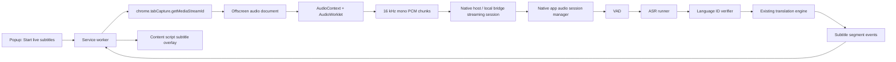

# Phase 4 Research: Browser Live Audio Translation And Subtitles

Last updated: 2026-07-04

Status: research report and candidate Phase 4 requirement point.

This report treats the user's "全国各种语言" wording as "各国语言 / global multilingual language identification". The target is not to replace the existing Phase 4 file-drop plan yet. It defines a candidate Phase 4.x requirement that can be merged into the roadmap after product prioritization.

## 1. Executive Conclusion

There are very small and fast language identification models, but the strongest "very small" option is for text, not raw audio:

- For text language identification after speech has already been transcribed, fastText `lid.176.ftz` is the best first choice: roughly sub-1 MB, offline, fast enough for every finalized subtitle segment, and supports 176 languages.
- For raw audio spoken-language identification, there is no equally tiny, highly accurate, all-language model suitable as the primary browser-extension model. The realistic local choices start around tens of MB and still cover only around 100 languages, or jump to 1B-parameter MMS models for thousands of languages.
- For real-time subtitles, language identification is only one step. The product must capture tab audio, segment speech, run ASR, identify or confirm source language from the ASR output, translate text, and render a subtitle overlay.

Recommended Phase 4.x implementation path:

1. Keep browser extension responsibilities narrow: current-tab audio capture, audio preprocessing, session control, and subtitle overlay.
2. Run ASR, language ID, and translation in the native llmTools app through an extended local bridge.
3. Use a two-layer language detection strategy:
   - primary: Whisper or ASR engine's detected language for each audio segment;
   - verifier: fastText text LID on finalized transcript, with confidence thresholds and "unknown" fallback for very short text.
4. Start with a Chrome-only MVP and local processing by default, matching Phase 2's privacy model.

## 2. Model Research

### 2.1 Text Language Identification

| Option | Size / footprint | Coverage | Fit for llmTools |
| --- | ---: | ---: | --- |
| fastText `lid.176.ftz` | About 917 KB compressed model | 176 languages | Best MVP text LID after ASR. Fast, offline, simple, mature. |
| fastText `lid.176.bin` | About 126 MB | 176 languages | Better accuracy/speed tradeoff than `.ftz`, but too large for "tiny model" positioning. Useful as optional quality mode. |
| Chrome / Edge Language Detector API | Browser-managed model download | Browser-supported language set, not exhaustive | Useful optional fallback or prototype, not product foundation because availability and language coverage are browser-controlled. |
| NLLB fastText LID variants | Larger model family | 200+ languages depending variant | Useful for later evaluation if 176 languages is insufficient. |

Recommendation:

- Bundle or download `lid.176.ftz` in the native app, not the extension.
- Run LID only on stable transcript text, not every partial token.
- Return `sourceLanguage`, `confidence`, and `source` fields with each finalized subtitle segment.
- Do not over-trust LID on short fragments. For subtitles shorter than roughly 15-20 characters, prefer the prior session language unless confidence is very high.

### 2.2 Spoken Language Identification

| Option | Size / footprint | Coverage | Fit for MVP |
| --- | ---: | ---: | --- |
| Whisper tiny/base multilingual | tiny 39M params, base 74M params; whisper.cpp ggml tiny around 75 MiB on disk, base around 142 MiB before quantization | Whisper multilingual language set; ASR + language identification | Best practical MVP because it also produces text. Tiny is fastest but weaker; base is safer default. |
| SpeechBrain VoxLingua107 ECAPA | Around 86 MB model files | 107 spoken languages | Good benchmark or optional raw-audio LID module. Not enough by itself because subtitles still need ASR. |
| Meta MMS LID | 1B-parameter checkpoints | 126, 256, 1024, or 4017 languages depending checkpoint | Excellent coverage research path, but not "small" and not MVP-friendly for local/browser runtime. |
| Browser built-in SpeechRecognition | Browser service; may be local or remote depending browser/API state | Browser-dependent | Prototype only. It is not a stable local-first production path for tab-audio subtitles. |

Recommendation:

- For the first shippable version, do not add a dedicated raw-audio LID model.
- Let ASR produce candidate language and use fastText on finalized text as a sanity check.
- Evaluate SpeechBrain VoxLingua107 only if Whisper language selection is unstable on multilingual media.
- Keep MMS out of MVP. It is a research-grade option for long-tail language coverage, not a small local app default.

### 2.3 Voice Activity Detection

VAD is required even though it is not language identification. Without VAD, every browser audio frame would be sent through ASR, creating unnecessary latency, CPU use, and subtitles during silence or music.

Recommended VAD:

- Silero VAD through ONNX or native runtime.
- Convert tab audio to 16 kHz mono PCM.
- Process 20-30 ms frames.
- Finalize subtitle segments when a silence threshold is reached, while still emitting partial captions during speech.

## 3. Browser Extension Feasibility

Chrome supports current-tab audio capture through `chrome.tabCapture`, but only after a user invokes the extension. This fits the product: realtime subtitles should start from an explicit popup button or command, not automatically across all pages.

Important browser facts:

- The extension must request the `tabCapture` permission.
- In Manifest V3, a service worker can request a stream ID and pass it to an offscreen document.
- The offscreen document can call `getUserMedia()` with the tab stream ID and create an audio `MediaStream`.
- Capturing tab audio can stop the tab audio from playing to the user unless the extension reconnects the stream to an `AudioContext` destination.
- Content scripts cannot directly use native messaging. Session control should go through the service worker.

Current llmTools fit:

- The existing extension already has `activeTab`, `scripting`, `storage`, `nativeMessaging`, and page overlay patterns.
- The existing native app bridge is request/response HTTP for webpage text translation, not continuous audio streaming.
- Phase 4.x needs a new realtime bridge shape, but it should reuse the existing native host pairing, token, diagnostics, local-first defaults, and popup/content-script UI patterns.

## 4. Proposed Architecture

### 4.1 Extension Components

- Add `tabCapture` and `offscreen` permissions.
- Add an offscreen document, for example `offscreen-audio.html` and `offscreenAudio.js`.
- Add an `AudioWorkletProcessor` that outputs small PCM chunks.
- Reconnect captured tab audio to local playback through `AudioContext.destination`.
- Add popup controls:
  - start live subtitles;
  - stop;
  - original / translated / bilingual subtitle mode;
  - target language;
  - font size and position if needed.
- Add content-script overlay:
  - fixed bottom subtitle layer;
  - shadow DOM container to reduce style collision;
  - translated-only and bilingual modes;
  - clear final/partial visual states;
  - no mutation of source page text.

### 4.2 Native App Components

Add a separate live audio feature area instead of overloading webpage translation:

- `LiveAudioSessionManager`
- `LiveAudioCaptureSession`
- `AudioResampler` if the extension does not fully normalize audio
- `VADRunner`
- `ASRRunner`
- `TextLanguageIdentifier`
- `SubtitleTranslationCoordinator`

Bridge protocol should support sessions:

- `POST /liveAudioSessions` creates a session and returns a session ID, supported sample rate, chunk format, model names, and privacy mode.
- `POST /liveAudioSessions/{id}/chunks` accepts sequence-numbered PCM chunks if staying with HTTP.
- Prefer WebSocket or a persistent native messaging port for lower overhead and bidirectional partial events.
- `POST /liveAudioSessions/{id}/stop` stops capture, cancels ASR/translation, and unloads models if needed.
- Events back to the extension:
  - `partialTranscript`
  - `finalTranscript`
  - `languageDetected`
  - `partialTranslation`
  - `finalTranslation`
  - `warning`
  - `error`
  - `stopped`

## 5. Runtime Strategy

### 5.1 MVP Runtime

Use native app runtime first:

- ASR: whisper.cpp multilingual `base` as default, `tiny` as speed mode, `small` as quality mode.
- VAD: Silero VAD.
- Text LID: fastText `lid.176.ftz`.
- Translation: existing llmTools model registry and `TaskEngine`, with a dedicated short-subtitle prompt.

Why native-first:

- Keeps large model files out of the browser extension.
- Avoids WebGPU/browser availability variance.
- Reuses llmTools' local-first privacy and model lifecycle model.
- Fits current architecture where the extension already delegates model work to the macOS app.

### 5.2 Browser-Only Prototype

Transformers.js can run Whisper-style ASR in the browser and has WebGPU examples. This is useful for a spike, but should not be the product default yet:

- model downloads are large for extension UX;
- WebGPU availability is browser/hardware dependent;
- MV3 service workers cannot own long-running audio/model work directly, so an offscreen document is still needed;
- packaging and caching model assets in a browser extension is less aligned with llmTools' existing native model registry.

### 5.3 Cloud / Remote Provider Mode

Remote ASR or translation should be explicit opt-in only:

- show provider/model used;
- show that audio or transcripts may leave the device;
- disable raw audio/history persistence by default;
- never silently fall back from local to cloud.

## 6. Candidate Phase 4.x Requirement

### Requirement Name

Browser Live Audio Translation And Subtitles

### Goal

The user can click llmTools in Chrome while a web page is playing audio or video, start live subtitles, and see original and/or Chinese translated subtitles over the page with local processing by default.

### In Scope

- Chrome current-tab audio capture after explicit user action.
- Realtime speech segmentation through VAD.
- Local ASR through a configured speech-capable model/runtime.
- Source-language detection for finalized subtitle segments.
- Translation into the configured target language, default Simplified Chinese.
- Subtitle overlay in the current page.
- Start, stop, retry, and cancellation.
- Redacted diagnostics: no raw audio, transcript, page URL, or translated text in diagnostics by default.
- Privacy controls: raw audio and transcripts are not stored unless the user explicitly opts in.

### Out Of Scope For MVP

- Always-on audio monitoring.
- Microphone dictation.
- System-wide audio capture outside the current browser tab.
- DRM/protected media guarantees.
- Speaker diarization.
- Word-perfect timestamps.
- Speech-to-speech translation.
- Claiming support for every human language.
- Safari/Firefox implementation.
- Browser-only model execution as the default product path.

### User Stories

1. As a user watching an English video in Chrome, I can start llmTools live subtitles and see Chinese subtitles without copying anything.
2. As a user watching a multilingual video, I can see the detected source language and get an "unknown/low confidence" state instead of wrong certainty.
3. As a privacy-sensitive user, I can confirm whether ASR and translation are local or remote before starting.
4. As a user, I can stop subtitles and know that audio capture and model work have stopped.

### Acceptance Criteria

- Starting live subtitles requires an explicit user action from the extension popup, command, or context menu.
- Captured tab audio continues playing to the user.
- The extension can stop capture and release the media stream within one second of user stop.
- A first partial transcript appears within roughly 1 second after speech begins on supported hardware/model settings.
- A final translated subtitle appears within roughly 2-4 seconds after the speech segment ends for the MVP supported model set.
- The system displays the selected ASR model, detected source language, target language, and local/remote processing mode.
- If the language detector confidence is too low, the subtitle event marks source language as `unknown` instead of fabricating certainty.
- Raw audio is not written to disk by default.
- Transcript/subtitle history is off by default.
- Diagnostics redact raw transcript text, translated text, page URL, and tab title.
- Existing Phase 2 webpage text translation remains unaffected.

## 7. Phased Delivery Plan

### Phase 4.x.0 Technical Spike

- Add a dev-only Chrome `tabCapture` prototype.
- Capture current-tab audio in an offscreen document.
- Preserve tab playback through `AudioContext`.
- Emit PCM chunk stats to the popup.
- Verify stop/restart and navigation behavior.

Exit criteria:

- Current-tab audio capture works on a normal HTTP/HTTPS video page.
- Capture cannot start without user action.
- Stop reliably releases capture.

### Phase 4.x.1 Local ASR Subtitle MVP

- Add native live-audio session protocol.
- Add VAD.
- Add whisper.cpp ASR runner.
- Render original-language live subtitles in the page overlay.
- Add cancellation and model unload behavior.

Exit criteria:

- English video produces readable original subtitles locally.
- Silence and music do not continuously trigger ASR.
- The UI shows running/stopped/error states.

### Phase 4.x.2 Translation And Language ID

- Add fastText text LID.
- Combine ASR detected language + fastText verification.
- Translate finalized transcript segments with existing llmTools translation engine.
- Add bilingual/translated-only/original-only overlay modes.

Exit criteria:

- English-to-Chinese subtitles work end to end.
- At least a small multilingual fixture set is tested: English, Chinese, Japanese, Korean, Spanish, French, German.
- Low-confidence language cases show `unknown`.

### Phase 4.x.3 Quality And Browser Expansion

- Add latency and CPU diagnostics.
- Add model selection: speed/default/quality ASR.
- Evaluate SpeechBrain VoxLingua107 only if raw-audio language ID improves real videos.
- Add Edge once Chrome is stable, reusing the Phase 2 browser-row pattern.

Exit criteria:

- Stable long-session behavior for at least 30 minutes.
- No memory growth beyond an agreed threshold.
- Stop/restart survives tab navigation.

## 8. Key Risks

- Latency: local ASR + translation can exceed subtitle expectations on slower Macs, especially with `small` or larger models.
- Accuracy: tiny ASR models are not precise enough for all media; noisy audio, music, accents, and overlapping speakers will degrade output.
- Language coverage: "all languages" is not realistic for a small local model. MVP should name supported/evaluated languages and handle unknowns honestly.
- Browser constraints: tab audio capture is permissioned and user-gesture-gated. Browser internal pages and protected contexts may not work.
- Bridge shape: current local bridge is request/response; realtime audio needs session streaming and backpressure.
- UX clutter: subtitle overlay must not mutate page content or conflict with video controls.
- Resource pressure: simultaneous ASR and translation can compete with existing model runners.

## 9. Open Decisions

- Should Phase 4 remain file/document intake only, or should browser media subtitles become Phase 4.x after Phase 3 OCR?
- Should ASR models be managed in the same registry as text/vision models, or in a separate "speech models" section?
- Should the first MVP support only English-to-Chinese despite multilingual detection, or expose multilingual auto mode from day one?
- Is remote ASR acceptable as an explicit provider-backed option, or should Phase 4.x remain strictly local?
- Should live subtitle transcript history exist at all, or remain ephemeral only?

## 10. Recommended Product Decision

Add "Browser Live Audio Translation And Subtitles" as a Phase 4 candidate requirement, but do not promise universal language coverage. The requirement should be framed as:

- local-first live subtitles for browser tab audio;
- multilingual source detection with confidence;
- Chinese translation by default;
- honest unsupported/low-confidence states;
- Chrome first;
- native app model execution first.

This keeps the demand aligned with llmTools' current architecture and avoids the trap of shipping a large, fragile model runtime inside the browser extension.

## References

- fastText Language Identification: https://fasttext.cc/docs/en/language-identification.html
- fastText small language detector blog: https://fasttext.cc/blog/2017/10/02/blog-post.html
- Chrome `tabCapture` API: https://developer.chrome.com/docs/extensions/reference/api/tabCapture
- Chrome audio recording and screen capture for extensions: https://developer.chrome.com/docs/extensions/how-to/web-platform/screen-capture
- Chrome native messaging: https://developer.chrome.com/docs/extensions/develop/concepts/native-messaging
- OpenAI Whisper repository and model sizes: https://github.com/openai/whisper
- Whisper model card: https://github.com/openai/whisper/blob/main/model-card.md
- whisper.cpp memory usage and quantization: https://github.com/ggml-org/whisper.cpp
- Transformers.js WebGPU ASR example: https://huggingface.co/docs/transformers.js/guides/webgpu
- Transformers.js pipeline streaming note: https://huggingface.co/docs/transformers.js/pipelines
- SpeechBrain VoxLingua107 language ID model: https://huggingface.co/speechbrain/lang-id-voxlingua107-ecapa
- Meta MMS speech overview: https://ai.meta.com/blog/multilingual-model-speech-recognition/
- MMS LID 4017 model card: https://huggingface.co/facebook/mms-lid-4017
- Silero VAD: https://github.com/snakers4/silero-vad
- sherpa-onnx: https://github.com/k2-fsa/sherpa-onnx
- MDN SpeechRecognition: https://developer.mozilla.org/en-US/docs/Web/API/SpeechRecognition
- MDN `SpeechRecognition.processLocally`: https://developer.mozilla.org/en-US/docs/Web/API/SpeechRecognition/processLocally
- Chrome Language Detector API: https://developer.chrome.com/docs/ai/language-detection
- Chrome Translator API: https://developer.chrome.com/docs/ai/translator-api
- Microsoft Edge Language Detector API: https://learn.microsoft.com/en-us/microsoft-edge/web-platform/languagedetector-api
