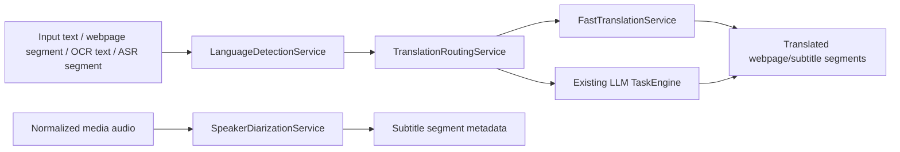

# Phase 4.x PRD: Language Routing, Speaker Intelligence, And Fast Local MT

Last updated: 2026-07-08

Status: proposed Phase 4.x plan. This is an enhancement phase on top of Phase 4 media subtitles and webpage translation. It does not replace the existing local ASR pipeline, OCR workflow, or the planned Phase 5 local document assistant.

## 1. Objective

Phase 4.x adds three small-model infrastructure capabilities to llmTools:

1. Ultra-small text language identification for automatic language detection and model routing.
2. Speaker diarization and speaker embedding support for media subtitles.
3. Dedicated local machine-translation runtimes for high-speed webpage and subtitle translation.

The goal is to make existing Phase 2 webpage translation and Phase 4 media/live subtitles faster, more automatic, and more transparent while preserving the local-first privacy boundary.

This phase should not become a broad chat feature, a meeting bot, a cloud ASR feature, or a document-indexing phase. It is a focused runtime-routing layer for language, speaker, and translation tasks.

## 1.1 Confirmed Product Decisions

- Phase 4 ASR remains local-only. Phase 4.x must not add remote ASR or automatic cloud ASR fallback.
- Language identification is text-first. The default detector runs after text is available from selected text, webpage text, OCR output, or ASR transcript segments. Raw-audio language ID is out of MVP unless a later spike proves it materially improves real subtitles.
- Speaker diarization starts with file subtitles. Realtime speaker diarization is optional and must not regress first-subtitle latency.
- Dedicated machine translation is an optional fast path. The existing LLM translation engine remains the default quality path and remains available for text tasks, OCR after-translation, webpage translation, and subtitles.
- Fast local MT is selected by explicit user preference, automatic routing rules, or task-specific speed mode. It must be visible which engine produced the output.
- Webpage and subtitle fast MT must preserve the current privacy model: page text, transcript text, and subtitle text stay local unless the user explicitly chooses a remote translation provider.
- This phase should reuse existing app-level capture, subtitle, webpage bridge, model registry, and Settings patterns. It should not reintroduce browser-extension-hosted live audio capture as the primary product path.

## 2. Scope Summary

### 2.1 In Scope

- Add language-detection model capability and runtime metadata.
- Add a local language ID sidecar/runtime using fastText `lid.176.ftz` as the MVP default, with `lid.176.bin` as an optional higher-accuracy local model.
- Use detected language in text tasks, webpage translation, OCR after-translation, media subtitle translation, and model-routing decisions.
- Add low-confidence and short-text language behavior instead of fabricating certainty.
- Add speaker diarization capability and runtime metadata.
- Add file-subtitle diarization that labels subtitle segments as `Speaker 1`, `Speaker 2`, etc.
- Store speaker labels and optional local speaker embedding IDs in subtitle segment metadata.
- Add optional speaker-aware subtitle export for SRT, VTT, TXT, and Markdown.
- Add a local fast MT runtime layer with command-template and packaged sidecar integration options.
- Support at least one CTranslate2-based translation path for evaluated language pairs.
- Support Argos Translate as a command/runtime option where installed by the user.
- Support NLLB/CTranslate2 as an experimental broad-language option after license and performance gates are explicit.
- Add Settings controls for language ID, speaker diarization, and fast MT.
- Add diagnostics that report engine, model, source/target language, latency, segment counts, and confidence without logging raw text by default.
- Add automated checks for preference migration, routing decisions, low-confidence behavior, speaker metadata export, and fast-MT fallback behavior.

### 2.2 Out Of Scope

- Remote ASR.
- Cloud diarization.
- Always-on microphone monitoring.
- Meeting bots or joining conferencing apps.
- Voice cloning, speaker identification against a personal biometric database, or cross-session speaker recognition by default.
- Word-perfect diarization.
- Raw-audio language ID as the default route.
- Replacing all LLM translation with MT.
- Browser PDF translation, browser image/canvas OCR translation, PDF/DOCX indexing, and multi-document QA.
- Silent model downloads.
- Production claims for NLLB or any non-commercial/research-limited model.

## 3. Product Principles

- Local-first: the new small-model services must run locally by default.
- Routing must be observable: show language, confidence, selected translation engine, speaker mode, and fallback reason when relevant.
- Conservative automation: automatic language and engine routing can help, but uncertain detection should fall back to the user's configured default.
- Quality path remains available: fast MT is for throughput and latency, not for all high-quality writing tasks.
- Reuse data structures: subtitle segment metadata should carry language and speaker fields instead of creating a separate parallel transcript model.
- Privacy by default: raw text, raw audio, speaker embeddings, and speaker names are not persisted unless the user explicitly opts in.
- Runtime honesty: gated, licensed, or user-token-dependent diarization models must be labeled as such.

## 4. User Stories

### 4.1 Automatic Language Detection And Routing

As a user, I can let llmTools detect source language automatically across selected text, webpage text, OCR output, and subtitle transcript segments.

Acceptance:

- The app can run local text language detection on UTF-8 text.
- The default detector supports 176 languages through fastText `lid.176.ftz`.
- The detector returns language code, confidence, text length bucket, and model name.
- Text below the short-text threshold uses session language, user hint, or existing task default unless confidence is very high.
- For bilingual subtitles, each finalized ASR segment can carry its own source-language confidence.
- Low confidence is shown as `unknown` or `low confidence` instead of a confident wrong language.
- Detected language can route translation direction for `auto` mode.
- Detected language can route between fast MT and the LLM translator when the selected engine supports or does not support the pair.
- Diagnostics do not include raw detected text by default.

### 4.2 Speaker-Aware File Subtitles

As a user processing an audio/video file with multiple speakers, I can generate subtitles that label speaker turns.

Acceptance:

- File media subtitle runs can enable diarization before export.
- Diarization consumes local normalized audio, preferably 16 kHz mono PCM/WAV, consistent with the existing media pipeline.
- Subtitle segments receive stable local labels such as `Speaker 1`, `Speaker 2`, etc.
- Speaker labels are stable within one file run.
- If diarization fails, the transcript/subtitle run remains usable without speaker labels.
- Export formats can include speaker labels when enabled.
- Markdown/TXT export can group by speaker turns.
- SRT/VTT export can prefix cue text with the speaker label when enabled.
- The app does not persist speaker embeddings by default.

### 4.3 Optional Realtime Speaker Labels

As a user watching live subtitles, I can optionally see approximate speaker changes only when the model/runtime can keep up.

Acceptance:

- Realtime speaker labels are disabled by default.
- Realtime diarization has a separate readiness/latency health state.
- Enabling realtime diarization must not block ASR partial subtitles.
- If realtime diarization lags behind, subtitles continue without labels and the lag/fallback state is visible.
- The default live-subtitle path remains optimized for first readable subtitle latency.

### 4.4 Fast Webpage Translation

As a user reading long webpages, I can select a local fast translation engine for lower latency than LLM translation.

Acceptance:

- Settings can select webpage translation engine: `Default LLM`, `Fast local MT`, or `Auto`.
- Fast local MT only appears ready for installed and supported language pairs.
- Webpage translation cache keys include the translation engine and model ID, so LLM and MT outputs are not mixed.
- Unsupported language pairs fall back according to the user's configured policy.
- The popup or diagnostics shows the engine used for the current page.
- DOM safety rules, restore, cache clearing, site rules, reading modes, and privacy diagnostics remain unchanged.

### 4.5 Fast Subtitle Translation

As a user translating generated subtitles, I can use a local MT engine for speed and retry with the LLM engine for quality.

Acceptance:

- Subtitle translation engine can be selected independently from webpage translation engine.
- Fast MT preserves subtitle segment order and timing.
- Translation can be retried from transcript segments without rerunning ASR.
- A subtitle export records whether output was produced by LLM translation or fast MT in redacted diagnostics/export metadata where appropriate.
- The user can compare or rerun selected segments with the quality LLM path.

## 5. Model And Runtime Strategy

### 5.1 Language Identification

MVP default:

- fastText `lid.176.ftz`.
- Size: about 917 kB.
- Coverage: 176 languages.
- Runtime boundary: command sidecar or embedded native wrapper after a spike; both must accept UTF-8 text and return top-k labels with probabilities.

Optional quality mode:

- fastText `lid.176.bin`.
- Size: about 126 MB.
- Slightly more accurate/faster according to upstream fastText documentation, but too large for the default tiny positioning.

Product behavior:

- Use `ftz` as the built-in recommended model.
- Make `bin` user-configurable for quality mode.
- Keep per-surface language hints. For example, ASR source-language hint and webpage target-language defaults remain meaningful.
- Do not override a clear user language selection with automatic detection.

Reference: fastText distributes two language-identification models that recognize 176 languages: `lid.176.ftz` at 917 kB and `lid.176.bin` at 126 MB.

### 5.2 Voice Activity Detection

MVP enhancement:

- Add Silero VAD as an optional VAD backend or benchmark candidate.
- Keep the current VAD path as fallback until Silero is validated in the packaged app.

Expected role:

- More reliable speech/silence decisions for file subtitles and live subtitles.
- Better segmentation input for diarization.

Reference: Silero VAD reports sub-1 ms processing for 30 ms+ audio chunks on a single CPU thread, about 2 MB JIT model size, 8 kHz/16 kHz sampling support, and MIT licensing.

### 5.3 Speaker Diarization And Embeddings

MVP default integration shape:

- Command-template sidecar first.
- Input: normalized local audio path.
- Output: JSON or RTTM-like speaker turns.
- App maps speaker turns onto existing subtitle segments.

Candidate runtime:

- pyannote speaker diarization 3.1 as a user-configured local Python sidecar.

Constraints:

- pyannote 3.1 is suitable for file diarization first because it consumes whole files and outputs an annotation.
- It is gated on Hugging Face and requires accepting user conditions plus an access token.
- It should not be silently installed or presented as built-in.
- Realtime diarization needs a separate latency spike before being accepted.

Required sidecar JSON output:

```json
{
  "speakers": [
    { "id": "SPEAKER_00", "label": "Speaker 1" },
    { "id": "SPEAKER_01", "label": "Speaker 2" }
  ],
  "turns": [
    { "start": 0.45, "end": 3.2, "speaker": "SPEAKER_00", "confidence": 0.86 },
    { "start": 3.35, "end": 7.1, "speaker": "SPEAKER_01", "confidence": 0.78 }
  ]
}
```

Speaker embedding policy:

- Embeddings are session-local by default.
- Persisting speaker embeddings requires an explicit opt-in and clear naming that this is a biometric-like local artifact.
- MVP should store only run-local speaker IDs and labels.

### 5.4 Fast Local Machine Translation

Runtime layer:

- Add a `FastTranslationRuntime` abstraction separate from the LLM `TaskEngine` runner.
- Initial execution should be via sidecar command templates or packaged helper scripts, mirroring the Phase 4 ASR command-template pattern.
- The abstraction should support pair readiness, language-code normalization, batch translation, cancellation, and fallback reason reporting.

Candidate engines:

1. CTranslate2.
   - Best first integration boundary for dedicated Transformer MT models.
   - Supports NLLB, MarianMT, M2M100, MBART, T5, and other selected Hugging Face Transformers families.
   - Supports conversion from HF models and optimized inference.
2. Argos Translate.
   - Good user-installed command/Python-library option.
   - Provides offline translation packages and language-pair package management.
   - Useful as a quick MVP sidecar because it already wraps OpenNMT/CTranslate2-style local translation workflows.
3. OPUS-MT / MarianMT pairs.
   - Good pair-specific fast mode where license and quality are acceptable.
   - Recommended for high-volume common pairs such as `en -> zh-Hans`, `zh -> en`, `ja -> zh-Hans`, and `ko -> zh-Hans` after local evaluation.
4. NLLB 600M via CTranslate2.
   - Experimental broad-language option.
   - Covers many languages, but upstream model card positions it primarily for research and single-sentence translation. Treat as optional user-configured runtime, not default production engine.

MVP language pairs:

- Required: `en -> zh-Hans`, `zh -> en`.
- Smoke set: `ja -> zh-Hans`, `ko -> zh-Hans`, `es -> zh-Hans`, `fr -> zh-Hans`, `de -> zh-Hans`.
- Fallback: unsupported pairs return a structured `unsupportedLanguagePair` state and can route to the configured LLM translator.

Batching requirements:

- Webpage translation batches preserve segment identity.
- Subtitle translation batches preserve timing and segment order.
- Fast MT should process batches without JSON protocol fragility. The sidecar response should be structured JSON with segment IDs.

Required sidecar JSON input:

```json
{
  "sourceLanguage": "en",
  "targetLanguage": "zh-Hans",
  "segments": [
    { "id": "seg-1", "text": "Hello world." },
    { "id": "seg-2", "text": "This page is translated locally." }
  ]
}
```

Required sidecar JSON output:

```json
{
  "engine": "ctranslate2",
  "model": "opus-mt-en-zh",
  "sourceLanguage": "en",
  "targetLanguage": "zh-Hans",
  "segments": [
    { "id": "seg-1", "translation": "你好，世界。" },
    { "id": "seg-2", "translation": "此页面在本地翻译。" }
  ]
}
```

## 6. Data Model Changes

### 6.1 Model Capabilities

Extend the model registry without breaking old registries:

```swift
public enum ModelInputCapability: String, Codable, Sendable, CaseIterable, Hashable {
    case text
    case image
    case speech
    case languageID
    case speakerDiarization
    case fastTranslation
}
```

Suggested metadata:

```swift
public struct LanguageIDCapabilities: Codable, Hashable, Sendable {
    public var supportedLanguages: [String]
    public var defaultModelVariant: String
    public var minReliableCharacters: Int
    public var source: ModelCapabilitySource
    public var confidence: Double
    public var note: String?
}

public struct SpeakerDiarizationCapabilities: Codable, Hashable, Sendable {
    public var supportsFile: Bool
    public var supportsRealtime: Bool
    public var outputFormats: [String]
    public var requiresUserToken: Bool
    public var source: ModelCapabilitySource
    public var confidence: Double
    public var note: String?
}

public struct FastTranslationCapabilities: Codable, Hashable, Sendable {
    public var engine: String
    public var supportedPairs: [LanguagePair]
    public var supportsBatch: Bool
    public var supportsCancellation: Bool
    public var source: ModelCapabilitySource
    public var confidence: Double
    public var note: String?
}
```

### 6.2 Subtitle Segment Metadata

Extend subtitle segment metadata:

```swift
public struct SubtitleSegmentLanguage: Codable, Hashable, Sendable {
    public var code: String
    public var confidence: Double
    public var detectorModel: String
}

public struct SubtitleSegmentSpeaker: Codable, Hashable, Sendable {
    public var speakerID: String
    public var displayLabel: String
    public var confidence: Double?
}
```

Segment fields:

- `detectedLanguage: SubtitleSegmentLanguage?`
- `speaker: SubtitleSegmentSpeaker?`
- `translationEngine: TranslationEngineID?`

### 6.3 Preferences

Suggested preferences:

- `languageRouting.enabled`
- `languageRouting.modelID`
- `languageRouting.shortTextMinimumCharacters`
- `languageRouting.lowConfidenceThreshold`
- `languageRouting.useForTextTasks`
- `languageRouting.useForWebpage`
- `languageRouting.useForSubtitles`
- `speakerDiarization.enabledForFileSubtitles`
- `speakerDiarization.enabledForLiveSubtitles`
- `speakerDiarization.modelID`
- `speakerDiarization.persistSpeakerEmbeddings`
- `fastTranslation.webpageEngine`
- `fastTranslation.subtitleEngine`
- `fastTranslation.fallbackPolicy`
- `fastTranslation.commandTemplates.ctranslate2`
- `fastTranslation.commandTemplates.argos`
- `fastTranslation.commandTemplates.generic`

Fallback policies:

- `showError`
- `fallbackToLLM`
- `askEachTime`

Default policy:

- Webpage: `fallbackToLLM`.
- Subtitles: `fallbackToLLM`.
- Text tasks: stay on LLM unless user explicitly selects fast MT.

## 7. Architecture

### 7.1 Services

Add focused services in `LLMToolsCore`:

- `LanguageDetectionService`
- `SpeakerDiarizationService`
- `FastTranslationService`
- `TranslationRoutingService`

High-level flow:



### 7.2 Runtime Boundary

Use sidecars first:

- Lower crash risk than in-process Python/C++/PyTorch integration.
- Matches the current ASR command-template pattern.
- Makes gated pyannote and user-installed MT packages explicit.
- Allows later native embedding only after performance and packaging are proven.

Runtime health checks:

- installed
- missing command
- missing model
- unsupported language pair
- missing user token
- incompatible output
- timed out
- ready

### 7.3 Browser/Webpage Boundary

No new page permissions are needed for fast MT.

The extension continues to own:

- DOM discovery
- restore
- reading mode
- cache controls
- page diagnostics

The native app owns:

- engine routing
- language detection
- translation execution
- local runtime health
- redacted diagnostics

Cache key additions:

- `translationEngine`
- `engineModelID`
- `sourceLanguage`
- `targetLanguage`
- `languageDetectionModelID` when source language is auto-detected

## 8. UX And Settings

### 8.1 Settings: Language Routing

Controls:

- Enable automatic language detection.
- Select language ID model.
- Low-confidence threshold.
- Short-text minimum characters.
- Use for selected text.
- Use for webpage translation.
- Use for OCR results.
- Use for media subtitles.

Visible state:

- model name
- supported language count
- last health check
- sample detection result

### 8.2 Settings: Speaker Diarization

Controls:

- Enable file subtitle speaker labels.
- Enable experimental live speaker labels.
- Select diarization runtime.
- Command template.
- Health check.
- Persist speaker embeddings, default off.

Visible state:

- file-ready
- realtime-ready
- requires token
- local-only
- last error

### 8.3 Settings: Fast Translation

Controls:

- Webpage translation engine.
- Subtitle translation engine.
- Fast MT runtime.
- Language-pair readiness.
- Fallback policy.
- Command templates.
- Batch size limits.

Visible state:

- ready language pairs
- unsupported language pairs
- engine/model name
- last latency check
- last failure

### 8.4 Runtime Surfaces

Webpage popup diagnostics:

- engine
- model
- detected source language
- target language
- fallback reason
- elapsed time

Subtitle window/status:

- detected language
- low-confidence language marker
- speaker label when enabled
- translation engine when not default

Export metadata:

- source ASR model
- language detector model
- diarization model
- translation engine
- target language
- generation timestamp

Do not include raw text in diagnostics by default.

## 9. Privacy And Security

- Language detection runs on local text and does not send data to a remote service.
- Speaker diarization runs on local normalized audio.
- Raw audio remains temporary and deleted after processing under the existing Phase 4 policy.
- Speaker embeddings are not persisted by default.
- If the user enables persistent speaker embeddings, the UI must explain that these are local biometric-like identifiers and provide a delete action.
- Fast MT runs locally by default.
- If fast MT cannot handle the pair and fallback to a remote LLM provider is enabled, the app must use the existing provider disclosure behavior.
- Diagnostics use hashes, counts, language codes, model IDs, timings, and error codes by default.

## 10. Milestones

### 10.1 Phase 4.x.1: Language ID And Routing Foundation

Deliverables:

- Add capability and preference models for language ID.
- Add `LanguageDetectionService` with a fixture/runtime adapter.
- Add fastText sidecar or wrapper support for `lid.176.ftz`.
- Add language detection to selected text, OCR output, webpage batches, and final subtitle segments.
- Add low-confidence and short-text rules.
- Add Settings controls and health check.
- Add checks for old preference decode, language routing, and redacted diagnostics.

Acceptance:

- Chinese, English, Japanese, Korean, Spanish, French, and German fixtures produce expected language labels above threshold.
- Short mixed fragments do not force a wrong language.
- Auto-translation direction uses detected language when confidence is high.
- Existing manual target/source choices still override automatic routing.

### 10.2 Phase 4.x.2: Speaker-Aware File Subtitles

Deliverables:

- Add diarization capability and preferences.
- Add command-template diarization service.
- Add pyannote-compatible JSON/RTTM parsing.
- Map speaker turns to subtitle segments.
- Add speaker-aware export for SRT/VTT/TXT/Markdown.
- Add Settings health check.
- Add fixture tests for speaker turn mapping and export.

Acceptance:

- A two-speaker fixture receives stable speaker labels.
- Exported subtitles can include speaker labels.
- Diarization failure does not destroy transcript/subtitle output.
- No speaker embeddings are persisted unless opt-in is enabled.

### 10.3 Phase 4.x.3: Fast MT Runtime For Subtitles

Deliverables:

- Add fast translation capability and preferences.
- Add `FastTranslationService` with structured JSON command protocol.
- Add CTranslate2 or Argos runtime adapter.
- Add subtitle translation engine selector.
- Add retry with LLM quality path.
- Add diagnostics and export metadata.

Acceptance:

- `en -> zh-Hans` subtitle fixture translates locally with segment order/timing preserved.
- Unsupported pairs produce a structured fallback or error.
- Retrying with the LLM engine reuses transcript segments and does not rerun ASR.

### 10.4 Phase 4.x.4: Fast MT Runtime For Webpage Translation

Deliverables:

- Add webpage translation engine selector.
- Route webpage batches through fast MT when supported.
- Update cache keys with engine/model/source language.
- Add popup diagnostics.
- Add DOM regression checks for fast-MT path.

Acceptance:

- A long English webpage can translate through local fast MT and restore normally.
- LLM and fast-MT cache entries do not collide.
- Unsupported language pairs fall back according to preference.
- Existing reading modes, site rules, cache clearing, and privacy checks remain green.

### 10.5 Phase 4.x.5: Realtime Speaker Label Spike

Deliverables:

- Benchmark realtime diarization latency with the existing live-subtitle bridge.
- Decide whether realtime speaker labels belong in product scope.
- If accepted, implement non-blocking delayed speaker labels.
- If rejected, document file-only speaker diarization as the supported mode.

Acceptance:

- Live ASR partial subtitles are not delayed by diarization.
- If speaker labels lag, they are displayed as delayed metadata or omitted.
- The app never waits for speaker labels before showing readable subtitle text.

## 11. Validation Plan

Automated:

- `swift run LLMToolsChecks`
- Existing `node scripts/check-browser-extension-dom.mjs`
- Existing `node scripts/check-phase4-media-subtitles.mjs`
- New language routing check script.
- New fast MT fixture check script.
- New speaker diarization fixture check script.

Manual/package-first:

- `./scripts/package-app.sh`
- `codesign --verify --deep --strict --verbose=2 dist/llmTools.app`
- Relaunch packaged app.
- Verify Settings health checks.
- Verify one webpage fast-MT run.
- Verify one file-subtitle diarization run.
- Verify one subtitle fast-MT run.

Model/runtime benchmarks:

- Language ID latency per 100, 1,000, and 10,000 characters.
- Fast MT throughput for webpage batches and subtitle batches.
- Diarization runtime on 1 min, 10 min, and 30 min files.
- Realtime speaker-label spike only if file diarization is stable.

## 12. Open Decisions

- Should fastText be embedded through a native wrapper, a small command-line helper, or a Python sidecar for MVP?
- Which local MT engine should be the first packaged/recommended path: CTranslate2 direct, Argos Translate, or a repo-owned wrapper around both?
- Which `en <-> zh` model pair should be the first quality/performance baseline?
- Should NLLB be exposed at all in normal UI, or only through custom command templates because its model card frames it as research-oriented?
- Should speaker labels be editable in the subtitle export UI?
- Should per-speaker names persist per media file only, or across files after explicit opt-in?
- What latency budget is acceptable for realtime speaker labels?

## 13. Source Notes

- fastText language identification: `lid.176.ftz` is a 917 kB compressed model and `lid.176.bin` is 126 MB; both recognize 176 languages and expect UTF-8 input. Source: https://fasttext.cc/docs/en/language-identification.html
- Silero VAD: reports sub-1 ms processing for 30 ms+ chunks on one CPU thread, about 2 MB JIT model size, 8 kHz/16 kHz support, and MIT licensing. Source: https://github.com/snakers4/silero-vad
- pyannote speaker diarization 3.1: accepts 16 kHz mono audio and outputs speaker diarization; access requires accepting model conditions and using a Hugging Face token. Source: https://huggingface.co/pyannote/speaker-diarization-3.1
- CTranslate2: supports selected Hugging Face Transformers families including NLLB and provides an NLLB 600M conversion example. Source: https://opennmt.net/CTranslate2/guides/transformers.html
- Argos Translate: offline Python translation library using OpenNMT, with command-line/library usage and installable language packages. Source: https://github.com/argosopentech/argos-translate
- NLLB 200 distilled 600M: model card frames the model as primarily intended for machine-translation research and single-sentence translation among 200 languages. Source: https://huggingface.co/facebook/nllb-200-distilled-600M
