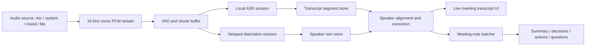

# Phase 4.y PRD: Live Meeting Transcription And Speaker Notes

Last updated: 2026-07-09

Status: proposed product surface. This is a separate delayed live transcription window, not an extension of the low-latency live subtitle overlay. The existing live subtitle speaker-diarization toggle remains disabled until its own latency gate passes.

## 1. Objective

Phase 4.y adds a dedicated live meeting transcription window to llmTools.

The user should be able to start a local audio session from a microphone, system audio, mixed desktop audio, or a local audio file, then watch llmTools build a running transcript that separates speakers and produces meeting notes. This workflow is allowed to lag behind the audio. It should optimize for readable transcript blocks, speaker grouping, editable speaker names, and useful meeting notes rather than sub-second subtitle latency.

The first product target is not video subtitles. It is a meeting-style note surface:

1. Capture audio after explicit user action.
2. Transcribe speech into timestamped turns.
3. Assign each turn to a session-local speaker label, even if that label arrives later.
4. Let the user rename and merge speakers.
5. Periodically produce summary, decisions, questions, and action items.
6. Export the transcript and notes as local files.

ASR remains local-first. The MVP must not silently send audio to a remote ASR or remote diarization provider. If a later version adds cloud diarization or cloud meeting transcription providers, that must be an explicit provider setting with visible privacy copy.

## 1.1 Confirmed Product Decisions

- This is a new window: `Live Meeting Transcription`, `Realtime Transcription`, or `Meeting Notes`. It is not the existing floating subtitle window.
- Latency is acceptable. The UI may show transcript and speaker labels several seconds after speech occurs.
- Speaker labels may be corrected retroactively for recent transcript rows.
- The app can display provisional states such as `Detecting speaker`, `Unknown speaker`, or `Speaker 2?` before the label settles.
- Transcript generation must continue even if speaker diarization is unavailable, slow, or failing.
- Meeting-note generation must consume finalized transcript windows, not raw audio.
- Speaker names and embeddings are session-local by default. Cross-session speaker identity is out of MVP unless the user explicitly opts into persistent local speaker embeddings.
- The session starts only by explicit user action and stops capture immediately when the user stops the session.
- The first implementation should prefer microphone input, then system audio and mixed audio, then local-file realtime playback mode.
- A stop-time finalization pass may improve speaker labels and meeting notes using the full captured session, but it must preserve user speaker-name edits.

## 1.2 Relationship To Existing Phase 4 And 4.x Work

This PRD builds on existing Phase 4 audio capture and ASR work, but it intentionally uses a different product contract.

- Phase 4 live subtitles prioritize first readable text. Speaker diarization must not block that path.
- Phase 4.x file speaker diarization labels subtitle segments after file ASR.
- Phase 4.y live meeting transcription allows delayed labels, correction, and finalization because meeting notes are not subtitles.
- The previous realtime diarization rejection still applies to live subtitle labels. It does not reject this delayed meeting transcription window.

## 2. Scope Summary

### 2.1 In Scope

- Dedicated live transcription window in the native macOS app.
- Explicit start/stop controls and visible capture state.
- Microphone audio capture for MVP.
- System audio and microphone+system mixed capture after the microphone path is stable.
- Local audio-file input in two modes: offline processing and realtime-playback simulation.
- Reuse of local ASR models and runtime health checks from Phase 4.
- Running transcript with timestamp, speaker label, transcript text, and stability state.
- Delayed speaker diarization worker that can label or relabel transcript rows after text appears.
- Session-local speaker list with rename, merge, and color/label assignment.
- Periodic meeting-note generation from finalized transcript windows.
- Meeting-note sections: short summary, decisions, action items, open questions, and topics.
- Stop-time finalization pass for improved speaker labels and cleaner notes.
- Export to Markdown and TXT for MVP, with JSON export for diagnostics or future import.
- Redacted diagnostics for audio source, model, runtime state, lag, segment counts, and error codes.
- Privacy defaults that avoid raw audio, transcript, speaker names, and meeting notes in diagnostics or history unless the user opts in.

### 2.2 Out Of Scope

- Sub-second subtitle rendering.
- Reusing the existing live subtitle overlay as the primary UI.
- Browser-extension-hosted audio capture.
- Joining Zoom, Teams, Tencent Meeting, or other meeting apps as a bot.
- Always-on microphone monitoring.
- Remote ASR or remote diarization fallback in the MVP.
- Cross-session speaker recognition by default.
- Voice verification, identity proof, or biometric speaker database behavior.
- Word-perfect diarization.
- Legal-grade meeting minutes guarantees.
- Mutating the source app, browser page, or meeting app UI.
- Automatic speaker-name inference from contacts, calendars, or meeting rosters.

## 3. Product Principles

- Notes over subtitles: the interface should be optimized for reading and editing a transcript, not for overlaying the current sentence.
- Delay is acceptable when it improves structure. The app should show lag honestly instead of pretending to be instant.
- Transcript first, speakers second. ASR output should continue even when speaker labeling is late.
- Corrections are normal. Recent transcript rows may be relabeled as diarization receives more context.
- User edits win. Manual speaker renames and merges must survive later model updates and finalization passes.
- Local-first privacy: audio stays on device by default, and diagnostics stay redacted.
- Explicit capture: no background listening and no capture after stop.
- Runtime honesty: show selected ASR model, diarization runtime, note-generation model, and fallback reason.

## 4. User Stories

### 4.1 Start A Microphone Meeting Session

As a user, I can open a live meeting transcription window, choose microphone input, and start a session.

Acceptance:

- The window shows microphone permission state before capture starts.
- The user can choose the local ASR model or use the configured default meeting ASR model.
- The user can choose whether meeting notes are generated during the session or only after stop.
- The window shows elapsed time, audio level, capture source, ASR state, diarization state, and note-generation state.
- Stopping the session releases microphone capture and stops worker processes.
- If microphone permission is denied, the UI shows an actionable permission error.

### 4.2 Read A Delayed Transcript

As a user, I can read finalized transcript turns as they become available, even if they are delayed.

Acceptance:

- The transcript is appended as stable rows, not fast-changing subtitle text.
- Each row includes start time, optional end time, speaker label, transcript text, and stability state.
- The UI may show partial rows, but final rows should be visually distinct.
- Transcript rows are ordered by audio time, not by worker completion time.
- If ASR lags behind, the lag is visible as seconds behind live audio.
- If ASR fails for a window, the session continues and shows a recoverable warning.

### 4.3 See Speaker Labels Arrive Late

As a user, I can see speaker labels appear after transcript text is already visible.

Acceptance:

- Rows without a speaker label show `Detecting speaker` or `Unknown speaker`.
- When diarization produces a speaker turn, affected transcript rows update in place.
- Recent rows may be relabeled if a later diarization window improves the assignment.
- The UI does not reorder transcript text only because a speaker label changes.
- Speaker-label lag is visible when it exceeds the configured target.
- If diarization is disabled or unavailable, transcript rows remain usable without labels.

### 4.4 Rename And Merge Speakers

As a user, I can correct speaker labels during or after the meeting.

Acceptance:

- The speaker list shows session-local speakers such as `Speaker 1`, `Speaker 2`, etc.
- The user can rename a speaker to a human-readable name.
- The user can merge two speaker labels when diarization splits one person incorrectly.
- Manual names and merges apply to existing rows and future rows assigned to that speaker ID.
- Later model updates must not overwrite manual names.
- Stop-time finalization must preserve user edits.

### 4.5 Generate Meeting Notes While The Session Runs

As a user, I can see a meeting-note draft update during the session.

Acceptance:

- Meeting notes are generated from finalized transcript rows only.
- Notes update in batches, for example every 30-90 seconds or after a stable transcript window.
- Notes include summary, decisions, action items, open questions, and topics.
- Action items preserve speaker labels or speaker names when available.
- The app shows when notes are stale relative to the latest transcript.
- Note generation failures do not stop capture, ASR, or diarization.

### 4.6 Finalize After Stop

As a user, I can stop the session and let llmTools clean up the transcript and notes.

Acceptance:

- After stop, the app can run an optional finalization pass.
- Finalization may use the full session audio buffer only if the user allowed temporary session audio retention during the run.
- Finalization can improve speaker labels, merge short adjacent turns, and regenerate notes.
- Finalization preserves manual speaker names and merges.
- The user can skip finalization and keep the current transcript.
- Temporary audio is deleted after finalization unless the user explicitly saved it.

### 4.7 Process Local Audio Input

As a user, I can use the same window for local audio input.

Acceptance:

- Offline mode processes a local audio file as a recording and can use file ASR plus file diarization.
- Realtime-playback mode feeds decoded audio through the same live session pipeline at approximately playback pace.
- The UI clearly distinguishes file processing from active microphone/system capture.
- File processing can still produce transcript, speaker labels, notes, and exports.

## 5. UX Requirements

### 5.1 Window Layout

The window should feel like a work surface, not a subtitle overlay.

Recommended regions:

- Top toolbar: source selector, start/stop, elapsed time, model selectors, lag indicators, export.
- Main transcript list: timestamped rows grouped by speaker turns.
- Side panel: speaker list, summary, decisions, action items, and open questions.
- Bottom status line: capture state, ASR state, diarization state, note-generation state, and last warning.

### 5.2 Transcript Row States

Each transcript row should support these states:

- `partial`: text may still change.
- `final`: ASR finalized the text.
- `speaker_pending`: speaker label is not ready.
- `speaker_assigned`: speaker label assigned by diarization.
- `speaker_edited`: speaker label or name was manually edited.
- `finalized`: row survived stop-time cleanup.

### 5.3 Lag Display

The feature is allowed to lag, but the lag must be visible.

Suggested indicators:

- ASR lag: audio time minus latest finalized transcript end time.
- Speaker lag: audio time minus latest speaker-assigned transcript end time.
- Notes lag: audio time minus latest transcript end time included in notes.

MVP target ranges:

- Transcript finalization: usually within 5-15 seconds.
- Speaker labeling: usually within 10-30 seconds.
- Note refresh: usually within 30-90 seconds.

These are product targets, not hard guarantees. The UI should show degraded state when the local machine or selected runtime falls behind.

## 6. Runtime And Architecture

### 6.1 Pipeline



### 6.2 Audio Capture

The implementation should reuse the existing native audio capture foundation:

- Microphone capture through the existing native microphone pipeline.
- System audio through the existing ScreenCaptureKit path.
- Mixed audio through the existing combined source option.
- Local audio files through the existing media normalization path or a decoded PCM feeder.

The meeting feature should own its own session state and window state. It should not share the live subtitle session object directly if that would couple meeting behavior to subtitle latency constraints.

### 6.3 ASR

The MVP should reuse Phase 4 local ASR infrastructure:

- Use the selected local realtime-capable ASR model for microphone/system sessions.
- Allow a slower ASR model when the user prioritizes transcript quality over lag.
- Keep partial transcript support optional; final transcript rows are the contract.
- Preserve audio timestamps so speaker turns and transcript rows can be aligned later.
- Do not add remote ASR fallback.

### 6.4 Speaker Diarization

The MVP needs a new delayed realtime diarization session. It should not call the current file-only pyannote sidecar synchronously for every transcript row.

Candidate local direction:

- First spike: a Python sidecar based on a realtime/online diarization library such as Diart.
- Input: PCM chunks or short rolling WAV windows.
- Output: NDJSON events containing speaker turns and confidence when available.
- App-side mapping: overlap speaker turns with transcript rows, then apply label updates.

Fallback direction:

- If realtime diarization is unavailable, keep transcript-only mode running.
- If a file-scope pyannote runtime is configured, offer stop-time finalization using the full session audio when temporary audio retention was allowed.

### 6.5 Speaker Alignment

Speaker alignment should use time overlap rather than text content.

Rules:

- Assign the speaker with the highest overlap against a transcript row.
- If overlap is weak, keep `Unknown speaker` instead of fabricating certainty.
- Allow recent rows to be relabeled inside a configurable correction window.
- Freeze rows after manual user edits unless the user resets that edit.
- Preserve deterministic session-local speaker labels.

### 6.6 Meeting Notes

Meeting notes should be generated from finalized transcript windows.

Rules:

- Batch transcript rows by stable time windows or a minimum token threshold.
- Use speaker labels when available, but do not block notes on diarization.
- Keep a structured note state: summary, decisions, action items, open questions, topics.
- Prefer incremental updates over rewriting the entire document on every batch.
- Keep a final regeneration option after stop.

The note-generation model can be the user's configured text model. If the user selected a remote text provider, that is a text-model/provider decision and must remain visible. It must not imply remote ASR.

## 7. Data Model

### 7.1 LiveMeetingSession

Suggested fields:

```swift
struct LiveMeetingSession {
    var id: UUID
    var source: LiveMeetingAudioSource
    var startedAt: Date
    var stoppedAt: Date?
    var asrModelID: UUID
    var diarizationRuntimeID: String?
    var notesModelID: UUID?
    var state: LiveMeetingRunState
    var transcriptLagMilliseconds: Int
    var speakerLagMilliseconds: Int
    var notesLagMilliseconds: Int
}
```

### 7.2 LiveMeetingSegment

Suggested fields:

```swift
struct LiveMeetingSegment {
    var id: UUID
    var index: Int
    var startTime: TimeInterval
    var endTime: TimeInterval?
    var text: String
    var speakerID: String?
    var speakerLabel: String?
    var confidence: Double?
    var state: LiveMeetingSegmentState
    var userEditedSpeaker: Bool
}
```

### 7.3 LiveMeetingSpeaker

Suggested fields:

```swift
struct LiveMeetingSpeaker {
    var id: String
    var label: String
    var displayName: String?
    var colorKey: String
    var mergedIntoSpeakerID: String?
    var userEdited: Bool
}
```

### 7.4 MeetingNoteState

Suggested fields:

```swift
struct MeetingNoteState {
    var summary: String
    var decisions: [MeetingDecision]
    var actionItems: [MeetingActionItem]
    var openQuestions: [MeetingQuestion]
    var topics: [MeetingTopic]
    var sourceSegmentRange: Range<Int>
    var updatedAt: Date
}
```

## 8. Privacy And Persistence

Defaults:

- Do not persist raw audio.
- Do not persist speaker embeddings.
- Do not persist full transcripts or notes in app history by default.
- Do not include raw transcript text, notes, or speaker names in diagnostics.
- Keep temporary audio only while the session needs it for ASR/diarization/finalization.
- Delete temporary audio after stop or after finalization completes.

Explicit opt-ins:

- Save transcript and notes to Recent History.
- Save raw session audio for manual reuse.
- Persist local speaker embeddings across sessions.

Any persistent speaker embedding option must explain that it is a biometric-like local artifact and must include a delete action.

## 9. Diagnostics

Diagnostics may include:

- Session ID hash.
- Audio source.
- Runtime source names.
- ASR model ID/name.
- Diarization runtime name.
- Notes model ID/name.
- Audio duration bucket.
- Transcript segment count.
- Speaker count.
- Lag buckets.
- Error codes.
- Worker exit codes.

Diagnostics must not include:

- Raw audio.
- Full transcript text.
- Meeting-note text.
- Speaker display names.
- Full local file paths.
- Full window/app titles from captured sources.

## 10. Milestones

### M0: Technical Spike

- Create fixture-driven ASR + diarization event streams.
- Validate speaker-turn-to-transcript mapping with delayed labels.
- Measure transcript lag and speaker-label lag in packaged app path.
- Prove the meeting pipeline does not alter existing live subtitle behavior.

### M1: Transcript-Only Window

- Add the live meeting transcription window.
- Support microphone input.
- Reuse local ASR runtime health checks.
- Display finalized transcript rows and lag.
- Stop capture reliably.

### M2: Delayed Speaker Labels

- Add realtime diarization sidecar session.
- Display delayed speaker labels.
- Support speaker rename and merge.
- Keep transcript running when diarization fails.

### M3: Meeting Notes

- Add note-generation batcher.
- Show summary, decisions, action items, questions, and topics.
- Track note lag.
- Add final note regeneration after stop.

### M4: Additional Inputs And Finalization

- Add system audio and mixed audio sources.
- Add local audio-file input.
- Add optional stop-time file diarization finalization.
- Add Markdown/TXT/JSON export.

## 11. Acceptance Gates

The feature is acceptable when all of these pass on the packaged app path:

- A user can start a microphone meeting session, speak, and see finalized transcript rows without using the live subtitle window.
- Transcript finalization lag is visible and usually stays within the configured target range on the test Mac.
- A diarization-enabled session can assign at least two speakers in a fixture or real two-speaker test.
- Speaker labels may arrive late but update existing rows without losing transcript text.
- The user can rename and merge speakers, and those edits survive later model updates.
- Meeting notes update from finalized transcript rows and continue to work when speaker labels are missing.
- Stopping a session releases audio capture and terminates worker processes.
- Exported Markdown contains transcript, speaker labels/names, summary, decisions, action items, and open questions.
- Raw audio, transcript text, meeting notes, and speaker names are absent from default diagnostics.
- Existing Phase 4 live subtitles still start, transcribe, and stop with no new dependency on diarization.

## 12. Test Plan

- Unit tests for speaker-turn overlap mapping and manual speaker merge behavior.
- Fixture tests for delayed diarization events arriving after ASR transcript events.
- Fixture tests for note-generation batching and stale-note state.
- Privacy tests for redacted diagnostics.
- Runtime health tests for missing ASR, missing diarization, worker failure, and transcript-only fallback.
- Packaged-app smoke for microphone session start/stop.
- Packaged-app smoke for two-speaker fixture or recorded two-speaker audio.
- Regression checks for existing live subtitles, file subtitles, webpage translation, and OCR.

## 13. Open Questions

- Should meeting transcript and notes save to Recent History by default after explicit export, or remain export-only?
- Should the MVP expose a quality-vs-lag selector, or only use one balanced mode?
- What is the maximum acceptable local session duration before the app requires manual checkpoint/export?
- Should stop-time finalization be automatic when temporary audio is available, or a separate button?
- Should cloud diarization providers be allowed later as an explicit opt-in provider class, or should this feature remain local-only indefinitely?
- Should local-file input default to offline high-quality processing instead of realtime-playback simulation?
