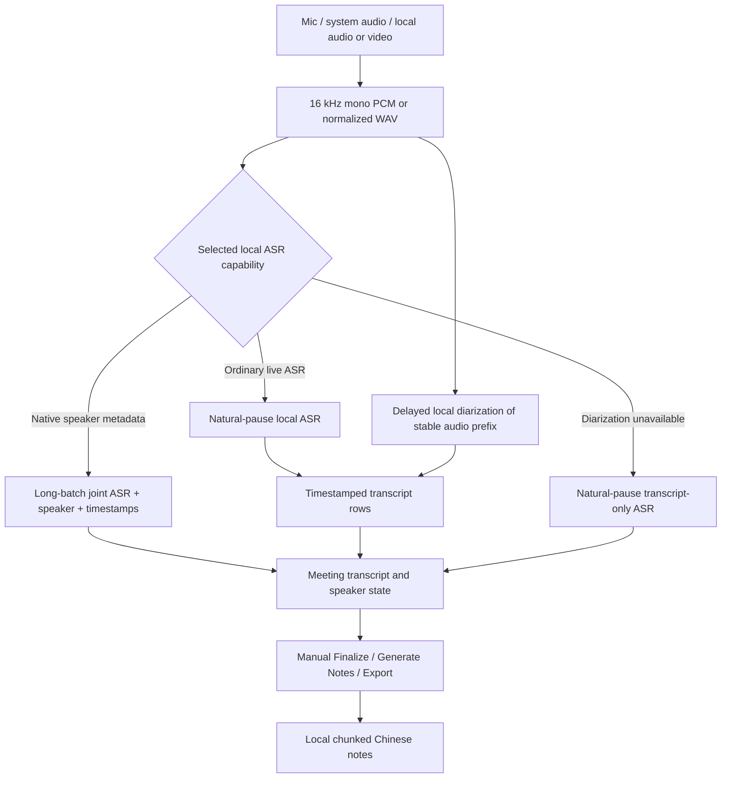

# Phase 4.y PRD: Live Meeting Transcription And Speaker Notes

Last updated: 2026-07-11

Status: implemented for v0.4.0. This is a separate delayed live transcription window, not an extension of the low-latency live subtitle overlay. The existing live subtitle speaker-diarization toggle remains disabled until its own latency gate passes.

## 1. Objective

Phase 4.y adds a dedicated live meeting transcription window to llmTools.

The user should be able to start a local audio session from a microphone, system audio, local audio file, or local video file, then watch llmTools build a delayed running transcript that separates speakers. After the session ends, llmTools should generate Chinese meeting notes from the finalized transcript. This workflow is allowed to lag behind the audio. It should optimize for readable transcript blocks, speaker grouping, editable speaker names, and useful final notes rather than sub-second subtitle latency.

The first product target is not video subtitles. It is a meeting-style note surface:

1. Capture audio after explicit user action.
2. Transcribe speech into timestamped turns.
3. Assign each turn to a session-local speaker label, even if that label arrives later.
4. Let the user rename and merge speakers.
5. Generate summary, decisions, questions, and action items after the session ends.
6. Export the transcript and notes as local files.

ASR, diarization, and meeting-note generation remain local-only for this feature. The product must not send audio or transcript text to a remote ASR, remote diarization, remote text, or cloud meeting transcription provider, and there is no planned cloud-provider mode for this surface.

## 1.1 Confirmed Product Decisions

- This is a new window: `Live Meeting Transcription`, `Realtime Transcription`, or `Meeting Notes`. It is not the existing floating subtitle window.
- V1 required inputs are microphone capture, system-audio capture through the existing native ScreenCaptureKit path, and local audio/video-file offline processing. Microphone+system mixed capture and local-file realtime playback simulation are deferred.
- Latency is acceptable. The UI may show finalized transcript rows 5-20 seconds after speech occurs and speaker labels 30-90 seconds later.
- Speaker labels may be corrected retroactively for recent transcript rows.
- The app can display provisional states such as `Detecting speaker`, `Unknown speaker`, or `Speaker 2?` before the label settles.
- Transcript generation must continue even if speaker diarization is unavailable, slow, or failing.
- V1 meeting-note generation runs after stop/finalization, not during live capture.
- Meeting-note generation must consume finalized transcript rows, not raw audio.
- Meeting notes default to Chinese. Transcript text preserves the source language produced by ASR.
- Meeting-note generation must use a local text model. Remote text providers are not part of this local-only feature surface.
- If no local text model is available for meeting notes, `Generate Notes` is disabled with an actionable local-model message. Transcript, speaker editing, and export still work.
- V1 meeting diarization reuses the already-configured local pyannote sidecar/runtime and its local model cache. The meeting adapter must not accept arbitrary commands or fall back to a network service.
- V1 may keep bounded local temporary working audio while a session is running so ASR and diarization can operate. v0.4.0 does not persist per-callback PCM chunks, deletes working audio after normal stop, and does not expose a persistent-audio save option.
- Speaker names are session-local. v0.4.0 does not persist speaker embeddings or perform cross-session speaker identity.
- The session starts only by explicit user action and stops capture immediately when the user stops the session.
- V1 shows a visible long-session reminder at 60 minutes. The reminder does not auto-stop capture.
- Speaker rename and speaker merge are required in V1.
- Final transcript row text editing is required in V1. User-edited transcript text must survive speaker relabeling, finalization, note generation, export, and crash recovery.
- A stop-time finalization pass is triggered by a separate user action. In v0.4.0 it cleans the current transcript/speaker state without rerunning ASR, and it must preserve user speaker-name edits.
- V1 saves a local recovery draft while a meeting session is active. The draft can contain transcript text and speaker edits, stays out of Recent History and diagnostics, and is offered for restore/delete after an app crash or abnormal termination.
- Recovery drafts do not retain temporary audio. After crash recovery, audio-level work is unavailable; transcript editing, note generation, and export remain available.
- This feature is local-only long term; cloud diarization, remote text-provider meeting notes, and cloud meeting transcription providers are out of scope, not deferred roadmap items.

## 1.2 Relationship To Existing Phase 4 And 4.x Work

This PRD builds on existing Phase 4 audio capture and ASR work, but it intentionally uses a different product contract.

- Phase 4 live subtitles prioritize first readable text. Speaker diarization must not block that path.
- Phase 4.x file speaker diarization labels subtitle segments after file ASR.
- Phase 4.y live meeting transcription allows delayed labels, correction, and finalization because meeting notes are not subtitles.
- The previous realtime diarization rejection still applies to live subtitle labels. It does not reject this delayed meeting transcription window.

## 2. Scope Summary

### 2.1 V1 In Scope

- Dedicated live transcription window in the native macOS app.
- Explicit start/stop controls and visible capture state.
- Microphone audio capture.
- Native system-audio capture through ScreenCaptureKit.
- Local audio/video-file offline processing.
- Reuse of local ASR models and runtime health checks from Phase 4.
- Running transcript with timestamp, speaker label, transcript text, lag, and stability state.
- Editable finalized transcript rows, with user edits protected from later model updates.
- Capability-adaptive recognition worker: native speaker ASR when available, otherwise delayed local diarization that creates speaker-bounded ASR audio slices.
- Session-local speaker list with required rename, merge, and color/label assignment.
- Chinese meeting-note generation after stop/finalization.
- Meeting-note sections: short summary, decisions, action items, open questions, and topics.
- Stop-time finalization pass for improved speaker labels and cleaner notes.
- Export to Markdown and TXT for MVP, with JSON export for diagnostics or future import.
- Redacted diagnostics for audio source, model, runtime state, lag, segment counts, and error codes.
- Owner-only local temporary audio workspaces during the active session, deleted after normal stop in v0.4.0.
- Local recovery draft storage for active or abnormally interrupted sessions.
- Privacy defaults that avoid raw audio, transcript, speaker names, and meeting notes in diagnostics or history unless the user opts in.

### 2.2 Deferred After V1

- Microphone+system mixed capture.
- Local audio-file realtime playback simulation.
- Persistent meeting-audio saving or retention after normal stop.
- Meeting-note generation while capture is still running.
- Persistent speaker embeddings across sessions.
- Calendar/contact/meeting-roster integration.

### 2.3 Out Of Scope

- Sub-second subtitle rendering.
- Reusing the existing live subtitle overlay as the primary UI.
- Browser-extension-hosted audio capture.
- Joining Zoom, Teams, Tencent Meeting, or other meeting apps as a bot.
- Always-on microphone monitoring.
- Remote ASR or remote diarization fallback.
- Remote text providers for meeting-note generation.
- Cloud diarization or cloud meeting transcription providers.
- Cross-session speaker recognition by default.
- Voice verification, identity proof, or biometric speaker database behavior.
- Word-perfect diarization.
- Legal-grade meeting minutes guarantees.
- Mutating the source app, browser page, or meeting app UI.
- Automatic speaker-name inference from contacts, calendars, or meeting rosters.

## 3. Product Principles

- Notes over subtitles: the interface should be optimized for reading and editing a transcript, not for overlaying the current sentence.
- Delay is acceptable when it improves structure. The app should show lag honestly instead of pretending to be instant.
- Choose the recognition order by model capability and input mode. A speaker-aware ASR emits text and speakers jointly. Ordinary live ASR emits natural-pause transcript rows first, then local diarization backfills speaker labels independently. Ordinary offline files may still diarize first and transcribe stable speaker slices. Transcript-only remains the failure fallback.
- Keep live transcript latency independent from speaker-label latency. Delayed diarization may assign a dominant or low-confidence speaker to an existing timestamped ASR row; it must never rewrite the row text or pretend that an unsplit multi-speaker row has word-level attribution.
- User edits win. Manual speaker renames and merges must survive later model updates and finalization passes.
- Local-first privacy: audio stays on device by default, and diagnostics stay redacted.
- Explicit capture: no background listening and no capture after stop.
- Runtime honesty: show selected ASR model, diarization runtime, note-generation model, and fallback reason.

## 4. User Stories

### 4.1 Start A Live Meeting Session

As a user, I can open a live meeting transcription window, choose microphone or system-audio input, and start a session.

Acceptance:

- The window shows the relevant microphone or system-audio capture permission state before capture starts.
- The user can choose the local ASR model or use the configured default meeting ASR model.
- The UI states that meeting notes are generated after stop, not during live capture in V1.
- The window shows elapsed time, audio level, capture source, ASR state, diarization state, and note-generation state.
- Stopping the session releases active capture and stops worker processes.
- If microphone or system-audio capture permission is denied, the UI shows an actionable permission error.
- When a live capture session reaches 60 minutes, the UI shows a visible reminder that the session is long-running and the user should consider stopping, finalizing, or exporting. The reminder must not stop capture automatically.

### 4.2 Read A Delayed Transcript

As a user, I can read finalized transcript turns as they become available, even if they are delayed.

Acceptance:

- The transcript is appended as stable rows, not fast-changing subtitle text.
- Native speaker-aware ASR closes a logical batch after about 2.5 seconds of clear audio interruption. After about 90 seconds it may also close at the next short natural pause (about 0.8 seconds). Continuous speech is sealed into bounded 120-second technical inference windows without declaring a logical turn boundary; stopping submits the remaining window immediately.
- With an ordinary live ASR, a logical transcript row is submitted after a natural pause (about 1.2 seconds) without waiting for diarization. After about 20 seconds, the next short pause (about 0.4 seconds) is sufficient; continuous speech is submitted at a 30-second hard ceiling. Local pyannote processes a stable audio prefix independently and later updates only the speaker fields of eligible rows.
- Transcript-only fallback uses the same bounded transcript policy and does not claim reliable speaker identity.
- Ordinary offline files may still become one bounded ASR slice per stable speaker turn. Live rows retain their ASR timestamp boundaries so later speaker updates do not merge away text-to-time evidence.
- Each row includes start time, optional end time, speaker label, transcript text, and stability state.
- The UI may show partial rows, but final rows should be visually distinct.
- Transcript rows are ordered by audio time, not by worker completion time.
- If ASR lags behind, the lag is visible as seconds behind live audio.
- If ASR fails for a window, the session continues and shows a recoverable warning.
- If two ASR windows are already queued behind an in-flight window, capture stops automatically with a visible backpressure reason and finishes the bounded queue.

### 4.2a Edit Final Transcript Text

As a user, I can correct obvious ASR mistakes in finalized transcript rows before generating notes or exporting.

Acceptance:

- Final transcript rows can be edited with plain text editing.
- Partial rows are not editable until they become final.
- Editing a row marks it as user-edited.
- The original ASR text is retained internally so the user can reset the row if a reset action is implemented.
- Speaker relabeling and speaker merge do not overwrite edited transcript text.
- Stop-time finalization does not overwrite edited transcript text unless the user explicitly resets or reruns that row.
- Meeting-note generation and export use the edited text.

### 4.3 See Speaker Labels Arrive Late

As a user, I can see speaker labels appear after transcript text is already visible.

Acceptance:

- Native speaker-aware ASR returns speaker labels with its transcript batch.
- With ordinary live ASR, transcript rows appear first and speaker labels are backfilled only after their row lies outside the diarization stabilization tail.
- Transcript-only fallback may show `Unknown speaker` and remains editable/exportable without labels.
- The UI does not reorder transcript text only because a speaker label changes.
- Speaker-label lag is visible when it exceeds the configured target.
- If diarization is disabled or unavailable, transcript rows remain usable without labels.

### 4.4 Rename And Merge Speakers

As a user, I can correct speaker labels during or after the meeting.

Acceptance:

- The speaker list shows session-local speakers such as `Speaker 1`, `Speaker 2`, etc.
- The user can rename a speaker to a human-readable name.
- The user can merge two speaker labels when diarization splits one person incorrectly.
- Manual names and merges apply to existing rows and future rows assigned to that speaker ID.
- Later model updates must not overwrite manual names.
- Stop-time finalization must preserve user edits.

### 4.5 Generate Meeting Notes After Stop

As a user, I can stop a meeting session and generate Chinese meeting notes from the finalized transcript.

Acceptance:

- Meeting notes are not generated while live capture is running in V1.
- After stop, the app can generate Chinese notes from finalized transcript rows.
- If no local text model is available, `Generate Notes` is disabled and explains that this local-only feature requires a local text model.
- Long transcripts must be summarized with chunked local summarization: generate partial summaries/decisions/actions/questions first, then merge them into the final notes.
- Notes include summary, decisions, action items, open questions, and topics.
- Action items preserve speaker labels or speaker names when available.
- The app shows note-generation progress and failure state.
- Note generation failure does not destroy the transcript or speaker edits.
- Transcript text remains in the ASR source language unless the user separately exports or translates it.
- If transcript text, speaker names, speaker merge state, or finalization output changes after notes are generated, mark notes as `Stale` and offer `Regenerate Notes`.

### 4.5a Stop-Time Actions

As a user, I can decide what to do after stopping a session instead of having expensive steps run automatically.

Acceptance:

- After stop, the window shows separate actions: `Finalize`, `Generate Notes`, and `Export`.
- `Finalize` is optional and user-triggered.
- `Generate Notes` is user-triggered and can run against the current transcript even if finalization was skipped.
- `Export` is available for the current transcript at any time after stop; if notes already exist, export includes them.
- `Cancel Finalize` and `Cancel Notes` stop those tasks without deleting the current transcript, speaker edits, or existing notes.
- None of these actions restarts audio capture.

### 4.6 Finalize After Stop

As a user, I can stop the session and let llmTools clean up the transcript and notes.

Acceptance:

- After stop, the app shows a separate `Finalize` action before generating notes.
- Finalization must not run automatically without the user pressing the finalization action.
- V1 finalization must not rerun ASR. It is not a `Re-transcribe` action.
- V1 finalization operates on the current transcript and speaker state. It does not rerun ASR or require retained audio.
- Finalization can merge short adjacent turns and clean empty or duplicate rows while preserving current speaker assignments.
- Finalization preserves manual speaker names and merges.
- Finalization preserves user-edited transcript text.
- The user can skip finalization and keep the current transcript.
- Temporary audio has already been deleted by the normal-stop path in v0.4.0.

### 4.7 Process Local Audio Or Video Input

As a user, I can process a local audio or video file through the same meeting-transcription surface.

Acceptance:

- V1 local file input uses offline processing, not realtime-playback simulation.
- Supported V1 files include local audio and video files whose audio can be extracted by the existing media pipeline.
- A file model that natively emits speaker-attributed timestamps, such as VibeVoice-ASR, is used directly and skips external diarization.
- For ordinary file ASR, file-scope diarization runs first and its stable turns are transcribed as separate audio slices. If file-scope diarization is unavailable but the online local sidecar is available, it can be used as fallback.
- The UI clearly distinguishes file processing from active microphone capture.
- File processing can still produce transcript, speaker labels, Chinese notes, and exports.
- If file diarization is unavailable, the file transcript remains usable without speaker labels.

### 4.8 Use Temporary Audio Safely

As a privacy-sensitive user, I can understand and trust how temporary audio is used.

Acceptance:

- During a running session, the app may keep local temporary PCM/WAV chunks for ASR and diarization.
- Temporary audio is not written to diagnostics or Recent History.
- Temporary audio is deleted after normal stop; v0.4.0 has no persistent-audio save action.
- If temporary audio cannot be written, the app shows an actionable local-storage error and does not begin capture.
- The UI copy identifies temporary local processing and does not imply persistent recording.

### 4.9 Recover An Interrupted Meeting Draft

As a user, I can recover a meeting draft if the app crashes or quits unexpectedly during a session.

Acceptance:

- While a session is active, the app writes a local recovery draft containing transcript rows, speaker state, user text edits, speaker rename/merge edits, source metadata, and note state if notes exist.
- Recovery drafts do not include raw audio. Restored drafts can be edited, exported, and used for note generation, but audio-level work is unavailable.
- Recovery drafts are stored under Application Support or another app-owned local directory, not in Recent History.
- Recovery drafts are not included in diagnostics.
- On next launch after abnormal termination, the app offers `Restore Draft` and `Delete Draft`.
- Restoring a draft opens the meeting transcription window with transcript rows, speaker edits, user text edits, and notes state restored.
- Deleting a draft removes the local draft files and any associated temporary audio chunks.
- Normal stop removes the recovery draft. An explicit delete action removes an unresolved or restored draft.

## 5. UX Requirements

### 5.1 Window Layout

The window should feel like a work surface, not a subtitle overlay.

Recommended regions:

- Top toolbar: source selector, start/stop, elapsed time, model selectors, speaker-count hint, lag indicators, export.
- Main transcript list: timestamped rows grouped by speaker turns.
- Side panel: speaker list, summary, decisions, action items, and open questions.
- Bottom status line: capture state, ASR state, diarization state, note-generation state, and last warning.

Stop-time actions:

- After stop, show `Finalize`, `Generate Notes`, and `Export` as separate buttons.
- `Finalize` and `Generate Notes` must show progress and failure states independently.
- `Export` should remain available even if finalization or note generation failed.

Speaker controls:

- Speaker-count hint supports `Auto`, `2`, `3`, `4`, and `5+`.
- The hint is passed to diarization sidecars that support it and ignored by runtimes that do not.
- Speaker list entries expose `Rename` and `Merge Into...`.
- V1 should provide `Undo Merge` when practical; at minimum it must provide `Reset Speakers` to recover from an incorrect merge.

### 5.2 Transcript Row States

Each transcript row should support these states:

- `partial`: text may still change.
- `final`: ASR finalized the text.
- `text_edited`: transcript text was manually edited by the user.
- `speaker_pending`: speaker label is not ready.
- `speaker_assigned`: speaker label assigned by diarization.
- `speaker_edited`: speaker label or name was manually edited.
- `finalized`: row survived stop-time cleanup.
- `notes_source`: row was included in generated meeting notes.

### 5.3 Lag Display

The feature is allowed to lag, but the lag must be visible.

Suggested indicators:

- ASR lag: audio time minus latest finalized transcript end time.
- Speaker lag: audio time minus latest speaker-assigned transcript end time.
- Notes elapsed time after stop: wall-clock time spent generating final notes.

MVP target ranges:

- Native speaker-aware ASR: submit after about 2.5 seconds of clear interruption. After about 90 seconds, use the next short natural pause as a soft logical boundary; uninterrupted speech uses bounded 120-second technical inference windows without treating the window edge as a semantic pause.
- Ordinary live ASR: transcript rows normally appear after a natural pause, prefer the next short pause after 20 seconds, and have a 30-second continuous-speech ceiling; local speaker labels normally follow after 30-90 seconds and never gate the text.
- Transcript-only fallback: uses the same bounded transcript policy and does not promise speaker identity.
- Notes: V1 runs after stop; show progress and elapsed time instead of a live note-refresh target.

These are product targets, not hard guarantees. The UI should show degraded state when the local machine or selected runtime falls behind.

## 6. Runtime And Architecture

### 6.1 Pipeline



### 6.2 Audio Capture

The implementation should reuse the existing native audio capture foundation, but V1 must stay narrow:

- Required in V1: microphone capture through the existing native microphone pipeline.
- Required in V1: system-audio capture through the existing native ScreenCaptureKit pipeline, as a separate source (not a mixed source).
- Required in V1: local audio and video files through the existing media extraction/normalization/offline file path.
- Deferred after V1: mixed audio through the existing combined source option.
- Deferred after V1: local-file realtime playback simulation.

The meeting feature should own its own session state and window state. It should not share the live subtitle session object directly if that would couple meeting behavior to subtitle latency constraints.

### 6.3 ASR

The MVP should reuse Phase 4 local ASR infrastructure:

- Use either a realtime-capable local ASR or a file-capable local ASR that natively emits speaker labels for microphone and system-audio sessions. This broader meeting picker must not change the low-latency Live Subtitles picker.
- Use the selected local file-capable ASR model for local audio/video-file processing.
- Allow a slower native speaker-aware model when the user prioritizes speaker attribution and transcript quality over lag.
- Keep the logical meeting turn separate from the ASR runtime's technical chunk duration so long uninterrupted speech does not require one unbounded model inference.
- Seal native speaker-aware capture into at most 120-second technical inference windows; adjacent results remain eligible for same-speaker presentation grouping.
- Keep at most two completed inference windows queued in memory; when that bound is reached, stop capture visibly and drain the queue instead of accumulating audio without limit.
- Keep partial transcript support optional; final transcript rows are the contract.
- Preserve audio timestamps so speaker turns and transcript rows can be aligned later.
- Do not add remote ASR or remote diarization fallback.

### 6.4 Speaker Diarization

The meeting window uses a separate adapter and independent speaker state. Ordinary ASR reuses the already-configured local pyannote sidecar, Python venv, model path, token handling, cache directory, and offline-only environment from file subtitles. Native speaker-aware ASR skips pyannote. The meeting adapter must not start a second interpreter, accept an arbitrary command template, or use a network service.

V1 local direction:

- Input for live ordinary ASR: natural-pause WAV batches for transcription plus an independently refreshed stable WAV prefix for diarization. Input for local files is the normalized full-file WAV.
- Output: local speaker turns and confidence when available.
- App-side planning: live capture applies stable turns only to timestamped transcript rows that are outside the unstable tail. Offline file processing may apply turn boundaries to PCM first and run ASR on each planned speaker slice.
- Aggregate consecutive diarization fragments for the same resolved speaker before evaluating confidence. Sequential fragments are not overlap; brief true overlap keeps a clear primary speaker, while complex or ambiguous overlap displays `Unknown` / low confidence.
- The meeting-window health check must report the shared local runtime and fallback reason.
- The `Auto` / `2` / `3` / `4` / `5+` hint is passed only to the bundled local pyannote sidecar; it is never interpolated into a custom command.
- Missing runtime or model cache must degrade to transcript-only mode, not fail the whole session.
- Fixture diarization must be available for automated checks without a real model/runtime.
- Real local-runtime readiness is not the only V1 acceptance gate. If it is unavailable on a machine, transcript-only behavior and fixture checks must still pass; real smoke runs when the runtime is ready.

### 6.5 Speaker Turn Planning

Speaker planning uses audio time boundaries rather than text content.

Rules:

- For offline files, sequential speaker turns create separate ASR slices even when there is no silence between them. Live capture prioritizes transcript latency and preserves ASR timestamp rows for later dominant/low-confidence speaker assignment.
- Brief overlap keeps a clearly dominant primary speaker; ambiguous overlap creates one `Unknown` low-confidence slice.
- V1 transcript rows display one primary speaker only. Overlapping speech or low-confidence speaker overlap is shown as low confidence or `Unknown speaker`, not as multiple speakers on one row.
- Merge adjacent technical slices only when they resolve to the same speaker and do not cross a meaningful pause.
- Freeze user-edited text during speaker updates, finalization, notes, export, and recovery.
- Preserve deterministic session-local speaker labels.

### 6.5a Finalization Scope

V1 finalization is a cleanup and speaker-alignment step, not a second transcription run.

Rules:

- Do not rerun ASR during V1 finalization.
- Do not overwrite user-edited transcript text.
- Preserve the speaker assignments already present on transcript rows.
- Merge very short adjacent rows from the same effective speaker when this does not discard user-edited text.
- Remove empty duplicate rows created by ASR/runtime artifacts.
- Restored drafts use the same text/speaker-state cleanup because recovery drafts never retain temporary audio.

### 6.6 Meeting Notes

V1 meeting notes should be generated after stop from finalized transcript rows.

Rules:

- Do not generate live meeting-note drafts during capture in V1.
- Use the latest finalized transcript and speaker mapping after optional finalization.
- Use speaker labels when available, but do not block notes on diarization.
- Keep a structured note state: summary, decisions, action items, open questions, topics.
- Default note language is Chinese.
- Support long transcript chunking with local models: generate chunk-level notes first, then merge them into the final meeting notes.
- If the local text model cannot fit or process a long transcript, preserve the transcript and show note-generation failure without falling back to remote providers.
- Preserve source-language transcript text unless the user separately translates or exports it.
- Keep a regenerate-notes action after stop.
- Mark notes as stale when transcript text, speaker names, speaker merge state, or finalization output changes after note generation.

The note-generation model must be a local text model. This feature is local-only end to end, so remote text providers should not be used for meeting-note generation even if remote providers exist elsewhere in llmTools.

### 6.7 Meeting Notes Template

V1 Markdown export should use this stable structure:

```markdown
# 会议纪要

## 元信息
- 时间：...
- 来源：麦克风 / 系统音频 / 本地音频文件
- ASR 模型：...
- 讲话人：Speaker 1, Speaker 2, ...

## 摘要
...

## 关键决策
- ...

## 待办事项
- [ ] 负责人：未知 事项：... 截止：未知

## 开放问题
- ...

## 讨论主题
- ...

## 完整转写
00:00:03 Speaker 1: ...
```

Export naming:

- Microphone session: `meeting-notes-YYYYMMDD-HHMM.md`.
- Local audio/video file: `<source-file-stem>-meeting-notes-YYYYMMDD-HHMM.md`.
- TXT export may use the same stem with `.txt`.
- JSON export may use the same stem with `.json` and is intended for diagnostics/future import, not as the primary user format.

## 7. Data Model

### 7.1 LiveMeetingSession

Suggested fields:

```swift
struct LiveMeetingSession {
    var id: UUID
    var source: LiveMeetingAudioSource
    var sourceFileURL: String?
    var sourceMediaKind: LiveMeetingSourceMediaKind?
    var startedAt: Date
    var stoppedAt: Date?
    var asrModelID: UUID
    var diarizationRuntimeID: String?
    var notesModelID: UUID?
    var notesLanguage: String
    var state: LiveMeetingRunState
    var temporaryAudioDirectory: String?
    var shouldDeleteTemporaryAudio: Bool
    var finalizationState: LiveMeetingFinalizationState
    var noteGenerationState: LiveMeetingNoteGenerationState
    var longSessionReminderShownAt: Date?
    var recoveryDraftURL: String?
    var lastRecoveryDraftSavedAt: Date?
    var transcriptLagMilliseconds: Int
    var speakerLagMilliseconds: Int
}
```

### 7.2 LiveMeetingSegment

Suggested fields:

```swift
struct LiveMeetingSegment {
    var id: UUID
    var index: Int
    var startTime: TimeInterval
    var endTime: TimeInterval?
    var text: String
    var originalText: String
    var speakerID: String?
    var speakerLabel: String?
    var confidence: Double?
    var state: LiveMeetingSegmentState
    var userEditedSpeaker: Bool
    var userEditedText: Bool
    var textEditedAt: Date?
    var includedInNotes: Bool
}
```

Transcript edit behavior:

- `text` is the display and export text.
- `originalText` keeps the ASR result for reset/diagnostics-free local recovery.
- When `userEditedText` is true, diarization relabeling and finalization must preserve `text`.
- Meeting-note generation uses `text`, not `originalText`.

### 7.3 LiveMeetingSpeaker

Suggested fields:

```swift
struct LiveMeetingSpeaker {
    var id: String
    var label: String
    var displayName: String?
    var colorKey: String
    var mergedIntoSpeakerID: String?
    var userEdited: Bool
}
```

Speaker merge behavior:

- Keep original diarization speaker IDs for diagnostics and mapping.
- Store the user's merge as an overlay so future diarization updates assigned to either source ID render as the merged speaker.
- Never overwrite `displayName` or merge overlays during model relabeling or finalization.

### 7.4 MeetingNoteState

Suggested fields:

```swift
struct MeetingNoteState {
    var summary: String
    var decisions: [MeetingDecision]
    var actionItems: [MeetingActionItem]
    var openQuestions: [MeetingQuestion]
    var topics: [MeetingTopic]
    var language: String
    var sourceSegmentRange: Range<Int>
    var updatedAt: Date
    var generationState: LiveMeetingNoteGenerationState
    var isStale: Bool
    var staleReason: String?
}
```

### 7.5 LiveMeetingRecoveryDraft

Suggested fields:

```swift
struct LiveMeetingRecoveryDraft {
    var id: UUID
    var sessionID: UUID
    var source: LiveMeetingAudioSource
    var savedAt: Date
    var sessionState: LiveMeetingRunState
    var segments: [LiveMeetingSegment]
    var speakers: [LiveMeetingSpeaker]
    var notes: MeetingNoteState?
    var temporaryAudioDirectory: String?
    var appVersion: String
}
```

Recovery draft rules:

- Drafts are local-only and app-owned.
- Drafts are for crash/abnormal-termination recovery, not for normal history.
- Drafts may contain transcript text and speaker names, so they must never be included in diagnostics.
- A restored draft opens as stopped or recoverable, not as an actively capturing microphone session.

## 8. Privacy And Persistence

Defaults:

- Do not persist raw audio.
- Do not persist speaker embeddings.
- Do not persist full transcripts or notes in app history by default.
- Do not include raw transcript text, notes, or speaker names in diagnostics.
- Keep temporary local audio chunks only while the active session needs them for ASR and diarization.
- Temporary audio is an implementation cache, not user-visible persistent history.
- Delete temporary audio after normal stop.
- Save a local recovery draft during active sessions. This draft may contain transcript text, user text edits, speaker labels/names, and note state, but it is only for crash recovery and must not appear in Recent History, diagnostics, or exports unless the user restores and exports it.
- Delete the recovery draft after normal stop or an explicit delete action. Export writes a separate local result file and does not retain the recovery draft.

Not implemented in v0.4.0:

- Save transcript and notes to Recent History.
- Save raw session audio for manual reuse.
- Persist local speaker embeddings across sessions.

Any persistent speaker embedding option must explain that it is a biometric-like local artifact and must include a delete action.

## 9. Diagnostics

Diagnostics may include:

- Session ID hash.
- Audio source.
- Runtime source names.
- ASR model ID/name.
- Diarization runtime name.
- Notes model ID/name.
- Audio duration bucket.
- Transcript segment count.
- Speaker count.
- Lag buckets.
- Recovery draft present/restored/deleted state.
- Error codes.
- Worker exit codes.

Diagnostics must not include:

- Raw audio.
- Full transcript text.
- Meeting-note text.
- Speaker display names.
- Recovery draft contents.
- Full local file paths.
- Full window/app titles from captured sources.

## 10. Milestones

### M0: Technical Spike

- Create fixture-driven ASR + diarization event streams.
- Validate speaker-turn-to-transcript mapping with delayed labels.
- Measure transcript lag and speaker-label lag in packaged app path.
- Prove the meeting pipeline does not alter existing live subtitle behavior.

### M1: Transcript-Only Window

- Add the live meeting transcription window.
- Support microphone and system-audio input.
- Reuse local ASR runtime health checks.
- Display finalized transcript rows and lag.
- Stop capture reliably.

### M2: Delayed Speaker Labels

- Add realtime diarization sidecar session.
- Display delayed speaker labels.
- Support speaker rename and merge.
- Keep transcript running when diarization fails.

### M3: Meeting Notes

- Add after-stop Chinese note generation.
- Show summary, decisions, action items, questions, and topics.
- Show note-generation progress and errors.
- Add regenerate-notes after stop.

### M4: Local Audio/Video File Input, Finalization, And Export

- Add local audio/video-file input through media audio extraction where needed.
- Add optional stop-time file diarization finalization.
- Add Markdown/TXT/JSON export.

### Deferred Milestones

- Add mixed audio sources.
- Add local-file realtime playback simulation.
- Add optional live meeting-note drafts while capture is still running.
- Keep cloud ASR, cloud diarization, and cloud meeting-transcription providers out of scope.

## 11. Acceptance Gates

The feature is acceptable when all of these pass on the packaged app path:

- A user can start a microphone or system-audio meeting session and see finalized transcript rows without using the live subtitle window.
- A user can process a local audio or video file offline through the same meeting transcription surface.
- Transcript finalization lag is visible and usually stays within 5-20 seconds on the test Mac for microphone sessions.
- A diarization-enabled session can assign at least two speakers in a fixture or real two-speaker test.
- Speaker labels may arrive 30-90 seconds late but update existing rows without losing transcript text.
- The user can rename and merge speakers, and those edits survive later model updates.
- The user can edit finalized transcript row text, and those edits survive speaker relabeling, finalization, note generation, export, and recovery restore.
- Speaker-count hint supports `Auto`, `2`, `3`, `4`, and `5+`.
- V1 shows one primary speaker per transcript row; overlapping or low-confidence speaker regions display low confidence or `Unknown speaker`.
- Microphone sessions show a visible 60-minute long-session reminder without auto-stopping capture.
- After stop, the app can generate Chinese meeting notes from finalized transcript rows.
- Notes use local chunked summarization for long transcripts and never fall back to remote providers.
- Notes become `Stale` after transcript/speaker/finalization changes and can be regenerated manually.
- Stop-time finalization is available through a separate user action and does not run automatically.
- V1 finalization does not rerun ASR.
- Finalization and note generation can be cancelled without deleting existing transcript, speaker edits, or notes.
- Meeting notes continue to work when speaker labels are missing.
- Stopping a session releases audio capture and terminates worker processes.
- Exported Markdown follows the fixed meeting-notes template and contains metadata, transcript, speaker labels/names, summary, decisions, action items, open questions, and topics.
- Export filenames follow `meeting-notes-YYYYMMDD-HHMM` for microphone sessions and `<source-file-stem>-meeting-notes-YYYYMMDD-HHMM` for local files.
- Raw audio, transcript text, meeting notes, and speaker names are absent from default diagnostics.
- Recovery drafts restore transcript rows, user text edits, speaker rename/merge edits, and notes state after abnormal termination.
- Recovery drafts stay out of Recent History and diagnostics.
- Temporary audio chunks are deleted after normal stop; v0.4.0 exposes no persistent-audio save action.
- Existing Phase 4 live subtitles still start, transcribe, and stop with no new dependency on diarization.

## 12. Test Plan

- Unit tests for speaker-turn overlap mapping and manual speaker merge behavior.
- Unit tests for transcript text editing and protection against finalization overwrite.
- Fixture tests for delayed diarization events arriving after ASR transcript events.
- Fixture tests for after-stop Chinese note generation and note-generation failure state.
- Fixture tests for recovery draft save, restore, delete, and diagnostics redaction.
- Fixture tests for fixed Markdown template and export naming.
- Fixture tests for notes stale state and chunked note generation.
- Fixture tests for cancel finalize and cancel notes behavior.
- Privacy tests for redacted diagnostics.
- Runtime health tests for missing ASR, missing diarization, worker failure, and transcript-only fallback.
- Packaged-app smoke for microphone session start/stop.
- Packaged-app smoke for local audio/video-file meeting transcription.
- Packaged-app smoke for two-speaker fixture or recorded two-speaker audio.
- Packaged-app smoke for after-stop Chinese note generation and Markdown export.
- Regression checks for existing live subtitles, file subtitles, webpage translation, and OCR.

## 13. Goal Implementation Contract

A goal-mode implementation should treat this section as binding.

### 13.1 Must Do

- Implement a separate live meeting transcription surface. Do not implement V1 by enabling speaker labels in the existing live subtitle overlay.
- Create independent meeting session state, transcript state, speaker state, note state, diagnostics, and export behavior.
- Support microphone input, system-audio input, and local audio/video-file offline processing in V1.
- Reuse existing Phase 4 local ASR runtime selection, health checks, and temporary audio handling where practical.
- Add a meeting-only local diarization adapter that reuses the configured bundled pyannote sidecar/runtime and turns stable speaker boundaries into ASR audio slices.
- Keep transcript-only mode usable when diarization is missing or fails.
- Provide fixture diarization so automated checks do not require a real third-party runtime.
- Expose diarization health state; real runtime smoke should run when ready but must not be the only V1 gate.
- Implement speaker rename and speaker merge in V1.
- Implement final transcript text editing in V1 and prevent later model/finalization work from overwriting user-edited text.
- Implement speaker-count hint controls: `Auto`, `2`, `3`, `4`, and `5+`.
- Generate Chinese meeting notes after stop/finalization in V1.
- Use a local text model for meeting-note generation.
- Disable `Generate Notes` with an actionable message when no local text model is available.
- Support chunked local summarization for long transcripts and mark notes stale after transcript/speaker/finalization changes.
- Export Markdown and TXT in V1. JSON export is allowed for diagnostics/future import.
- Use the fixed meeting-notes Markdown template and deterministic export naming.
- Keep temporary audio local and delete it after normal stop.
- Save local recovery drafts for active sessions and offer restore/delete after abnormal termination.
- Show a visible 60-minute long-session reminder for live capture sessions without auto-stopping capture.
- Provide a separate user-triggered finalization action after stop.
- Keep V1 finalization scoped to speaker/segment cleanup and do not rerun ASR.
- Support cancellation for finalization and note generation without deleting existing results.
- Add fixture checks so CI can validate transcript, delayed speaker updates, speaker merge, note generation, export, and privacy redaction without requiring real models.
- Validate through the packaged app path before claiming completion.

### 13.2 Must Not Do

- Do not restore browser-extension-hosted live audio capture.
- Do not add remote ASR, remote diarization, remote text-provider note generation, cloud meeting transcription, or automatic cloud fallback.
- Do not make live subtitles depend on meeting diarization.
- Do not persist raw audio, transcript text, meeting notes, speaker names, or speaker embeddings by default.
- Do not put recovery drafts into Recent History or diagnostics.
- Do not infer speaker names from contacts, calendars, app window titles, or meeting rosters.
- Do not make mixed audio a blocker for V1 completion.
- Do not require live meeting-note updates during capture for V1 completion.
- Do not run stop-time finalization automatically without user action.
- Do not rerun ASR during V1 finalization.
- Do not make real third-party diarization runtime installation success the only acceptance path.

### 13.3 Suggested Implementation Order

1. Add core meeting data types and fixture-driven reducers for transcript rows, transcript text edits, speaker turns, speaker rename/merge, recovery draft state, and note state.
2. Add a dependency-free check script or Swift check covering delayed ASR/diarization fixtures and export output.
3. Add the native meeting window UI with fixture/manual session state before wiring real audio.
4. Wire microphone capture into the independent meeting session.
5. Wire local ASR into finalized transcript rows.
6. Add the local diarization sidecar contract, speaker-turn planner, PCM slicing, and per-turn ASR path.
7. Add local audio/video-file offline processing.
8. Add after-stop Chinese note generation with local chunking and stale-state behavior.
9. Add recovery draft restore/delete.
10. Add privacy diagnostics and export.
11. Run build/check/package/relaunch validation.

### 13.4 Required Verification

- `swift build --product llmTools`
- Existing focused checks that still apply, including `swift run LLMToolsChecks`.
- A new meeting transcription fixture check covering delayed speaker labels, rename/merge, transcript text edits, recovery drafts, chunked/stale notes, cancellation, export, and privacy redaction.
- `./scripts/package-app.sh`
- `codesign --verify --deep --strict --verbose=2 dist/llmTools.app`
- Relaunch packaged `dist/llmTools.app` and verify microphone meeting start/stop, local audio/video-file processing, speaker rename/merge, after-stop Chinese notes, export, and existing live subtitles.

## 14. Goal-Mode Prompt

Use this prompt to start the implementation goal:

```text
在 /Users/po/Documents/llmTools 中完整实现 docs/phase-4y-live-meeting-transcription-prd.md 的 V1。一步一步思考后行动，保护现有未提交改动，不要回滚无关文件。V1 必须新增独立的实时转写/会议纪要窗口，不要通过打开现有实时字幕 speaker label 来实现；不要恢复浏览器插件音频捕获；不要添加远程 ASR、云端 diarization、远程文本 provider 会议纪要、云端会议转写或任何云端 fallback，本功能长期坚持端到端 local-only。必须支持麦克风、原生系统音频和本地音频/视频文件离线处理，视频通过现有媒体管线抽取音频，复用现有本地 ASR runtime/health check 和既有本地 pyannote diarization runtime；允许转写延迟 5-20 秒、speaker label 延迟 30-90 秒并回填；真实 diarization runtime 不可用时必须 transcript-only 可用且 fixture 检查通过，runtime ready 时再做真实 smoke。V1 必须支持讲话人重命名和合并，支持 speaker-count hint（Auto/2/3/4/5+），重叠讲话只显示主 speaker/低置信/Unknown，支持编辑 finalized transcript row 文本且用户编辑不能被 speaker relabel/finalization/note generation/export/recovery 覆盖；麦克风会话达到 60 分钟时显示明显时长提醒但不自动停止；停止后提供单独的 Finalize/最终整理、Generate Notes/生成纪要、Export/导出按钮，不要自动执行最终整理或纪要生成；V1 Finalize 不重跑 ASR，只做 speaker/segment cleanup，Finalize 和 Notes generation 都可取消且不删除已有结果；会议纪要在停止/最终整理后用本地文本模型生成，没有本地文本模型时禁用 Generate Notes 并提示；长转写必须支持本地分块总结，转写/speaker/finalization 变化后 notes 标记 stale，可手动 regenerate；默认中文，转写保留原语言，并使用 PRD 固定 Markdown 模板和确定性导出命名；运行期间允许本地临时缓存音频分片，停止/最终整理后默认删除；recovery draft 默认不保留临时音频，异常退出后下次启动提供恢复/删除，draft 不进入 Recent History 或 diagnostics。补充 fixture 检查，覆盖 60 分钟提醒、手动 finalization、取消、延迟 speaker label、speaker count hint、rename/merge、文本编辑保护、recovery draft、chunked/stale 本地中文纪要、导出模板/命名和隐私红线。完成后按 packaged app 路径验证：swift build --product llmTools、swift run LLMToolsChecks、相关新增 check、./scripts/package-app.sh、codesign verify、重启 dist/llmTools.app，并确认现有实时字幕不依赖新 diarization。
```

## 15. Final Confirmed Product Decisions

- V1 shows a visible long-session reminder at 60 minutes and does not auto-stop capture.
- Stop-time finalization is a separate user-triggered action, not an automatic step.
- V1 finalization does not rerun ASR; it only performs speaker and segment cleanup.
- Finalization and note generation are cancellable without deleting existing transcript, speaker edits, or notes.
- V1 supports editing finalized transcript row text, and user-edited text is protected from later relabeling/finalization/note/export/recovery operations.
- V1 saves a local recovery draft for active sessions and offers restore/delete after abnormal termination.
- V1 supports microphone, system-audio, and local audio/video-file input through the independent meeting surface.
- Meeting notes require a local text model and support chunked summarization plus stale-note regeneration.
- Real diarization runtime availability is not the only V1 gate; fixture checks and transcript-only fallback are required.
- Meeting recognition distinguishes native speaker ASR, transcript-first live ASR with delayed speaker labels, diarization-first offline-file ASR, and transcript-only fallback. Existing Live Subtitles continues to use its own realtime ASR path and never depends on meeting diarization.
- The live meeting transcription feature remains local-only long term. Cloud ASR, cloud diarization, remote text-provider meeting notes, and cloud meeting transcription providers are not planned for this feature.
